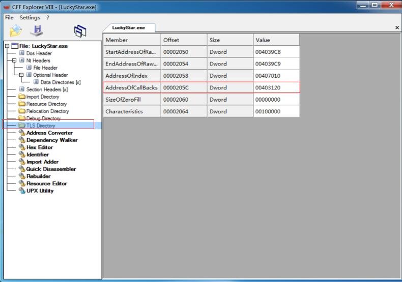
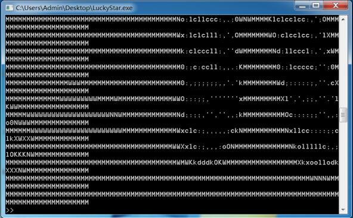
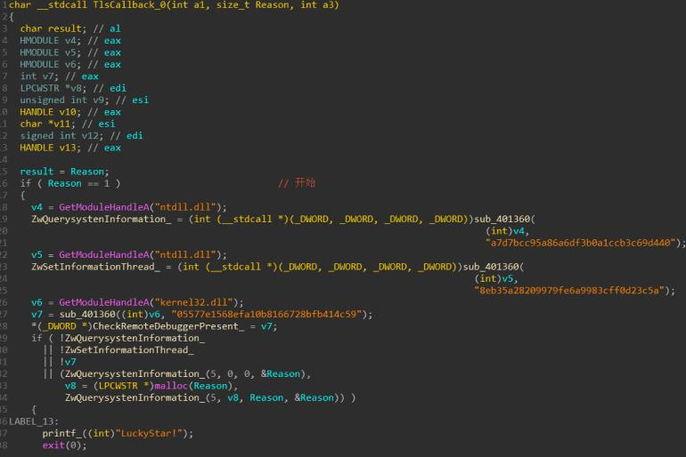
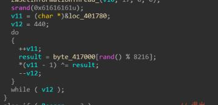
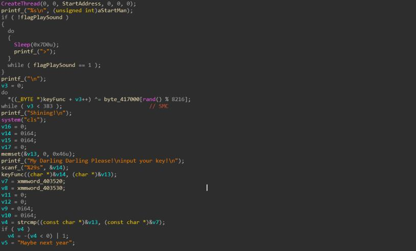
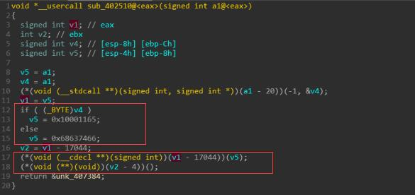
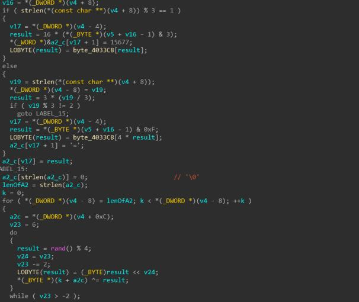

# Tls callback 反调试
## 1. 什么是Tls
**Tls全称是Thread Local Storage,线程局部存储,用来将数据与一个正在执行的指定线程关联起来**
**比如有一个全局变量**
```C++
int global = 0x1234;
```
**并且创建了几个线程,几个线程都需要访问这个变量,但是这几个线程又是相互独立的,也就是说这几个线程对这个变量的修改应该是独立的,比如thread1 修改global = 0x12,thread2 修改global = 0x34,此时global对于thread1 = 0x12,对于thread2 = 0x34,所以需要对于每个线程创建global的副本,Tls就是用来做这个的**

------------------------

## 2. Tls callback
>Tls callback和Tls创建数据存储副本没有关系
>**TLS回调函数的调用运行要先于EP代码执行，该特性使它可以作为一种反调试技术使用**
### 2.1 什么是Tls callback
**如果程序设置了Tls回调函数,那么在程序的PE头结构里的TlsTable表中的AddressOfCallBack就会有一个值(地址),这个指针指向一个Tls callback的数组,然后在程序执行OEP代码之前,依次执行Tls callback函数,之后再执行oep代码**


### 2.2 设置Tls callback

```C++
#pragma comment(linker, "/INCLUDE:__tls_used")
//<span id="mt3" class="sentence SentenceHover" data-guid="35511d92-64ec-2051-fb37-f1dab0c450e3" data-approved="/INCLUDE 选项告知链接器将指定的符号添加到符号表中。">The /INCLUDE option tells the linker to add a specified symbol to the symbol table.</span>
 
void NTAPI tls_callback(PVOID h, DWORD reason, PVOID pv)
{
	MessageBox(NULL,"Before Main!","TlsTest",MB_OK);
	return;
}
//创建TLS段
#pragma data_seg(".CRT$XLT")
//<span id="mt1" class="sentence" data-guid="15117b5d-61c1-addd-d419-146c7c47a1f4" data-approved="指定 .obj 文件中用于存储初始化变量的数据段。">Specifies the data segment where initialized variables are stored in the .obj file. </span>
/*example:
#pragma data_seg(".my_data1")
int j = 1;                     // stored in "my_data1" 
*/
//定义回调函数
PIMAGE_TLS_CALLBACK p_thread_callback = tls_callback;
#pragma data_seg()
```
**Tls详解:https://blog.csdn.net/lixiangminghate/article/details/46770635?utm_source=blogxgwz3**

------------------------

## 3. HCTF的签到题LuckyStar
>这个题就是用了Tls callback anti-debugger的技术

### 3.1 分析程序

**程序一开始会放一段音乐,直到音乐结束才会让你输入flag**


**用IDA分析程序,发现可以找到关键字符串,但是找不到字符串的交叉引用,怀疑是用了SMC(动态修改程序)**
**并且程序有一个TlsCallBack_0函数**

### 3.2 TlsCallBack_0函数
**1.发现一开始调用了大量的反调试函数**

**2.之后会修改main函数的opcode,解密main函数**
>利用了伪随机数srand(0x61616161)



**3 Patch反调试并dump解密后的内存**

**发现程序逻辑是这样的:**
* **播放音乐**
* **直到音乐播放完毕,输入flag**
* **自解密一个函数(keyFunc)**
* **调用函数(KeyFunc)加密**
* **将加密后的输入与特定字符串比较**

### 3.3 keyFunc函数
>将解密后的内存dump下来
**但是发现keyFunc函数IDA反编译错误,看汇编指令完全不对,毫无逻辑**
**猜测可能有另一处反调试,因为解密也用到了rand,猜测是反调试把随机数种子改了**

**1.动态调试(给srand下断点查看调用栈) 2.静态分析交叉引用**
**第二处反调:**

**动态调试发现,如果检测到调试器则将种子置为0x10001165,否则种子为0x68637466**
**然后调用srand(种子),rand()**

**Patch掉第二次反调,再看keyFunc**

**1.字母表被改变的base64 2.利用rand再次进行xor加密**

