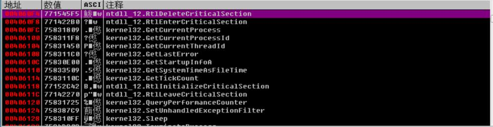
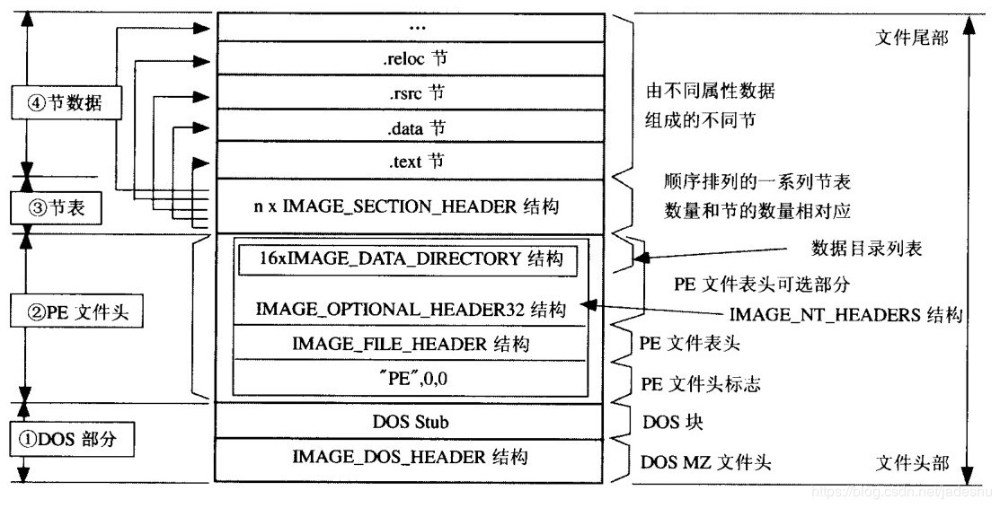
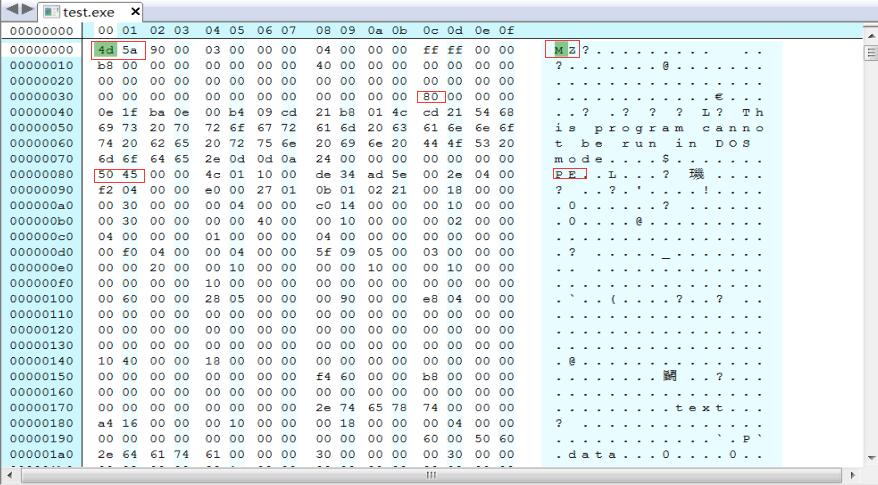
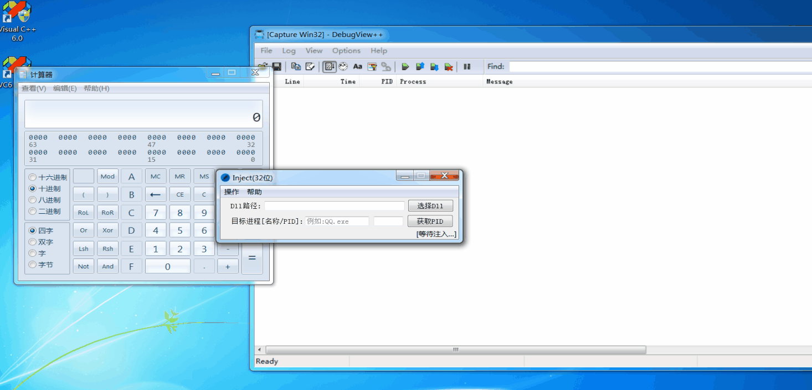

# IAT Hook
>IATHook即导入表Hook,相对于之前分享的inlink hook还是比较简单的
但是前提是了解**PE**相关的知识

**每一个程序都有一堆导入地址表(IAT), 其中记录着调用其他dll中的函数的地址**
**比如:**
```C++
int main()
{
    SetWindowTextA(hwnd,lpcstr);// win API -> in user32.dll
    return 0;
}
```
**在汇编层面的实现:**
```C++
....
call dword ptr [0x4060F4]// 是一个间接调用
....
```
**在汇编层面,不是直接CALL这个函数地址,而是从某个地址读取出函数地址再CALL**

**那么只需要将表中的某个函数地址改为我们自己写的函数的地址,就可以在程序调用某个函数时，实际去调用我们替换的那个函数**

-------------

## 1.PE头知识
>PE(Portable Executable),常见的.exe, .dll, .o都是PE文件
PE文件具有固定的格式, windows加载器在加载程序的时候会根据pe头中的信息加载

**PE文件的结构:**

**比如IMAGE_DOS_HEADER结构:**
```C++
typedef struct _IMAE_DOS_HEADER {       //DOS .EXE header                                    位置  
    WORD e_magic;                       //Magic number;                                      0x00  
    WORD e_cblp;                        //Bytes on last page of file                         0x02  
    WORD e_cp;                          //Pages in file                                      0x04  
    WORD e_crlc;                        //Relocations                                        0x06  
    WORD e_cparhdr;                     //Size of header in paragraphs                       0x08  
    WORD e_minalloc;                    //Minimum extra paragraphs needed                    0x0A  
    WORD e_maxalloc;                    //Maximum extra paragraphs needed                    0x0C  
    WORD e_ss;                          //Initial (relative) SS value                        0x0E  
    WORD e_sp;                          //Initial SP value                                   0x10  
    WORD e_csum;                        //Checksum                                           0x12  
    WORD e_ip;                          //Initial IP value                                   0x14  
    WORD e_cs;                          //Initial (relative) CS value                        0x16  
    WORD e_lfarlc;                      //File address of relocation table                   0x18  
    WORD e_ovno;                        //Overlay number                                     0x1A  
    WORD e_res[4];                      //Reserved words                                     0x1C  
    WORD e_oemid;                       //OEM identifier (for e_oeminfo)                     0x24  
    WORD e_oeminfo;                     //OEM information; e_oemid specific                  0x26   
    WORD e_res2[10];                    //Reserved words                                     0x28  
    LONG e_lfanew;                      //File address of new exe header                     0x3C  
} IMAGE_DOS-HEADER, *PIMAGE_DOS_HEADER;  
```
**二进制数据:**


**在可选头中的最后一个成员是一个有16个元素的数组，每个元素均为一个结构体，结构体中的第一个成员指向一张表:**
```C++
typedef struct _IMAGE_DATA_DIRECTORY {
    DWORD VirtualAddress;
    DWORD Size;
} IMAGE_DATA_DIRECTORY,*PIMAGE_DATA_DIRECTORY;
```
**需要理解的就是其中的导入表**


------------

## 2.代码实现
>在附录

**Hook替换后的函数:**
```C++
BOOL HookSetWindowTextW(HWND hWnd,LPCWSTR  lpString)
{
	lpString = L"中国";

	return SetWindowTextW(hWnd,lpString);
}
```
**此实例会将调用SetWindowTextW函数的参数改为"中国"**

## 3.效果
