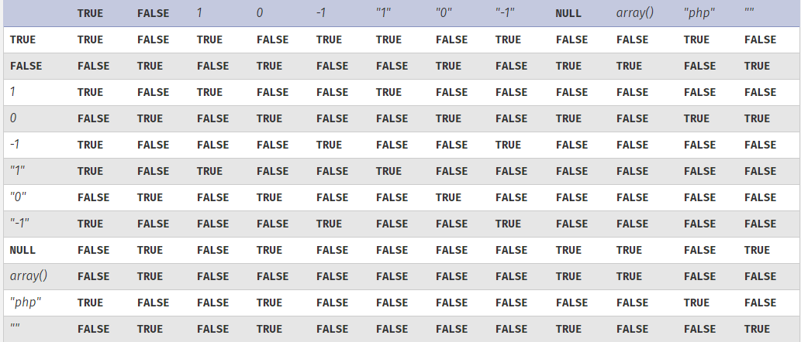

# php弱类型比较

php有两种不同比较模式：

- 松散比较
- 严格比较

### 松散比较

​	松散比较用 '==' 表示，只比较两变量（或是常量）的值，不比较类型(> , < 也有此机制)

​	由于这种机制，会有以下结果：



[图片来源于：php官方](https://www.php.net/manual/zh/types.comparisons.php)

这使得这种比较方式存在一个弱化漏洞：

```
示例：example1 == example2


```

​	如果这里的 **example1** 是数字，而 **example2** 是前几位为数字的字符串
则会将 **example2** 弱化为数字,具体弱化规则如下

例如：

```php
333 == '333fhjkashfjhaskjfhkasf241'

/*
php会将'333fhjkashfjhaskjfhkasf241'弱化为数字333

从而得到结果为TRUE
*/
```

**PS：**

- 如果字符串数字后为 **'E'** 或者 **'e'**， 会将其视为科学计数法

例如：

```php
333 == '333e3dzfavzxv' //false
333 == '333e1dzfavzxv' //true

```


- 如果字符串数字后为 '.' ，会将其视为浮点型

```php
333 == '333.1asfasfasx'
/*
结果为FALSE
*/
```


- 如果字符串数以**'0X'** 开头，则会将其视为16进制数再转换为十进制比较

```php
"0x1e240"=="123456" //true
"0x1e240"==123456 //true
```


### 弱化特性的妙用

#### 攻防世界web新手区的一道题  

（用来表示一下弱化bug的威力）

```php
<?php
show_source(__FILE__);
include("config.php");
$a=@$_GET['a'];
$b=@$_GET['b'];
if($a==0 and $a){     //此条件解读为：变量a与0松散比较为真 并且 a不为空且不为0
    echo $flag1;
}
if(is_numeric($b)){   // is_numeric()函数用于检测变量是否为 数字 或数字字符串。我们不能使其成立
    exit();
}
if($b>1234){        //这里是返回flag2的条件。
    echo $flag2;
}
?>
/*
	初步分析一下是要我们上传表单中的a,b来满足返回flag的条件。
	分析后，只需上传满足条件的a，b值即可
	a = 0a
	b = 1235a
	
*/
```

```
payload:
http://124.126.19.106:55985/index.php?a=0a&b=1235a
```

得到flag.

---

#### 简单的MD5绕过

```php
<?php
$md51 = md5('QNKCDZO');//将此字符串加密，得0e848240448830537924465865611904
$a = @$_GET['a'];
$md52 = @md5($a);
if(isset($a))
{	//下面条件是a明文不等于QNKCDZO 密文一样
	if($a != 'QNKCDZO' && $md51 == $md52){ 
		echo "nctf{**************}"; //返回flag
	else{
	echo "false!!!";
}
}
else
{
    echo "pleacs input a";
}
}
?>
//题目摘自：https://blog.csdn.net/Ljt101222/article/details/81135431//
```

综上分析，因为 0e 视为科学计数法恒为0，我们可以任意选取密文为 0e 开头的且明文不等于'QNKCDZO'的a值。

搜了一下以**'0e'**开头的MD5密文，有很多

**取a = s878926199a**

**密文md52 = 0e545993274517709034328855841020**

即可绕过验证

