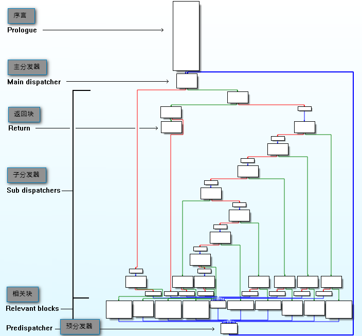

#利用angr反ollvm混淆的控制流平坦化
>**只是给大家简单介绍一下什么是符号执行，什么是ollvm混淆，什么是控制流平坦化，至于怎么实现用符号执行去除控制流平坦化，因为要熟悉angr脚本等内容还是挺复杂的，感兴趣的可以看 https://security.tencent.com/index.php/blog/msg/112 这篇文章**

## 1. ollvm
### llvm
>一个编译器分为前端和后端,前端用于生成与平台无关的中间代码(IR),后端用于进行优化中间代码、转化成对应平台的机器码等工作

**LLVM是一个完整的编译器架构，包括了前端、后端、优化器、众多的库函数以及很多的模块，狭义上的LLVM只是编译器后端，clang作为编译器前端**
### ollvm
>OLLVM(Obfuscator-LLVM)是瑞士西北应用科技大学安全实验室于2010年6月份发起的一个项目,该项目旨在提供一套开源的针对LLVM的代码混淆工具,以增加对逆向工程的难度

**总的来说，ollvm其实就是在llvm基础上添加了一些混淆功能，但是ollvm在2017年就停止更新了**
**(ollvm需要自己用cmake编译，没有编译好的成品)**

## 2. 混淆
>ollvm官方提供了3种混淆规则

### 控制流扁平化
这个模式主要是把一些if-else语句，嵌套成do-while语句

-mllvm -fla：激活控制流扁平化
-mllvm -split：激活基本块分割。在一起使用时改善展平。
-mllvm -split_num=3：如果激活了传递，则在每个基本块上应用3次。默认值：1

### 指令替换
这个模式主要用功能上等效但更复杂的指令序列替换标准二元运算符(+ , – , & , | 和 ^)

-mllvm -sub：激活指令替换
-mllvm -sub_loop=3：如果激活了传递，则在函数上应用3次。默认值：1

### 虚假控制流程
这个模式主要嵌套几层判断逻辑，一个简单的运算都会在外面包几层if-else，所以这个模式加上编译速度会慢很多因为要做几层假的逻辑包裹真正有用的代码。

另外说一下这个模式编译的时候要浪费相当长时间包哪几层不是闹得！

-mllvm -bcf：激活虚假控制流程
-mllvm -bcf_loop=3：如果激活了传递，则在函数上应用3次。默认值：1
-mllvm -bcf_prob=40：如果激活了传递，基本块将以40％的概率进行模糊处理。默认值：30

## 3. 控制流平坦化
>控制流平坦化的流程类似于小型虚拟机

**正常程序流程:**

**混淆后流程:**

**通过一个例子，来更好的理解:**

ubuntu

----------

**加了控制流平坦化混淆后,会把控制流隐藏(隐藏了相关块之间的关系)**

## 4. 解决思路
[Deobfuscation: recovering an OLLVM-protected program](http://blog.quarkslab.com/deobfuscation-recovering-an-ollvm-protected-program.html)