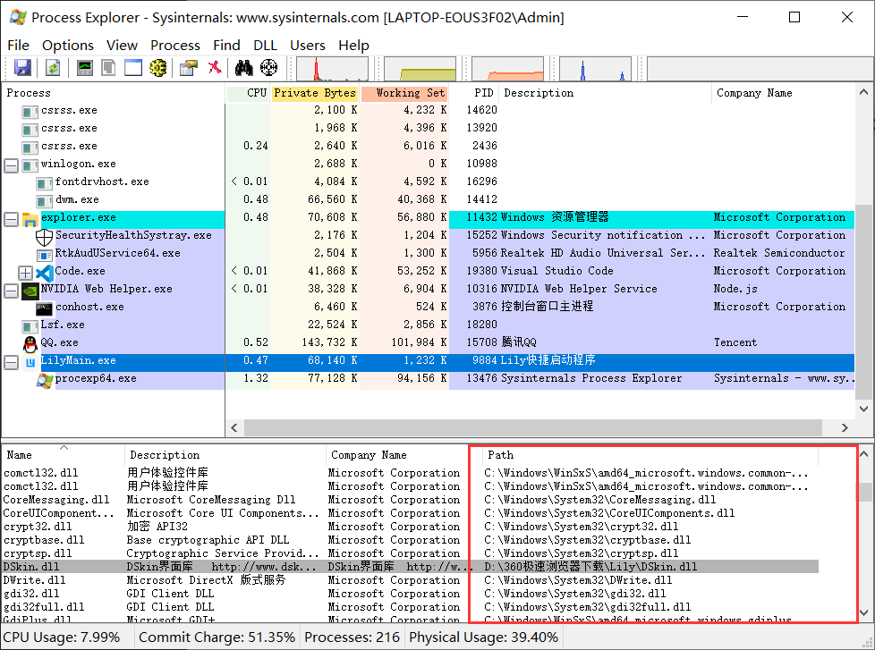
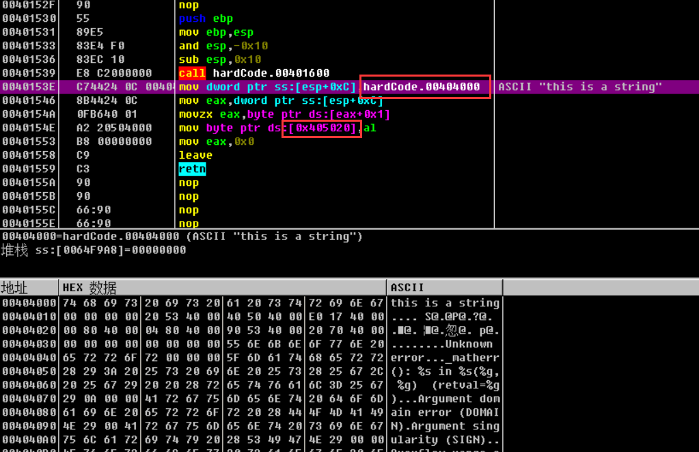
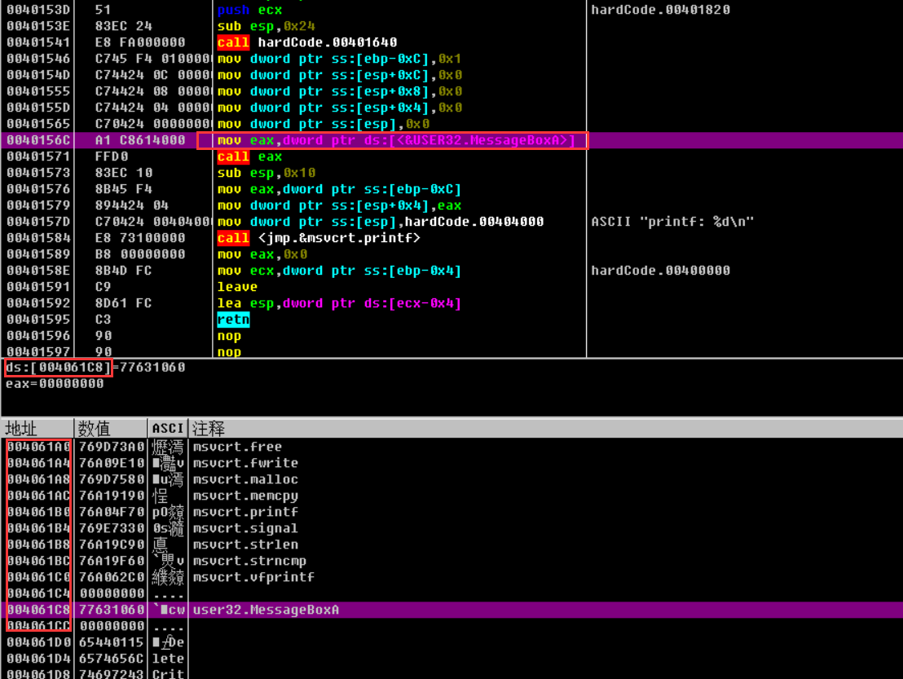

# 受限的代码注入
>**为什么说是受限制的代码注入，因为这种方法的代码注入确实有很多限制，但是比较简单**
**代码注入就是将代码拷贝到目标进程空间，然后在目标进程中创建一个远程线程执行代码**

----------

## 代码注入 vs Dll注入
>**dll注入已经满足了大部分需要，但是也有一些缺点**

**dll注入会留下痕迹**
将dll注入目标进程后，目标进程的模块列表里一定会有你注入的dll，那么安全工作者就可以轻松的发现你的dll
(当然也可以通过一些方法隐藏dll,但是暴力枚举或者从0环还是可以发现)

**代码注入不会留下痕迹**
相比于dll注入，代码注入并没有那么好发现，而且代码注入可以占用更少的内存空间

-------------

## 代码注入的限制
>**其实要注入的代码的限制是显而易见的,因为我们要将自身进程的<u>01机器码</u>拷贝到目标进程，然后在目标进程执行该代码**

### 1. 任何硬编码
比如说:
```C++
char g_var = 0;

void ThreadProc(LPCVOID *arg)
{
    char *str = "this is a string";
    g_var = *(str+1);
}
```
**两个问题: " "形式的字符串和全局变量都是硬编码**
看一下汇编就懂了：


### 2. 任何系统调用
比如说:
```C++
void ThreadProc(LPCVOID *arg)
{   
    int a = 1;
    MessageBoxA(0,0,0,0);
    printf("printf: %d\n", a);
}
```
**因为调用的时候是先找<u>导入表</u>，再call导入表里的内容**
看一下汇编:


----------

## 代码注入的实现
>**即然不能直接调用函数，那就把函数地址和参数当作远程线程函数的参数传进入**

关键代码:
```C++
typedef struct
{
    DWORD dwMsgBoxAddr;
    LPCSTR lpMsgText;
    LPCSTR lpMsgTitle;
}PARAM_THREAD;

// 将ThreadProc复制到目标进程的内存空间
DWORD WINAPI ThreadProc (LPVOID lpParameter)
{
    typedef (WINAPI *pfnMessageBox)(HWND,LPCSTR,LPCSTR,UINT);

    PARAM_THREAD *tParam = (PARAM_THREAD *)lpParameter;
    pfnMessageBox MessageBoxApi = (pfnMessageBox)(tParam->dwMsgBoxAddr);
    MessageBoxApi(0,tParam->lpMsgText,tParam->lpMsgTitle,MB_OK);
    
    return 0;
}
// 在main里:
CreateRemoteThread(hHandle,NULL,0,(LPTHREAD_START_ROUTINE)lpThreadFunc,lpParam,0,NULL);
```

---------------

## 效果
.gif