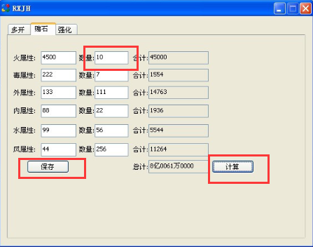

# DirectUI -- duilib
> **duilib是一个开源的directui界面库,可以将用户界面和处理逻辑彻底分离**

+ duilib只是一个C++界面库，而且是纯windows平台的。
+ 因为PC微信的界面就是用duilib(腾讯改版)写的，所以要逆向微信肯定要了解duilib.

---------

## 1. 传统win sdk窗口 和 DirectUI窗口
**正常创建的窗口(win api):**

微软提供一整套界面标准，比如窗口、按钮、滚动条、列表等。对于每一个窗口（控件也是一个窗口），其能响应的消息和行为都有规范（通过API提供给开发者）

主窗口有一个句柄，每一个控件都是子窗口也有一个句柄，全都由操作系统维护

**DirectUI思想:**

DirectUI是一种界面开发思想。其核心思想是指将所有的界面控件都绘制在一个窗口上，这些控件的逻辑和绘制方式都必须自己进行编写和封装，而不是使用Windows的原生控件，所以这些控件都是无句柄的（Windowsless）。

*比如说在主窗口的(0,0)处画一个5,4的长方形，并认为这就是一个按钮，当用户点击这个区域就认为点击了一个按钮*

--------------

## 2. duilib
>**将用户界面和处理逻辑彻底分离**


+ 新建一个类 CMainWnd 继承自 WindowImplBase
WindowImpBase是duilib的窗口类，用于主窗口的创建 和 响应消息事件 
```C++
class CMainWnd : public WindowImplBase
{
public:
    CHelloDuilibWnd(void);
    ~CHelloDuilibWnd(void);

protected:
    virtual CDuiString GetSkinFolder() { return _T ("skin"); };
    virtual CDuiString GetSkinFile()  { return _T ("skin.xml"); };
    virtual LPCTSTR GetWindowClassName(void) const { return _T ("HelloDuilib_Wnd"); };
};
```

+ WinMain函数
CPaintManagerUI成员对象用来管理整个窗口的绘制
```C++
int APIENTRY _tWinMain(HINSTANCE hInstance,
                     HINSTANCE hPrevInstance,
                     LPTSTR    lpCmdLine,
                     int       nCmdShow)

{
    CPaintManagerUI::SetInstance(hInstance);// 加载XML的时候，需要使用该句柄去定位EXE的路径，才能加载XML的路径

    CMainWnd* wnd = new CMainWnd; // 生成对象
    wnd->Create(NULL, NULL, UI_WNDSTYLE_DIALOG, 0); // 创建DLG窗口
    wnd->CenterWindow(); // 窗口居中
    wnd->ShowWindow(); // 显示

    CPaintManagerUI::MessageLoop(); // 消息循环

    delete wnd; // 删除对象

    return 0;
}
```

+ 响应事件
在 CMainWnd 中重载 WindowImplBase::Notify ();
```C++
void CMainWnd::Notify(TNotifyUI& msg)
{
    if (msg.sType == DUI_MSGTYPE_CLICK) // 先判断消息类型，如果是单击
    {
        if (msg.pSender->GetName() == _T ("btnClose")) // 如果控件名为 btnClose
        {
            close(ID_OK)
            PostQuitMessage(0);
            return;
        }
    }
}
```
----------------

## 3. 实例
...