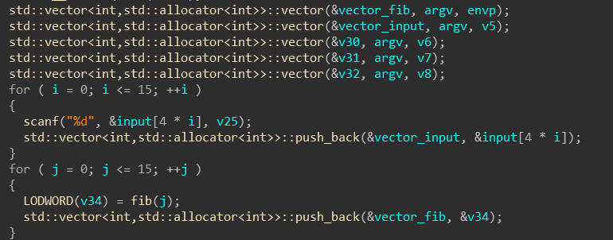
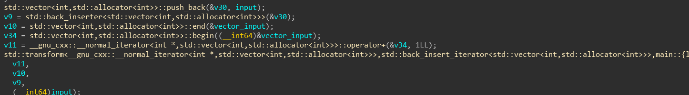
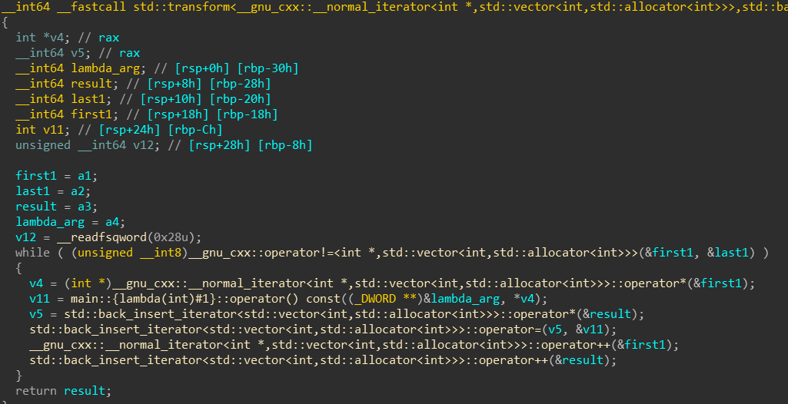
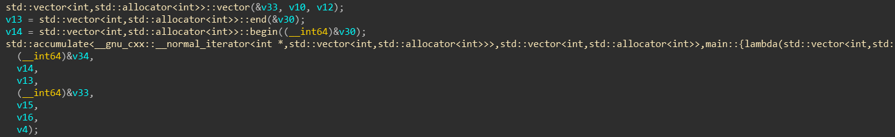

# C++ STL逆向分析
>STL，英文全称 standard template library,其包含有大量的模板类和模板函数,是 C++ 提供的一个基础模板的集合。ST 就是借助模板把常用的数据结构及其算法都实现了一遍,并且做到了数据结构和算法的分离.例如,vector的底层为顺序表,list的底层为双向链表.

**以一道题为例(虽然很简单),但是因为之前接触的C++都没怎么用到STL,所以逆起来还是有很多坑**

## easyCpp

### 第一部分

**简化一下**:
```C++
vector<int> input, fib;

for(i<16){
    input.push_back(输入的第i个);
}

for(i<16){
    //斐波那契函数
    fib.push_back(fib的第i个)；
}
```
### 第二部分

**简化一下**:
```C++
std::vector<int,std::allocator<int>>::push_back(&v30, input);
// 这条语句,一开始我以为是把input整个数组压入v30中,因为传进去的是指针
// 但其实是
v30.push_back(input[0])// 压入第一个
```
写了个简单的样本让ida反编译一下:
```C++
std::vector<int> i(2,1);
char input[3] = {9,8,7};
i.push_back(input[0]);
```
发现反编译结果传的也是指针:
```C++
std::vector<int,std::allocator<int>>::push_back(&i, input);
```

```C++
v9 = std::back_inserter<std::vector<int,std::allocator<int>>>(&v30);
v10 = std::vector<int,std::allocator<int>>::end(&vector_input);
v34 = std::vector<int,std::allocator<int>>::begin((__int64)&vector_input);
v11 = __gnu_cxx::__normal_iterator<int *,std::vector<int,std::allocator<int>>>::operator+(&v34, 1LL);
//->
v9 = back_inserter<int>(v30); // 迭代器 从最后插入
v11 = input.begin() + 1;

std::transform<__gnu_cxx::__normal_iterator<int *,std::vector<int,std::allocator<int>>>,std::back_insert_iterator<std::vector<int,std::allocator<int>>>,main::{lambda(int)#1}>(
    v11,
    v10,
    v9,
    (__int64)input);
// std::transform
template< class InputIt, class OutputIt, class UnaryOperation > 
OutputIt transform( InputIt first1, InputIt last1, OutputIt d_first, UnaryOperation unary_op ) 
{ 
  while (first1 != last1) { 
  *d_first++ = binary_op(*first1++); 
  } 
  return d_first; 
}
//-> 这里我一开始没有看到第四个参数是lambda表达式,以为input是第四个参数op
std::transform(v11, input.end, v9, [](int c, vector<int> input){return input[0] + c;});// input其实是lambda表达式的参数
```
std::transform函数:

其中的lambda表达式其实就是:
```C++
[](int c, vector<int> input){return input[0] + c;}
```
**整个第二部分的作用就是把除第一个输入以外的数,加上第一个输入**

### 第三部分

**简化一下**:
```C++
vector<int> v28;
v21 = std::accumulate(input.begin(), v30.begin(), v30.end(), );
```
**但是,标准的std::accumulate用法是这样的:**
```C++
template <class InputIterator, class T>
T accumulate (InputIterator first, InputIterator last, T init, BinaryOperation binary_op)
{
  while (first!=last) {
    init=binary_op(init,*first++);
  }
  return init;
}
```
**而ida分析出来的是这样的:**

**第一个参数是[out]传出的结果,第二个参数是起始位置,第三个参数是结束位置**
**按照ida的反编译结果分析一遍(也可以动调,可以但没必要)就是:**
```C++
// f->lf->alf->..反转

vector<int> a1;
a1.push_back(a4);
v4 = back_inserter<int>(a1);
std::copy(a3.begin(),a3.end(),v4);
return a1;
```
**整个第三部分的作用就是把第二部分的结果翻转一下**

### 第四部分
```C++
if(v21 != fib){
    puts("Your failed!");
    exit(0);
}

puts("You win!");
printf("Your flag is:flag{%s",input);
puts("}");
```
## 写script
>**所以其实整个流程就是把输入从第[1]个开始加上第[0]个,然后把结果逆序**

所以脚本就呼之欲出了:
```C++
#include <stdio.h>

int fib(int arg)
{
    if (!arg || arg == 1)
	    return 1;
    return fib(arg-1) + fib(arg-2);
}

int main()
{
    unsigned int v34 = 0, fibs[16] = {0,}, refib[16] = {0,};
    for (int j = 0; j <= 15; ++j )
    {
    	v34 = fib(j);
    	//printf("%u\n", v34);
    	fibs[j] = v34;
    }   
    /*
    i >= 1
    input[i] = input[i] + input[0];
    reverse
    */  
    for (int i = 0; i < 16; ++i)
    {
        refib[i] = fibs[15-i];
    }   
    unsigned int flag[16] = {0,};
    flag[0] = refib[0];
    for (int i = 1; i < 16; ++i)
    {
        flag[i] = refib[i] - refib[0];
    }   
    for (int i = 0; i < 16; ++i)
    {
        printf("%d ", flag[i]);
    }
    printf("\n");   
    return 0;
}
```
