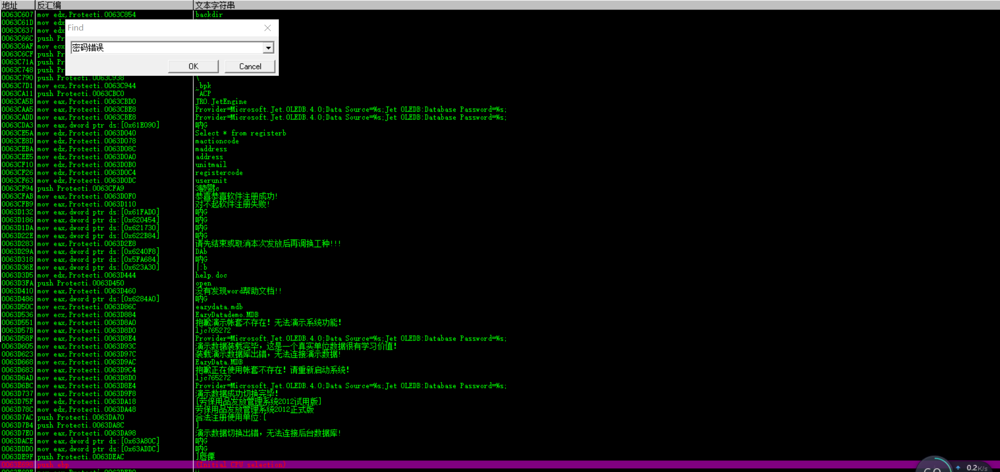
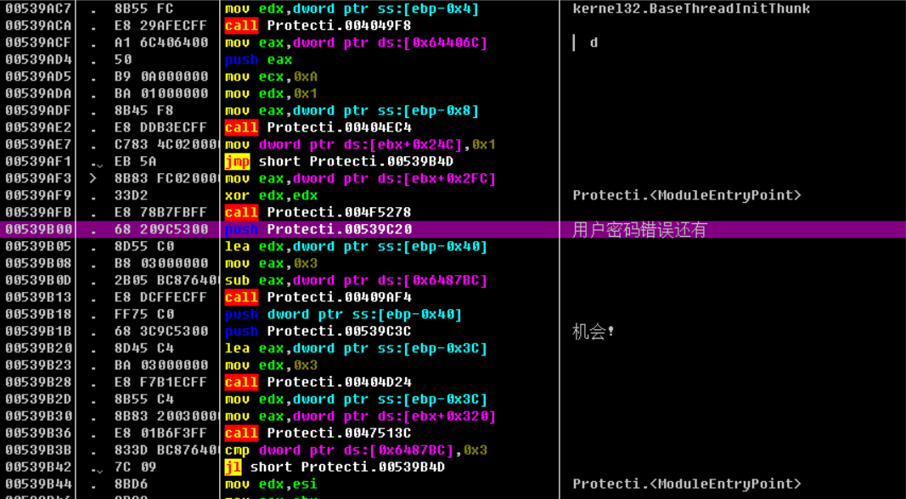
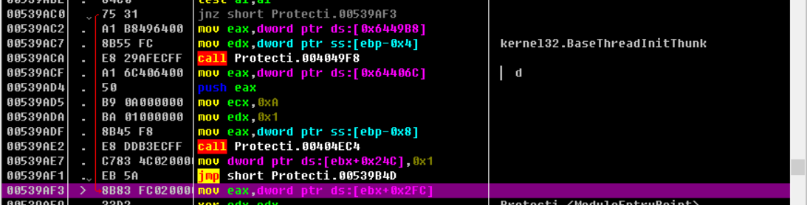
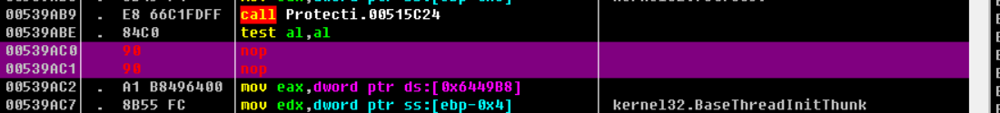

# Nop

## 简述及作用

​	就是通过nop指令的填充（nop指令一个字节），使指令按字对齐，从而减少取指令时的内存访问次数。（一般用来内存地址偶数对齐，比如有一条指令，占3字节，这时候使用nop指令，cpu 就可以从第四个字节处读取指令了。

​	具体应用：1. 跳过一些程序的密码身份验证（把else分支填充掉）

​					   2.去花指令

​	下面举一个跳过登陆验证的实例

## 实例

打开管理系统界面如下：

试几次密码，注意这句话，3次，2次，1次自动退出了

那就拖进OD找这句话吧

右键--中文搜索引擎--智能搜索

Ctrl+F 搜‘’密码错误‘’定位到这里（所以不要整句搜，关键词就行）

（所以不要整句搜，关键词就行）

发现箭头

跟踪到539SC0那里，发现是个else跳转

右键Nop（Binary-filled with nops）填掉就OK了

