# 逆向分析 FSViewer 并写出注册机

**借鉴了看雪 [@深山修行之人](https://bbs.pediy.com/user-857678.htm) 大牛的文章: https://bbs.pediy.com/thread-258428.htm**
<br />
>FastStone有四款产品(FSCapture93/FSMaxView33/FSResizer43/FSViewer75)都十分实用
其中FSViewer是一款老牌的图片管理查看编辑软件, 个人使用免费, 商用收费
本文将逆向分析FSViewer的注册算法并编写注册机

## 1. 准备工作
### 1.1 判断程序语言以及加密情况
用ExeInfo PE查看一下:
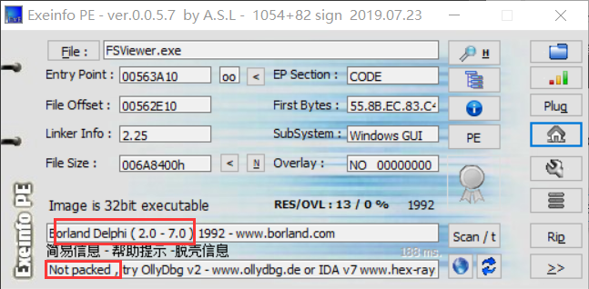
可以看到是32位程序,用Delphi语言编写,未加壳

对于Delphi程序,自然要使用针对delphi的大杀器: [IDR(Interactive Delphi Reconstructor)](https://github.com/crypto2011/IDR)

### 1.2 定位btnRegisterCliced函数
通过IDR找到注册按钮被点击事件:
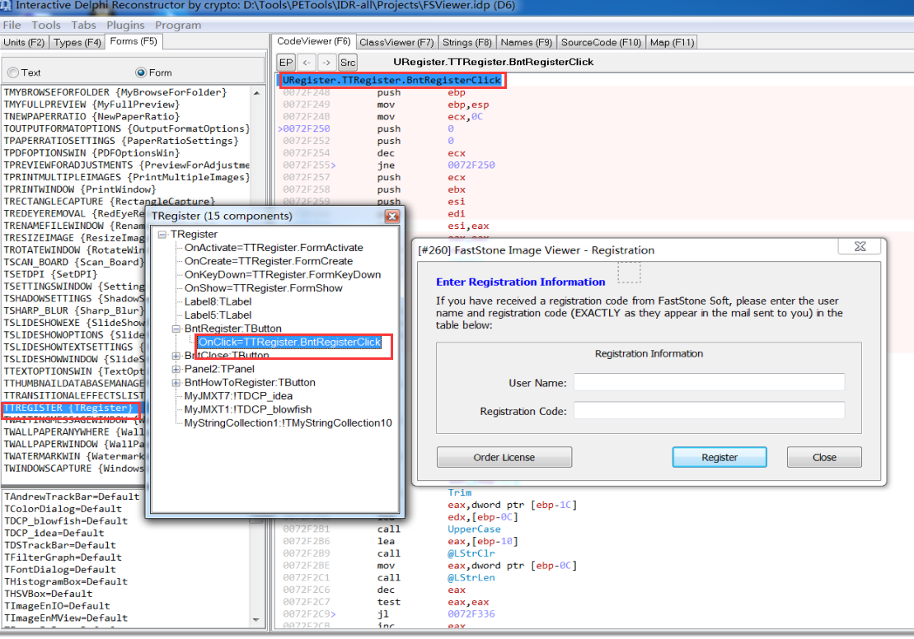

可知: **btnRegisterCliced : 0x72F248**

### 1.3 导出并加载map和idc文件
>虽然IDR可以识别Delphi的大部分函数,但是只有反汇编,如果要看流程图和反编译还是需要ida
而IDR提供了导出map和idc文件的功能,所以用IDR导出map和idc文件分别供调试器和ida使用

跑完idc脚本后ida效果还是可以的(需要4-5分钟)

这里我使用x32dbg加载map文件进行动态调试(OD的LoadMapEx总是崩溃,可以在xp下使用)

----------------------------

## 2. 分析注册流程
>Delphi遵循_fastcall调用约定，但是与Windows的_fastcall略有不同，参数顺序为eax为第一个参数、edx为第二个参数、ecx为第三个参数，大于3个的参数通过堆栈传递，大于三个的堆栈顺序从左到右依次压栈，堆栈由被调用者恢复

整体的注册逻辑流程很简单,而且关键点在验证函数,所以不再赘述,这里贴出我分析出的伪C代码:
```C++
void OnBtnRegisterClicked(void *this)
{
    String userName = Trim(TControl_GetText(edit)); // [ebp-0x18]->[ebp-0x4]
    String regiCode = Trim(TControl_GetText(edit)); // [ebp-0x20]->[ebp-0x1C]
    String upperCode = upperCase(regiCode); // [ebp-0xC]
    String trueCode = NULL; // [ebp-0x10]

    if((LStrLen(upperCode)-1) >= 0)
    {
        int len = LStrLen(upperCode); // [ebp-0x14]

        for(int i = 0; i < len; i++)
    	{
    	    if (upperCode[i] >= 0x41 && upperCode[i] <= 0x5A) // in [A,Z]
            {
                String toCat = NULL; // [ebp-0x24]
                LStrFromChar(toCat, upperCode[i]);
                LStrCat(trueCode, toCat);
    	    }
    	    if (LStrLen(trueCode) == 5 || 11 || 17)
                LStrCat(trueCode, "-");
        }
    }

    String cpTrueCode = NULL; // [ebp-0x8]
    LStrLAsg(cpTrueCode, trueCode); // StrCopy
    /*
    userName = Viking
    trueCode = ABCDE-FGHIJ-KLMNO-PQRST
    */
    if (userName != NULL)
    {
        if ((sub_72E770(this, userName, cpTrueCode, 0) && 
            sub_72EBFC(this, userName, cpTrueCode, 0)) 
                ||
            (sub_72E770(this, userName, cpTrueCode, 1) &&
            sub_72EBFC(this, userName, cpTrueCode, 1))) 
        {
    	    int res = GetLicenseType(cpTrueCode); // sub_72F030
    	    if (res > 1)
    	    {
    	        if (res == 4999)
                    MessageBox("Corporate Site");
                else if (res >= 5000)
                    MessageBox("Corporate Worldwide");
                else
                    MessageBox("Multiple User");
            }
            else
                MessageBox("Singel User");
        }
        else 
            MessageBox("无效用户名或注册码");
    }
    else
        MessageBox("用户名为空");
    
    return 0;
}
```
**总体流程就是**:
注册码为20个字母, xxxxx-xxxxx-xxxxx-xxxxx五个一组, 只有纯字母
将用户名和注册码传入sub_72E770和sub_72EBFC这两个验证函数
只要sub_verify1(..., 0) && sub_verify2(..., 0)
或者sub_verify1(..., 1) && sub_verify2(..., 1)有一个分支成立即可

----------------------

## 3. 分析验证函数sub_72E770,sub_72EBFC
>以userName = Viking
registerCode = ABCDE-FGHIJ-KLMNO-PQRST作为输入

### 3.1 验证函数sub_72E770(...)
用x32dbg步进sub_72E770:一开始会将userName和registerCode都转为大写
通过动态调试可知,一开始会将注册码中的'-'去掉:
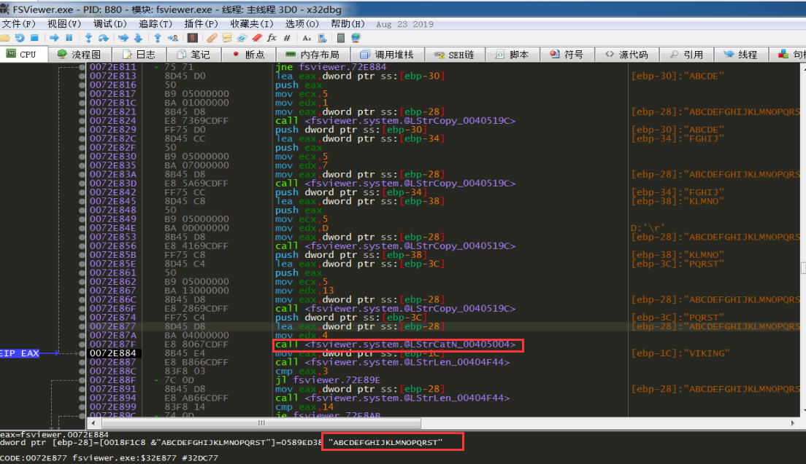
此后会进行某种循环,通过动调和ida静态分析可知:
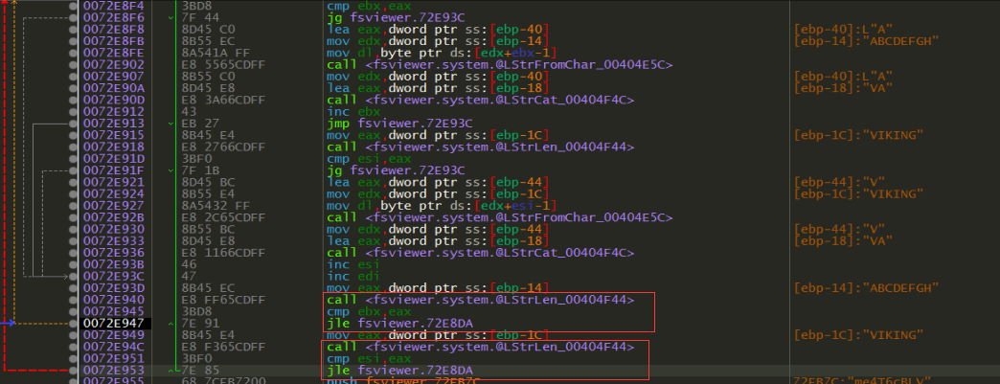
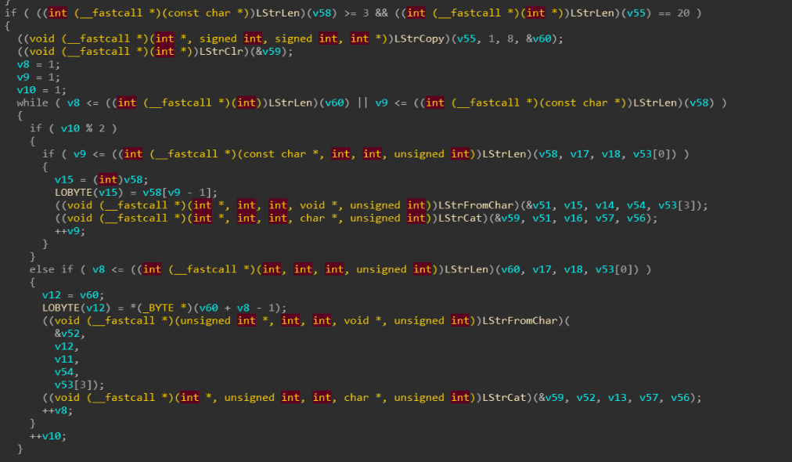
👆此循环是将userName和registerCode的前8位交叉混合起来
具体逻辑是:(userName[i])占偶数位,(Code前8位[i])占奇数位,超出8位的字符直接补到后面
本例输入在交叉后的字符串即:VAIBKCIDNEGFGH

之后将注册码前8位和内置的两个字符串拼接起来,作为某种加密函数sub_71FB90的参数:
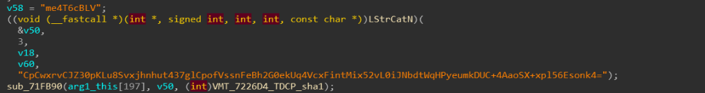
之后有个一判断分支,判断第三个参arg3是0还是1, 并且也调用了sub_71FB90函数:
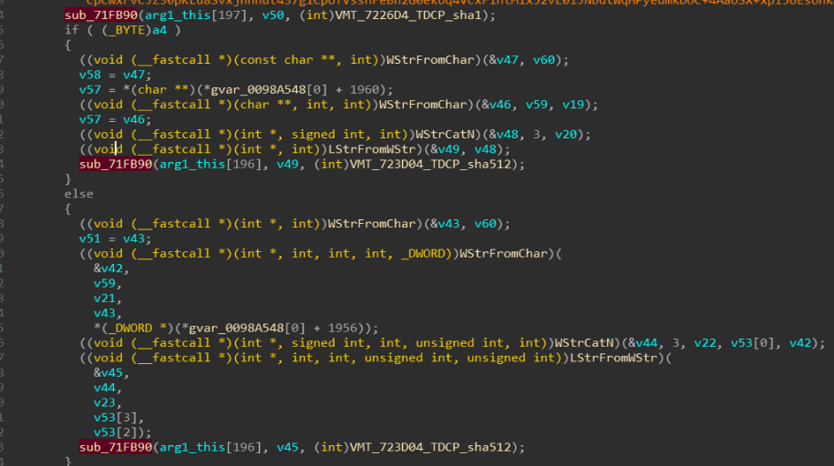
(这里贴出伪C代码):
```C++
if (flag)
{
    //0x72E99C
    String toCat[2] = {0,}; // [ebp-0x54,0x58]
    WStrFromLStr(toCat[0], cp8Code);
    WStrFromLStr(toCat[1], n8Str, "96888", toCat[0]);
    String cp8N8Str = NULL; // [ebp-0x50]
    WStrCatN(cp8N8Str, 3, toCat[1]);
    String cp8N8Str1 = NULL; // [ebp-0x4C]
    LStrFromWStr(cp8N8Str1, cp8N8Str);
    DCPcrypt2.encrypt(VMT_723D04_TDCP_sha512, cp8N8Str1);// 0x71FB90
}
else
{
    String toCat[2] = {0,}; // [ebp-0x64,0x68]
    WStrFromLStr(toCat[0], cp8Code);
    WStrFromLStr(toCat[1], n8Str, "96332", toCat[0]); // ??
    String cp8N8Str = NULL; // [ebp-0x60]
    WStrCatN(cp8N8Str, 3, toCat[1]);
    // result: cp8N8Str = cp8Code+96332+n8Str
    // ABCDEFGH96332VAIBKCIDNEGFGH
    String cp8N8Str1 = NULL; // [ebp-0x5C]
    LStrFromWStr(cp8N8Str1, cp8N8Str);
    DCPcrypt2.encrypt(VMT_723D04_TDCP_sha512, cp8N8Str1);// 0x71FB90
}
```
👆这一块是将注册码前8个字符+96332+交叉字符串拼接起来并作为sub_71FB90函数的参数

再之后(伪代码和汇编可能有些出入,因为我是按整体逻辑写的,逻辑是正确的)
```C++
String encodeStr1 = NULL; // [ebp-0x20]
DCPcrypt2.sub_71FEB4(Base64, n8Str, encodeStr1);
// mzvoPqb8etggqNJ9TqI=
String encodeStr2 = NULL; // [ebp-0x6C]
DCPcrypt2.sub_71FEB4(Base64, encodeStr1, encodeStr2);
// 4hQ99VfA1SHNNrjvHQv78MSew2Q=
LStrLAsg(encodeStr1, encodeStr2); // copy
```
进行两次加密,且输出都是base64
最后就是进行判断了:**从加密字符串里取前八个大写字母和输入的注册码的第9-16个字符比较**
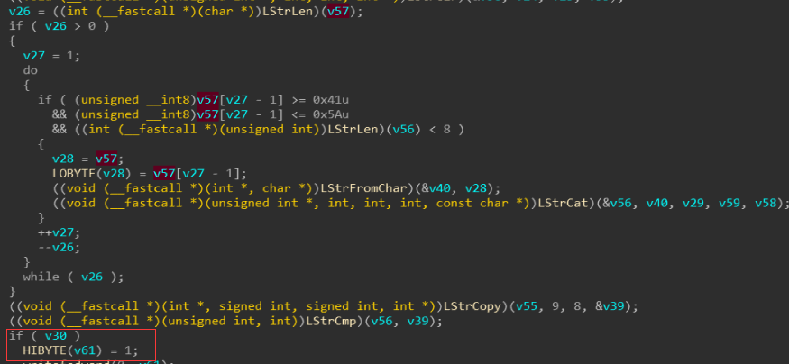
如果相等则返回TRUE,不相等则返回FALSE
那么**关键点**就在于sub_71FB90和sub_71FEB4这两个函数.

#### 3.1.1 分析sub_71FB90函数
可以看到idr将此函数识别为DCPcrypt2模块的函数
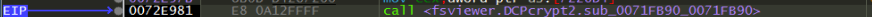
猜测sub_71FB90和sub_71FEB4这两个函数都是某种密码学算法
可以用插件识别一下程序中的密码学算法有哪些:
```C++
BASE64 table :: 0058677C :: 00987B7C
BLOWFISH [sbox] :: 005810C8 :: 009824C8
SHA1 [Compress] :: 003228C5 :: 007234C5
SHA-512 [init] :: 0032D559 :: 0072E159
IDEA
```
跟进sub_71FB90函数可以发现一些很明显的特征:
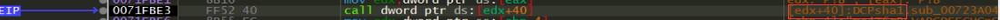
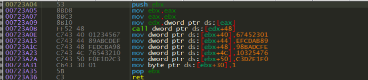
👆此处是在初始化sha1的链接变量
sub_71FA88将拼接字符串作为输入,判断出是sha1摘要
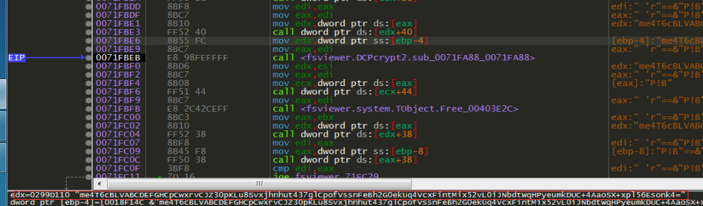
此处进行最终sha1
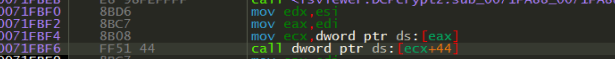
根据x32dbg提示可知此函数是一个分组加密函数:
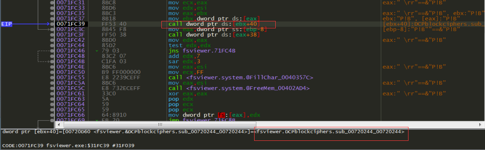
跟进去可以发现是blowfish初始化s,p_box:
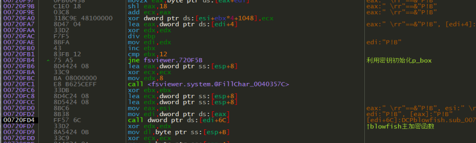
**注意:初始化完后,又调用了一次bf主加密函数,参数为8个0:**


总体流程即:用拼接字符串的sha1 hash值作为密钥初始化blowfish的s,p_box,再调用bf主加密函数加密8个0
伪C代码:
```C++
// ebx = arg1, [ebp-4] = arg2, [ebp-8] = arg3 
void sub_0071FB90(void *arg1, String encodeStr, void *vtable)
{
    if (arg1[48])
        DCPblowfish.sub_7210D0(arg1, *arg); // init 
    int ret = 0;
    if ( (ret = DCPsha1.sub_723928()) < 0) // 恒为160
    	ret += 7;
    ret = ret >> 3; // 算数右移 = 20
    BYTE *shaMem = GetMem(ret); // malloc // esi
    TComponent.Create(1, arg1);
    DCPsha1.initABCDE(shaMem); //sub_723A04();初始化链接变量ABCDE
    // 进行sha1
    DCPcrypt2.sub_71FA88(shaMem, encodeStr);//->DCPsha1.sub_723A7   (encodeStr);
    DCPsha1.sub_723B24(shaMem);// 最终sha1,结果在mem
    TObject.Free(...);
    ret = DCPblowfish.sub_720E28(); // 恒为448
    ret1 = DCPsha1.sub_723928(); // 恒为160
    if (ret < ret1) // 恒不会进入的分支
    {
    	...
    }
    DCPblockcipher.sub_720244(arg1, shaMen, 160);// 初始化p,s_box
    Bf_fn();
}
```
同样的,在if分支里调用的sub_71FB90函数和上面的流程一样,但是传入的虚表变了,是用sha512 hash值作为密钥初始化idea算法

#### 3.1.2 分析sub_71FEB4函数
将交叉码作为参数输入
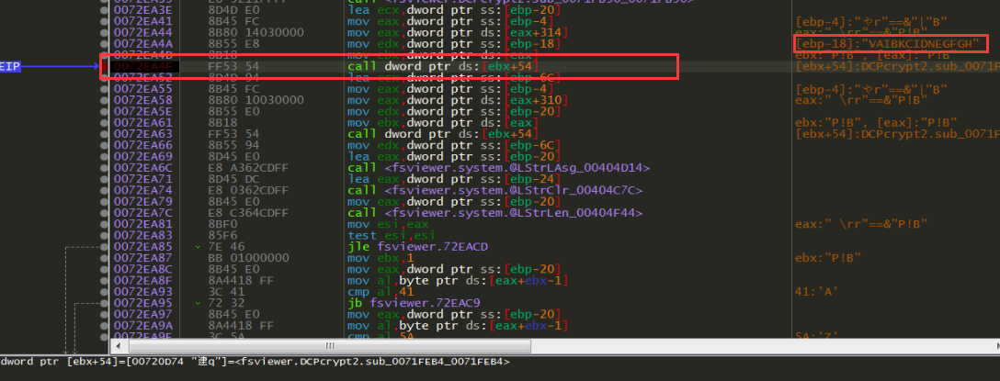
函数体内就两个关键函数:一个加密函数,一个base64函数

跟进加密函数:发现blowfish加密主函数
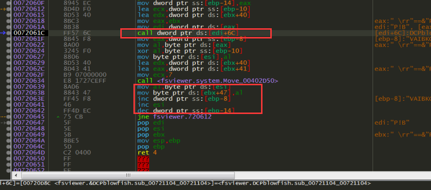
👆循环处理明文,将加密data(8个0)后的首个字节与明文第[i]个异或,然后将data向左移动1个字节,将异或结果补到最后作为下次bf加密输入
伪C代码:
```C++
0x71FEFE| call dword ptr ds:[esi+7C] | [esi+7C]:DCPblockciphers.sub_007205D8_007205D8
arg1@eax = this/vtable , arg2@edx = "VA.."待异或字符串 , arg3 = 0xA6FDB18 结果输出
{
    // [ebp-4] = arg3@ecx
    // [ebp-8] = arg2@edx

    for (int i = 0; i < len(arg2); ++i)
    {
        BYTE *ret = ...;
        BYTE var[8] = {全0数据加密后的8bytes};
        DCPblowfish.sub_721104(this, var, result);
        BYTE tmp = result[0]^arg2[i];   
        ret[i] = tmp;       
        move(var[0], var[1], 7);
        var[7] = tmp;
    }
}
```
最后将结果result进行base64编码输出
同样的,之后调用的sub_71FB90函数和上面的流程一样,传入的待异或字符串是上次的base64字符串,并且是调用的idea算法加密
整体流程伪C代码:
```C++
String encodeStr1 = NULL; // [ebp-0x20]
DCPcrypt2.sub_71FEB4(Base64, n8Str, encodeStr1);// blowfis+xor+base64
// mzvoPqb8etggqNJ9TqI=
String encodeStr2 = NULL; // [ebp-0x6C]
DCPcrypt2.sub_71FEB4(Base64, encodeStr1, encodeStr2);// ide+xor+base64
// 4hQ99VfA1SHNNrjvHQv78MSew2Q=
LStrLAsg(encodeStr1, encodeStr2); // copy
```

### 3.2 验证函数sub_72EBFC(...)
sub_72EBFC与sub_72E770非常相似:
```C++
//int func@<eax> (String @<edx>, String @<ecx>, int @<stack>)
int sub_72EBFC(String userName, String trueCode, int flag)
{
    /*
    [ebp-0x4] = this
    [ebp-0x8] = userName
    [ebp-0xC] = trueCode
    */
    LStrAddRef(userName); 
    LStrAddRef(trueCode); // 增加字符串引用计数

    ....
    //与第一种加密函数相同
    ....

    //sha512摘要作为密钥初始化blowfish
    DCPcrypt2.encrypt(VMT_sha512, "0923284924839834...", vtable);// 0x71FB90 
    if (flag)
    {
        // 0x72EDD7
    	String code = 拼接注册码前8个字符+96888+交替码
    	DCPcrypt2.encrypt(VMT_sha1, code);// 0x71FB90
    }
    else
    {
    	// 0x72EE31
    	String code = 拼接注册码前8个字符+96332+交替码
    	DCPcrypt2.encrypt(VMT_sha1, code);// 0x71FB90
    	// sha1摘要作为密钥初始化idea   
    }// 与第一种相同    
    String ecode = name & code 交错;
    int count = regiCode[0] - 0x32;
    if (cout >= 0)
    {
    	cout += 1;
    	for (int i = 0; i < count; ++i)
    	{
    	    DCPcrypt2.sub_71FEB4(this, ecode, resIdea);// idea+xor+base64
    	}
    }   
    DCPcrypt2.sub_71FEB4(this, resIdea, resBlfh);// blowfish+xor+base64 
    String final4code = 从resBlfh里取前4个大写字母
    String codeCmpStr = NULL; // [ebp-0x74]
    LStrCopy(tuTrueCode, 17, 4, codeCmpStr); //(最后四个字符) QRST
    if (!LStrCmp(final4code, codeCmpStr)) // 相等
    	return 1;
    else
    	return 0;
}
```
此处的加密方式变成了sha512初始化blowfish,sha1初始化idea,并用注册码[0]-0x32作为循环次数,循环进行idea加密
最后进行判断:**从加密字符串里取前四个大写字母和输入的注册码的第17-20个字符(最后四个)比较**
如果相等则返回TRUE,不相等则返回FALSE

---------------------

## 4. 获取注册类型
> 当验证函数通过后就会调用sub_72F030函数获取注册类型

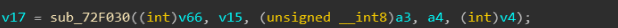
伪C代码:
```C++
int sub_72F030(this, cpTrueCode)
{
    /*
    [ebp-4] = arg2
    */
    String regiCode = cpTrueCode; // [ebp-4]
    regiCode = Trim(UpperCase(trueCode)); // [ebp-0x4]->[ebp-0x14]- [ebp-0x10]   
    if (LStrLen(regiCode) == 23)
    {
    	regiCode = regiCode去掉横线; // [ebp-0x10]
    }   
    if (LStrLen(regiCode) == 20)
    {
        /*
        String toCat[] = {0,}; // [ebp-0x2C]
        LStrCopy(regiCode, 4, 1, toCat[0]);
        IntToStr(toCat[0]-0x4D, result);
        */
        取注册码的第4、8、6、2位的字符
        得到[3]-77,[7]-68,[5]-73,[1]-79拼接而成的字符串
        return 将字符串转为int;
    }
}
```
注册类型见 2. 分析注册流程 伪代码部分

---------------

## 5. 写注册机
>至此流程分析完毕,注册机按注册流程写一遍就出来了,详细代码请见附件

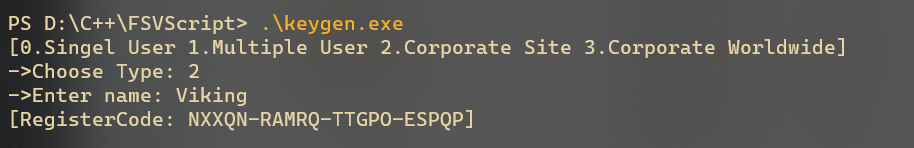
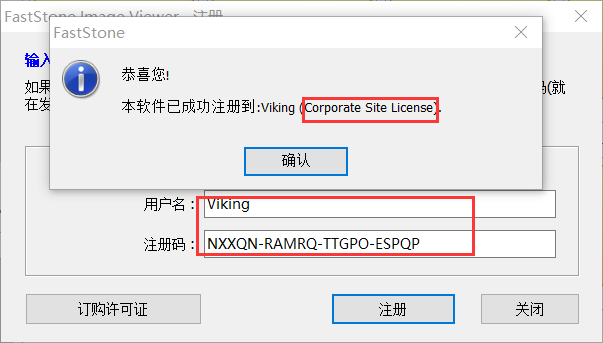

