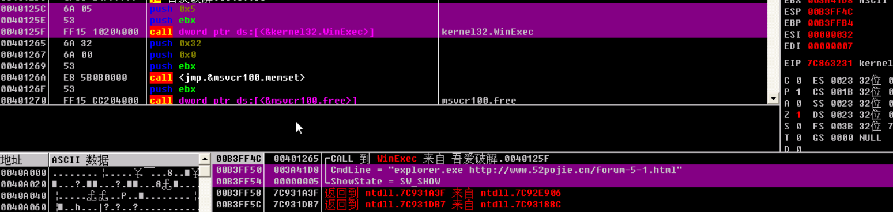
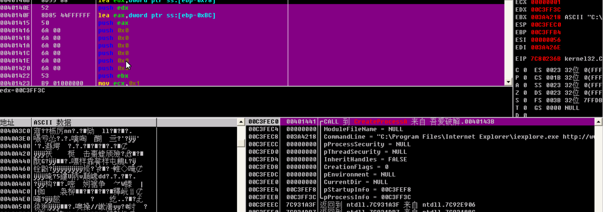
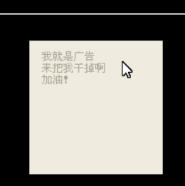
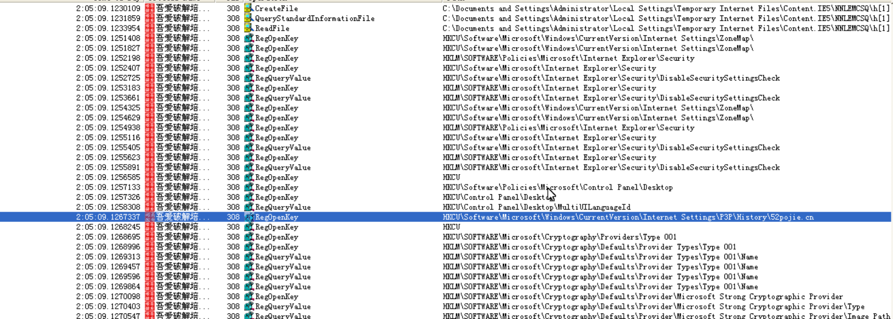

# 一些恶意软件弹窗处理

这是一个悲伤的故事，，，

分享会要讲花指令在网上找例子，想下载MSLRH作为实例，结果（毫无安全意识地）在某下载网站上抱着侥幸心理下载。。。

经过网络搜索学习和分析，这些应该是绑在下载软件（本地软件）里头的，卸载就行。万一需要使用软件，可以以下方法去掉弹窗。

可以把他们分成3类，弹网页，消息框和注册表

主要是对一些winapi调用的学习

## 弹网页

### 1.未加密

winhex或cm32直接搜网址字符串，全部00填充


### 2.加密

搜不到的话开OD, 利用调用名定位然后nop（一个个试）

弹网页的api调用：

###### 1.ShellExecuteA/W

```
ShellExecuteA/W

_In_opt_ HWND hwnd,

        _In_opt_ LPCSTR lpOperation, //操作

        _In_ LPCSTR lpFile,         //打开的文件

        _In_opt_ LPCSTR lpParameters,

        _In_opt_ LPCSTR lpDirectory,

        _In_ INT nShowCmd      //显示模式

    ShellExecuteA(0, "open", "mspaint", 0, 0, 1);
```

###### 2.WinExec

WinExec主要运行EXE文件，不能运行其他类型的文件。不用引用特别单元

###### 3.CreateProcessA/W

WIN32API函数CreateProcess用来创建一个新的进程和它的主线程，这个新进程运行指定的可执行文件

具体方法是ctrl+G-找到上面的然后下断点-堆栈窗口回车

然后右键保存为可执行文件就OK了




## 消息框

###### MessageBoxA/W

```
MessageBoxA PROTO,
    hWnd:DWORD,                   ;窗口句柄（可以为空）
    lpText:PTR BYTE,                 ;字符串，对话框内
    lpCaption:PTR BYTE,           ;字符串，对话框标题
    uType:DWORD                   ;内容和行为
```

所以一定是**4**句push

**字符串搜索**或API搜，和上面一样

像右下角那种框框



可以搜

###### CreateWindowExA/w

创建一个窗口

###### DialogBoxParamA/W

DialogBox是一个Windows API函数。它的作用是从一个对话框资源中创建一个模态对话框。该函数直到指定的回调函数通过调用EndDialog函数中止模态的对话框才能返回控制。该函数通过调用DialogBoxParam函数来实现。

## 注册表

1.RegCreateKeyExA/W
2.RegOpenKeyExA/W
3.RegDeleteKeyExA/W

原理类似上面的

还可以利用process monitor



另还有CreateThread：

创建一个在调用进程的虚拟地址空间内执行的线程。