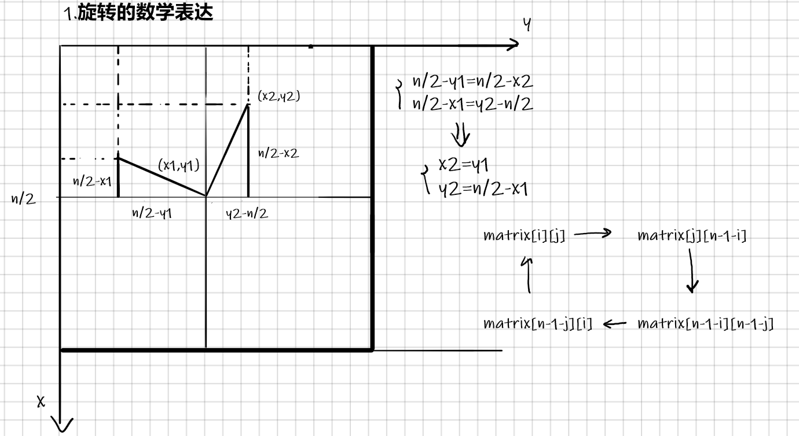
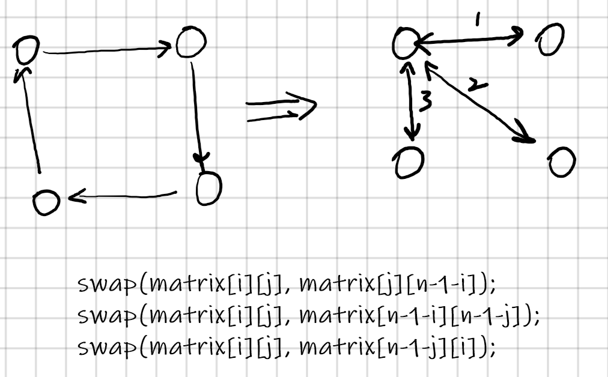
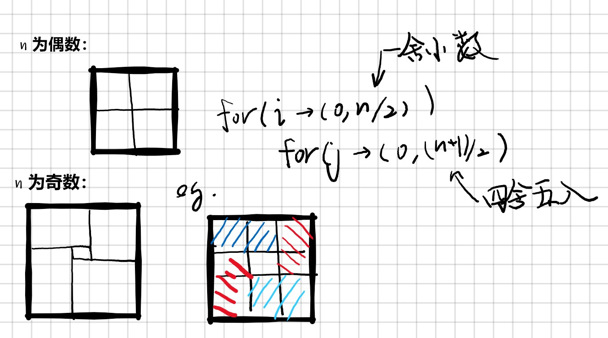
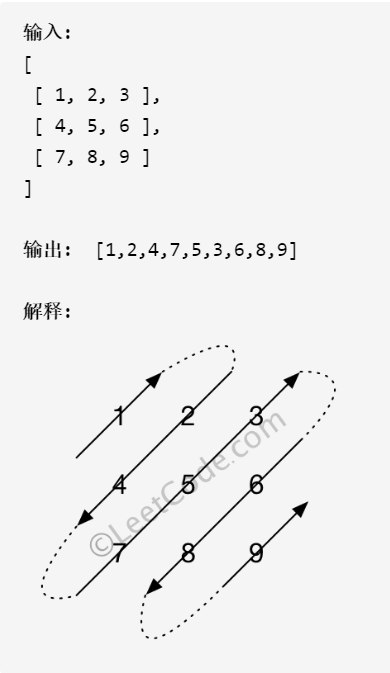

---
考察编程功底和数学推理能力。
---

# 一、逆时针旋转

先看看顺时针怎么旋转.

## 1.旋转的数学表达



> 千万注意 x, y !!!

## 2.交换方法



## 3. “第一象限”分奇偶数



```cpp
void rotate(vector<vector<int>> &matrix) {
    int n = matrix.size();
    if (n == 0)
        return;
    for (int i = 0; i < n / 2; i++) {
        for (int j = 0; j < (n + 1) / 2; j++) {
            swap(matrix[i][j], matrix[j][n-1-i]);
            swap(matrix[i][j], matrix[n-1-i][n-1-j]);
            swap(matrix[i][j], matrix[n-1-j][i]);
        }
    }
}
```

## 4. 逆时针旋转


顺时针：
$$
\begin{cases}
x_2 = y_1 \\
y_2 = n - x_1 \\

\end{cases}

\Rightarrow

\begin{cases}
swap(matrix[i][j], matrix[j][n-1-i]);\\
swap(matrix[i][j], matrix[n-1-i][n-1-j]);\\
swap(matrix[i][j], matrix[n-1-j][i]);
\end{cases}
$$
逆时针：
$$
\begin{cases}
x_1 = n - y_2 \\
y_1 = x_2
\end{cases}

\Rightarrow

\begin{cases}
swap(matrix[i][j], matrix[n - 1 - j][i]);\\
swap(matrix[i][j], matrix[n - 1 - i][n - 1 - j]);\\
swap(matrix[i][j]], matrix[j][n - 1 - i]);
\end{cases}
$$

```cpp
void rotate(vector<vector<int>> &matrix) {
    int n = matrix.size();
    if (n == 0)
        return;
    for (int i = 0; i < n / 2; i++) {
        for (int j = 0; j < (n + 1) / 2; j++) {
            swap(matrix[i][j], matrix[j][n-1-i]);
            swap(matrix[i][j], matrix[n-1-i][n-1-j]);
            swap(matrix[i][j], matrix[n-1-j][i]);
        }
    }
}
```

---

# 二、对角线遍历



```cpp
vector<int> findDiagonalOrder(vector<vector<int>> &matrix) {
    int flag = 1, i = 0, j = 0;

    vector<int> ans;
    // 1. special
    int n = matrix.size();
    if (n == 0)	return ans;
    int m = matrix[0].size();
    if (m == 0)	return ans;
    if (n == 1 && m == 1) {
        ans.push_back(matrix[0][0]);
        return ans;
    }
    // 2. traverse
    while (1) {
        if (flag) {
            while (i >= 0 && j < m) {
                ans.push_back(matrix[i--][j++]);
            }
            if (i == n - 2 && j == m)
                break;
            if (j == m) {
                i++;
                j--;
            }
            i++;
            flag = 0;
        } else {
            while (j >= 0 && i < n) {
                ans.push_back(matrix[i++][j--]);
            }
            if (i == n && j == m - 2)
                break;
            if (i == n) {
                i--;
                j++;
            }
            j++;
            flag = 1;
        }
    }
    return ans;
}
```

