# 逆向分析010editor

>010editor的注册算法比较简单,作者也没有进行防破解的任何操作,甚至可以直接用IDA静态分析出算法

分析的是最新版的64位便携版(010EditorWin64Portable10.0.2.exe)

注册机、伪造server和patch代码见附件

---------------

## 1. 准备工作
* 首先x64的传参方式是从第一个参数开始按 rcx rdx r8 r9 依次传参,超过的用栈传参
* 通过字符串可以定位到On_BtnCheckLicense_Clicked按钮事件位于0x1401CF170(这里是相对于ImageBase因为程序有ASLR)
* 修改PE头关闭aslr便于动态调试

----------------

## 2. 分析Check License按钮事件
>对于Qt程序,IDA的反编译效果非常好,虽然会有一些细小的反编译错误,但是不影响整体逻辑

一开始是判断Name是否为空,PassWord是否输入完整:
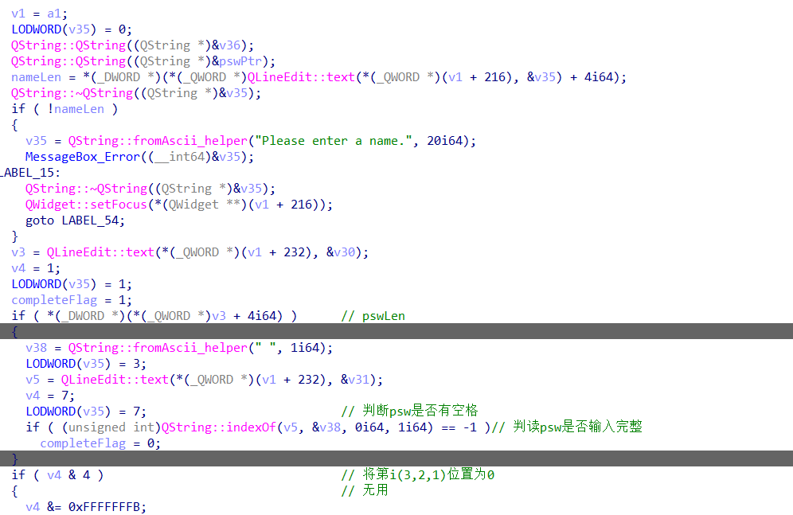
通过动态调试可以发现\*((QString*)var + 4)是字符串长度:
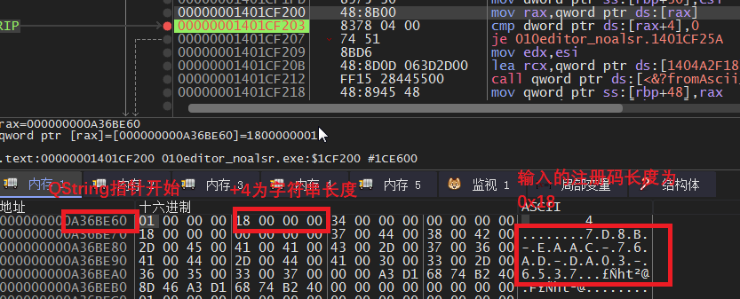

之后会对输入的Name和PassWord进行一些判断和替换:


clearQuot函数是除去输入的Name中的引号,并赋值给arg1+8:
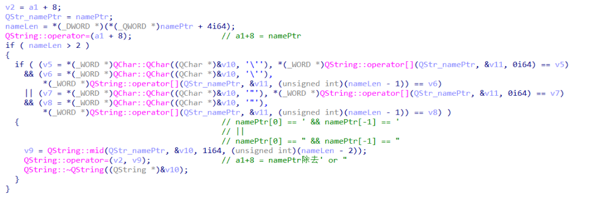
repalceOol函数是将PassWord中的O和o替换为0,l替换为1并赋值给arg1+16:
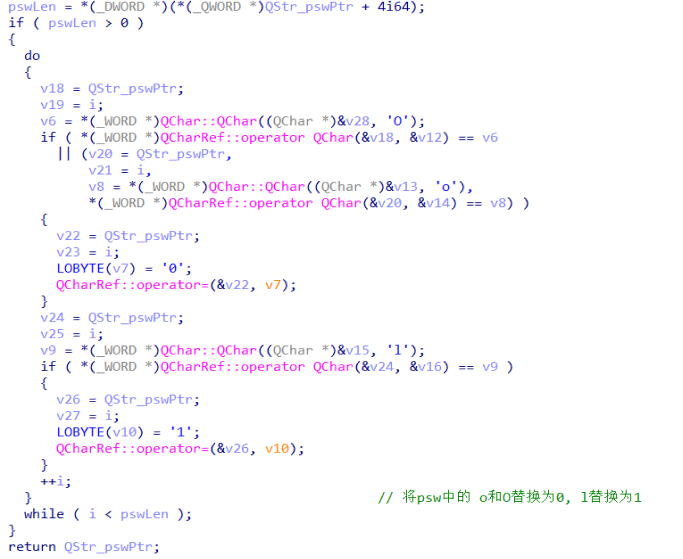

那么关键在于这个arg1,也就是qword_1406F01F8肯定是个**结构体**
这是分析后的结构体命名为**stKey**:
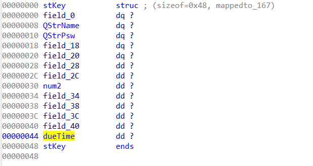

然后就是最关键的**验证函数**了:
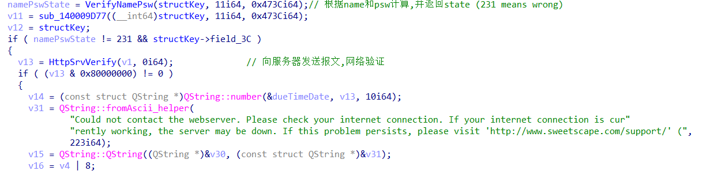

### 2.1 注册算法验证函数VerifyNamePsw

一开始会将**PassWord转成10组16进制数**,比如 ABCD-1234-...
会转成 0xAB,0xCD,0x12,0x34...:暂且命名为数组**str2Hex[]**
并会对一些禁止掉的Name和PassWord进行判断
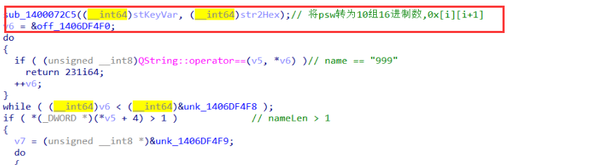

**注册算法**在之后的switch语句里,通过IDA可以看到返回值有231,78和45

231是验证失败,通过对验证函数之后函数的分析:
v11 == 219则弹出成功MessageBox,v11是sub_140009D77的返回值
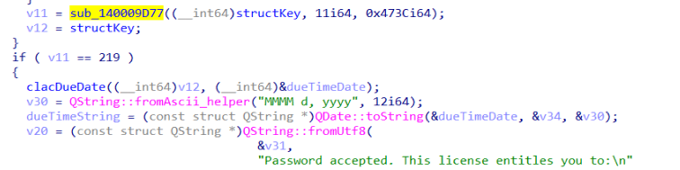
sub_140009D77:又调用了v6 = VerifyNamePsw(), v6为45则返回219
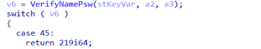

所以注册算法一定要返回45,而switch判断str2Hex[3] (psw转为16进制数的数组)，
str2Hex[3] 只能= 0x9C || 0xFC || 0xAC
case 0x9C or case 0xAC 都可以return 45, 但是0x9C这条分支没有对到期时间(stKey->dueTime)赋值,**所以要分析case 0xAC**.
这里贴出我分析的伪C代码:
```C++
case 0xAC:
    stKey->field_2C = 2;
    vNum2 = ((hex7^hex1)<<8) + (hex5^hex2);
    vNum2 = ((vNum2^0x7892) + 0x4D30) ^ 0x3421;
    vNum2 = vNum2 % 0xB != 0 ? 0 : vNum2/0xB; //必须>0
    stKey->field_30 = vNum2;
    if (vNum2 - 1 <= 0x3E7)
    {
    	vNum1 = ((hex5^hex9)<<16) + ((hex8^hex4)<<8) + (hex6^hex0);
    	vNum1 = (((vNum1^0x5B8C27^0x22C078)-0x2C175)^0xFFE53167) & 0xFFFFFF;
    	vNum1 = vNum1 % 0x11 !=  0 ? 0 : v2/0x11; //必须>0
    	stKey->dueTime = vNum1; 
    	cmpValue = sub_140006901(nameChar, 1, vNum1, vNum2);    
    	if (str2Hex[4..7] == cmpValue[0..3])
    	{
    		if (vNum1 < 0x473C)
    		{
    		    return 78;//wrong;
    		}
    		return 45;	 
    	}
    }
    break;


uint sub_140006901(a1,a2,vNum1,vNum2)
{
    datas[] = {..}; //dword_1406DF020 共308个,可以用LazyIDA插件导出
    int j = 15*vNum2, k = 0, m = 17*vNum1;
    int ret = 0;
    for (int i = 0; i < nameLen; ++i)
    {
    	up = toupper(nameChar[i]);  
    	ret = datas[j] + datas[m] + datas[k] + datas[up+47]*((ret+datas[up]) ^ datas[up+13]);   
    	j += 13;
    	m += 9;
    	k += 19;
    }
    return ret;
}
```
----------------

## 3. 逆推注册算法写注册机

vNum2必须整除0xB, vNum1必须整除0x11, 并把vNum1和vNum2作为参数传进sub_140006901和name一起计算一个32位数, 然后str2Hex的第4到7位等于这个数(BYTE)的0到3位
那么可以随机选取vNum1和vNum2, 通过sub_140006901计算出str2Hex的4到7位, 然后xor是可逆的,所以就可以生成剩下的5位16进制数。
关于到期时间的计算是通过stKey->dueTime*86400作为localtime函数的参数算出到期时间,stKey->dueTime被赋值为伪代码中的vNum1

---------------

## 4. 去掉网络验证(V2)
>因为一开始用插件查了一下程序用到的密码学算法,有CRC32和MD5,所以以为会有线程在进行完整性校验,就没有直接patch程序

### 4.1 抓包http
通过抓包可以发现,程序会发送一个get请求,返回的内容是 invalid
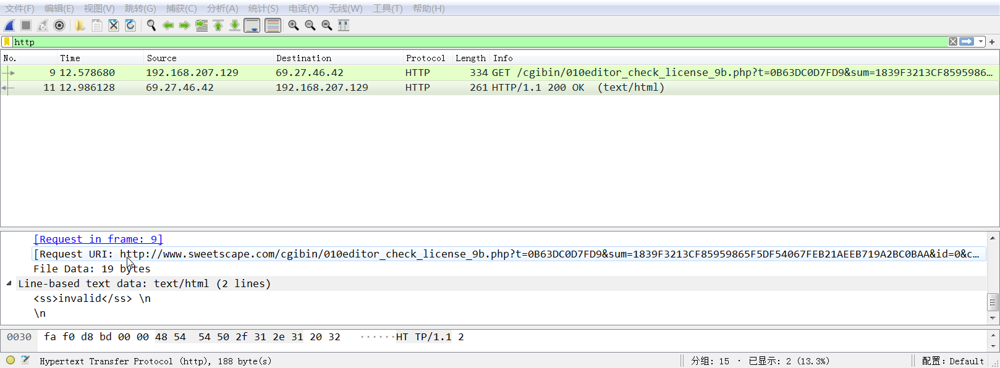
那么可以修改host, 并伪造一个http_server,**关键在于正确返回的数据应该是什么形式**

### 4.2 定位发送接收数据函数
再次分析HttpSrvVerify函数: 通过动态调试可以发现部分函数功能
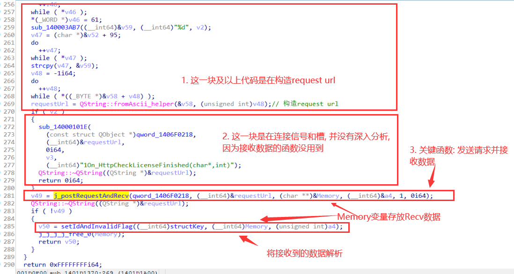
在postRequestAndRecv函数里,下图部分代码用于接收数据:
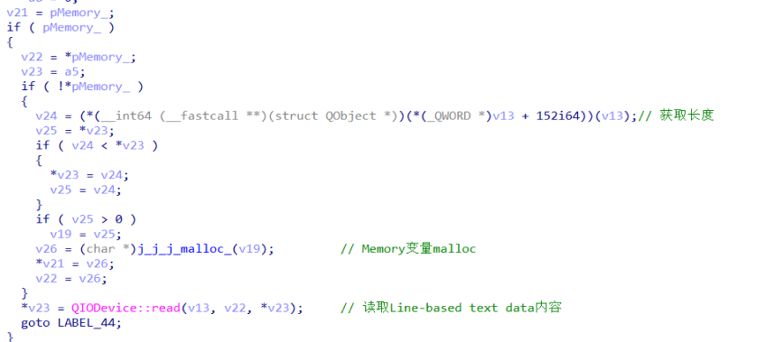
 
### 4.3 分析验证数据函数
setIdAndInvalidFlag函数是用于解析并验证接收到的数据,首先贴出再次分析后的**stKey结构体**:

**验证第一部分:**:
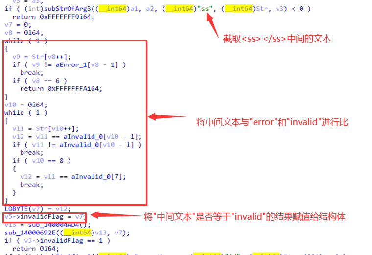

**验证第二部分:**
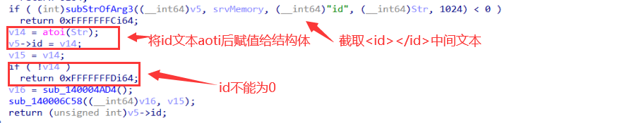

### 4.4 正确数据格式
所以说正确的数据格式应该是 **\<ss\>valid\</ss\>\<id\>1\</id\>**
其中ss中间的内容除了invalid和error都可以, id中间的内容除了0都可以


### 4.5 Patch程序

我的方法是,在setIdAndInvalidFlag函数中:
直接jmp到invalidFlag赋值之前, mov ebx,0把invalidFlag值赋为0
然后再jmp到id赋值之前, mov eax,1把id值赋值为1
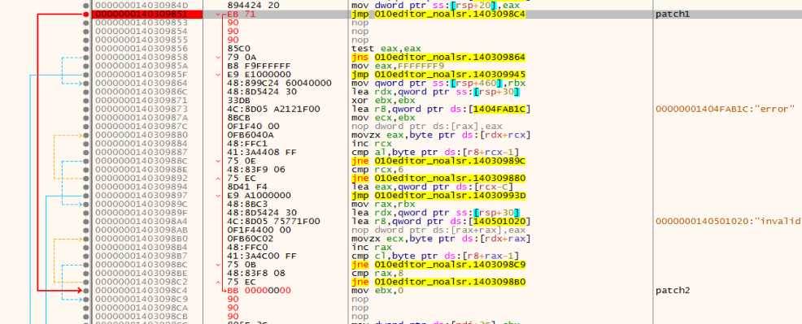
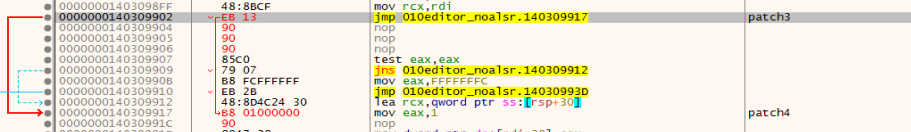
```C++
// patch1
RAW: 00308C51
EB C1ECCFFF -> EB 71 909090

// patch2
RAW: 00308CC4
41 3A4C00 FF 0F94C3 -> BB 00000000 909090

// patch3
RAW: 00308D02
E8 10ECCFFF -> EB 13 909090

// patch4
RAW: 00308D17
FF15 6BEB4100 -> B8 01000000 90
```
## 5. 注册机效果
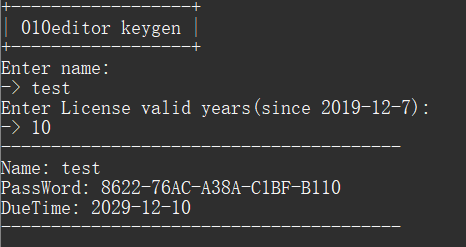