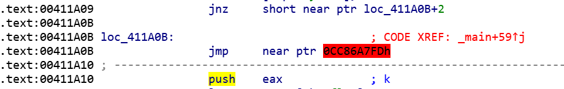
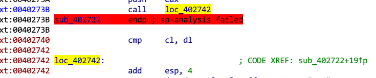
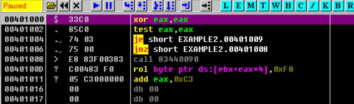
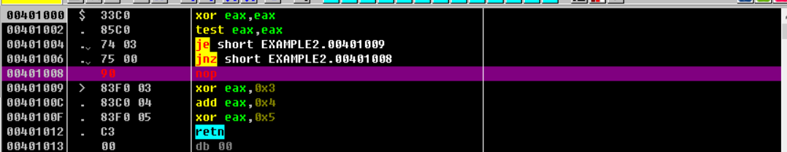
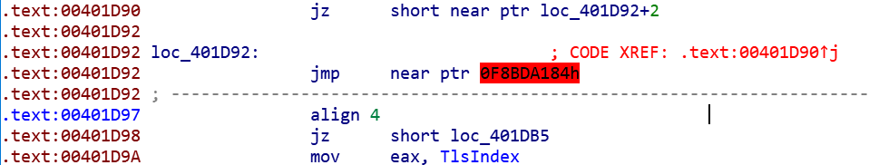
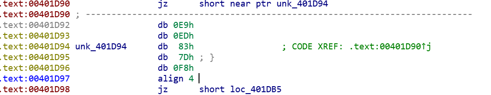

#  花指令

## 原理

目的是反反汇编（保护技术的一种）

在程序中插入若干代码，因为反汇编工具利用的线性扫描算法没有办法正确地将代码和数据分开，导致反汇编错误。

## 花指令的生成

### 机器码

0xE8 CALL 后面的四个字节是地址
0xE9 JMP 后面的四个字节是偏移
0xEB JMP 后面的二个字节是偏移
0xFF15 CALL 后面的四个字节是存放地址的地址
0xFF25 JMP 后面的四个字节是存放地址的地址

0x68 PUSH 后面的四个字节入栈
0x6A PUSH 后面的一个字节入栈

### __asm关键字

##### 简介

__asm 关键字用于调用内联汇编程序，并且可在 C 或 C++ 语句合法时出现。 

 _asm是 __ASM 的同义词。

##### 语法

 __asm后跟一个程序集指令、一组括在大括号中的指令或者至少一对空大括号。 

 

1、__asm与大括号一起使用，则该关键字表示大括号之间的每一行都是一条汇编语言语句。

  如：

_asm　{　mov al, 2 　mov dx, 0xD007　out al, dx　}

2、asm不与大括号一起使用，放在代码行首部，则 asm 关键字表示此行的其余部分是一条汇编语言语句。

 如：

__asm mov al, 2

__asm mov dx, 0xD007

__asm out al, dx

3、__asm做语句分隔符，可将汇编语句放在同一行代码中。

如：

__asm mov al, 2 __asm mov dx, 0xD007 __asm out al, dx

## 一些分类

### jz jnz/jmp




```c
__asm { 
    _emit 075h    #jmp $+4
    _emit 2h
    _emit 0E9h
    _emit 0EDh
}
```

9是jmp指令对应的机器码，当反汇编器读取到E9时，接着会往下读取四个字节的数据作为跳转地址的偏移，所以才会看到错误的汇编代码。

### call ret

call+pop/add esp/add [esp] + retn

call指令可以理解为jmp + push ip
因此如果通过add esp,4来降低栈顶即可去除push ip的影响，从而使call等价于jmp
但IDA会认为这是函数的分界，从而导致函数的范围识别错误



```c
#include <iostream.h>
#include <windows.h>
void main()
{
    DWORD p;
    _asm
    {
        call l1
l1:
        pop eax
        mov p,eax//确定当前程序段的位置
        call f1
        _EMIT 0xEA//花指令，此处永远不会执行到
        jmp l2//call结束以后执行到这里
f1://这里用F8OD会终止调试，F7跟进的话就正常,why?
        pop ebx
        inc ebx
        push ebx
        mov eax,0x11111111
        ret
l2:
        call f2//用ret指令实现跳转
        mov ebx,0x33333333//这里永远不会执行到
        jmp e//这里永远不会执行到
f2:
        mov ebx,0x11111111
        pop ebx//弹出压栈的地址
        mov ebx,offset e//要跳转到的地址
        push ebx//压入要跳转到的地址
        ret//跳转
e:
        mov ebx,0x22222222
    }
    cout<<hex<<p<<endl;
}
```

## 去花

### OD

创建一个指向无效数据的跳转指令的代码

```assembly
start_:

		xor     eax,eax
		test    eax,eax
		jz		label1
		jnz		label0
label0:		
                db		0E8h	
label1:	xor     eax,3
		add     eax,4
        xor     eax,5
        ret

end start_
```

用od反汇编



出错了

因为OD认为垃圾数据0E8h所在的地址00401008h是有效的，故将其作为指令的起始地址。导致后面的指令出错

解决方法：把无用的字节nop掉，就可以成功反汇编



### IDA

与OD原理大同小异 都是nop,但是IDA的Nop不同于od，需要用idc代码实现。



首先将0x00401D92处的代码转换成数据（快捷键D），错误消失



然后将0x00401D94处的数据转换成代码，再把0x00401D92，0x00401D93处的数据nop掉即可


E9是jmp指令对应的机器码，当反汇编器读取到E9时，接着会往下读取四个字节的数据作为跳转地址的偏移，所以才会看到错误的汇编代码。

#### idaPython

下载安装：https://www.cnblogs.com/17bdw/p/7785469.html

常用函数

```python
MakeCode(ea) #分析代码区，相当于ida快捷键C
ItemSize(ea) #获取指令或数据长度
GetMnem(ea) #得到addr地址的操作码
GetOperandValue(ea,n) #返回指令的操作数的被解析过的值
PatchByte(ea, value) #修改程序字节
Byte(ea) #将地址解释为Byte
MakeUnkn(ea,0) #MakeCode的反过程，相当于ida快捷键U
MakeFunction(ea,end) #将有begin到end的指令转换成一个函数。如果end被指定为BADADDR（-1），IDA会尝试通过定位函数的返回指令，来自动确定该函数的结束地址
```

代码实例

```python
def nop(addr, endaddr):
    while addr < endaddr:
        PatchByte(addr, 0x90)
        addr += 1

def undefine(addr, endaddr):
    while addr < endaddr:
        MakeUnkn(addr, 0)
        addr += 1

def dejunkcode(addr, endaddr):
    while addr < endaddr:
        MakeCode(addr)
        # 匹配模板
        if GetMnem(addr) == 'jmp' and GetOperandValue(addr, 0) == addr + 5 and Byte(addr+2) == 0x12:
            next = addr + 10
            nop(addr, next)
            addr = next
            continue
        addr += ItemSize(addr)

dejunkcode(0x00411820, 0x00411957)
undefine(0x00411820, 0x00411957)
MakeFunction(0x00411820, -1)
```


#### idc

语法：https://www.cnblogs.com/gwind/p/8250842.html

常用函数

```c
long Byte(long addr) #从虚拟地址addr中读取一个字节值

long Word(long addr) #从虚拟地址addr中读取一个字（2字节）值

long Dword(long addr) #从虚拟地址addr中读取一个双字（4字节）值

void PatchByte(long addr, long val) #设置虚拟地址addr处的一个字节值

void PatchWord(long addr, long val) #设置虚拟地址addr处的一个字值

void PatchDword(long addr, long val) #设置虚拟地址addr处的一个双字值

bool isLoaded(long addr)# 如果addr包含有效数据，则返回1，否则0
```


关键代码：用0x90覆盖

```
PatchByte (x,0x90); //nop
```

贴一段看雪上去花的源码。（来自https://www.52pojie.cn/thread-849105-1-1.html）

```c
#include <idc.idc>
static main() 
{
	auto x,FBin,ProcRange;

	HideJunkCode();

	PatchJunkCode();

	AnalyzeArea (MinEA(),MaxEA());
}


static PatchJunkCode() 
{
    auto x,FBin,ProcRange;

	FBin = "E8 0A 00 00 00 E8 EB 0C 00 00 E8 F6 FF FF FF";
	//花指令1的特征码
	for (x = FindBinary(MinEA(),0x03,FBin);x != BADADDR;x = FindBinary(x,0x03,FBin))
	{
		x=x+5; //E8
		PatchByte (x,0x90);
		x = x + 3; //00
		PatchByte (x,0x90);
		x++;  //00 E8
		PatchWord (x,0x9090);
		x =x +2 ; //F6 FF FF FF
		PatchDword (x,0x90909090);
	}

	FBin = "74 04 75 02 EB 02 EB 01 81";
	// 花指令2的特征码
	for (x = FindBinary(MinEA(),0x03,FBin);x != BADADDR;x = FindBinary(x,0x03,FBin))
	{
		x = x + 4; //EB 02
		PatchWord (x,0x9090);
		x = x + 4; //81
		PatchByte (x,0x90);
	}

	FBin = "50 E8 02 00 00 00 29 5A 58 6B C0 03 E8 02 00 00 00 29 5A 83 C4 04";
	// 花指令3的特征码
	for (x = FindBinary(MinEA(),0x03,FBin);x != BADADDR;x = FindBinary(x,0x03,FBin))
	{
		x = x + 6;//29 5A
		PatchWord (x,0x9090);
		x = x + 11; //29 5A
		PatchWord (x,0x9090);
	}

	FBin = "EB 01 68 EB 02 CD 20 EB 01 E8";
	for (x = FindBinary(MinEA(),0x03,FBin);x != BADADDR;x = FindBinary(x,0x03,FBin))
	{
		x = x+2; //68
		PatchByte (x,0x90);
		x = x+3;  //CD 20
		PatchWord (x,0x9090);
		x = x+4;  //E8
		PatchByte (x,0x90);
	}
}


static HideJunkCode()
{
	auto x,y,FBin;

	FBin = "E8 0A 00 00 00 E8 EB 0C 00 00 E8 F6 FF FF FF";
	for (x = FindBinary(MinEA(),0x03,FBin);x != BADADDR;x = FindBinary(x,0x03,FBin))
	{
		MakeUnknown (x,0x17,1);
		//x起始地址,y结束地址
		y = x + 0x17;
		HideArea (x,y,atoa(x),atoa(x),atoa(y),-1);
	}

	FBin = "74 04 75 02 EB 02 EB 01 81";
	for (x = FindBinary(MinEA(),0x03,FBin);x != BADADDR;x = FindBinary(x,0x03,FBin))
	{
		MakeUnknown (x,0x09,1);
		//x起始地址,y结束地址
		y = x + 0x09;
		HideArea (x,y,atoa(x),atoa(x),atoa(y),-1);
	}

	FBin = "50 E8 02 00 00 00 29 5A 58 6B C0 03 E8 02 00 00 00 29 5A 83 C4 04";
	for (x = FindBinary(MinEA(),0x03,FBin);x != BADADDR;x = FindBinary(x,0x03,FBin))
	{
		MakeUnknown (x,0x17,1);
		//x起始地址,y结束地址
		y = x + 0x17;
		HideArea (x,y,atoa(x),atoa(x),atoa(y),-1);
	}

	FBin = "EB 01 68 EB 02 CD 20 EB 01 E8";
	for (x = FindBinary(MinEA(),0x03,FBin);x != BADADDR;x = FindBinary(x,0x03,FBin))
	{
		MakeUnknown (x,0x09,1);
		//x起始地址,y结束地址
		y = x + 0x9;
		HideArea (x,y,atoa(x),atoa(x),atoa(y),-1);
	}

}

```

