# 科学上网

**基本思路**：

​	使用VPS服务器搭建

## 第一步：购买VPS（创建账号）

这里选择hostwinds的VPS，hostwinds的VPS可以一件更换IP(并且免费)，数据中心比较多。


进入hostwinds官网注册账号。


*hostwinds官网购买*

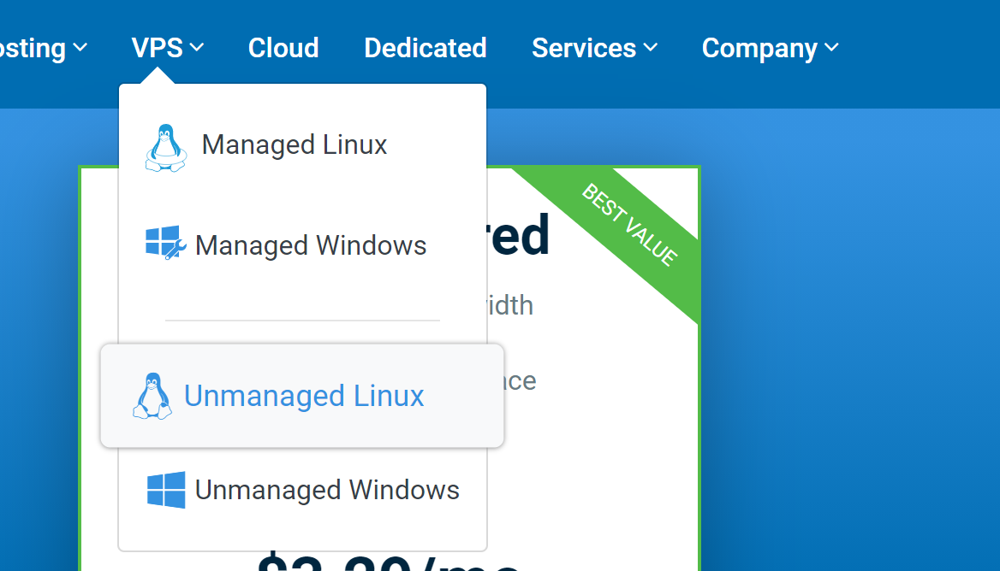

**选择你需要的套餐**

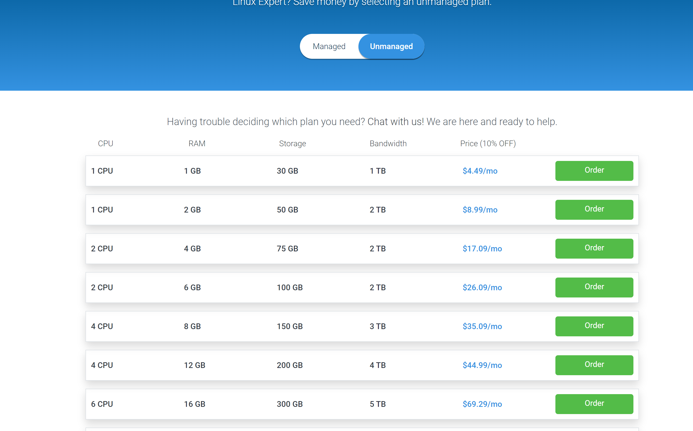

**大陆IP登录会有Alipay选项**


***PS：因为平时不常用VPN所以只买了一个月，之前也是用的此商家的VPS每个月扣钱，心疼***


## 第二步：连接到VPS

​	**这里使用Xshell6（xshell是一个虚拟命令行，可以连接到远程主机或服务器）**

**（Xshell下载方式很多，推荐吾爱破解上下载（百度吾爱破解搜索Xshell6））**

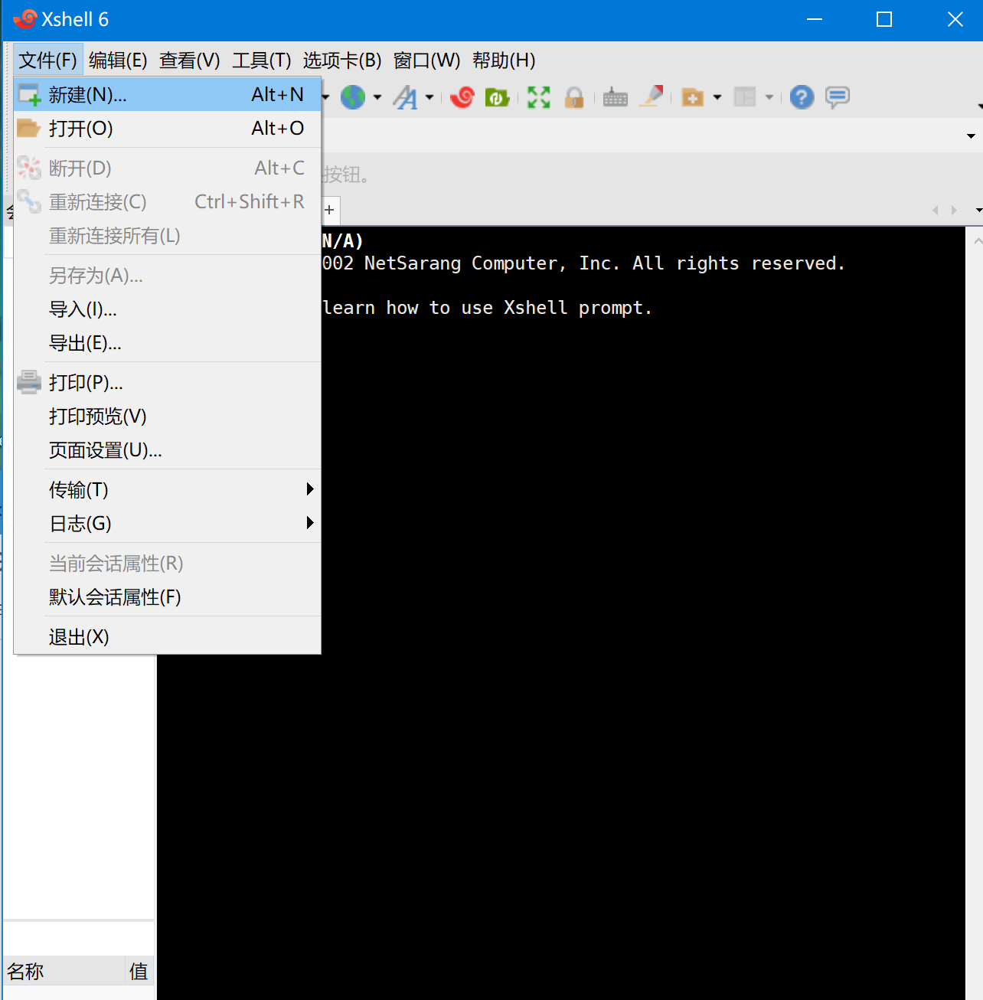


**在新建的会话中连接到VPS的IP  (VPS的IP在hostwinds管理页面上的manage项可以查到)**

**在主机选项卡填入购买的VPS的IP 端口号22默认 协议SSH**

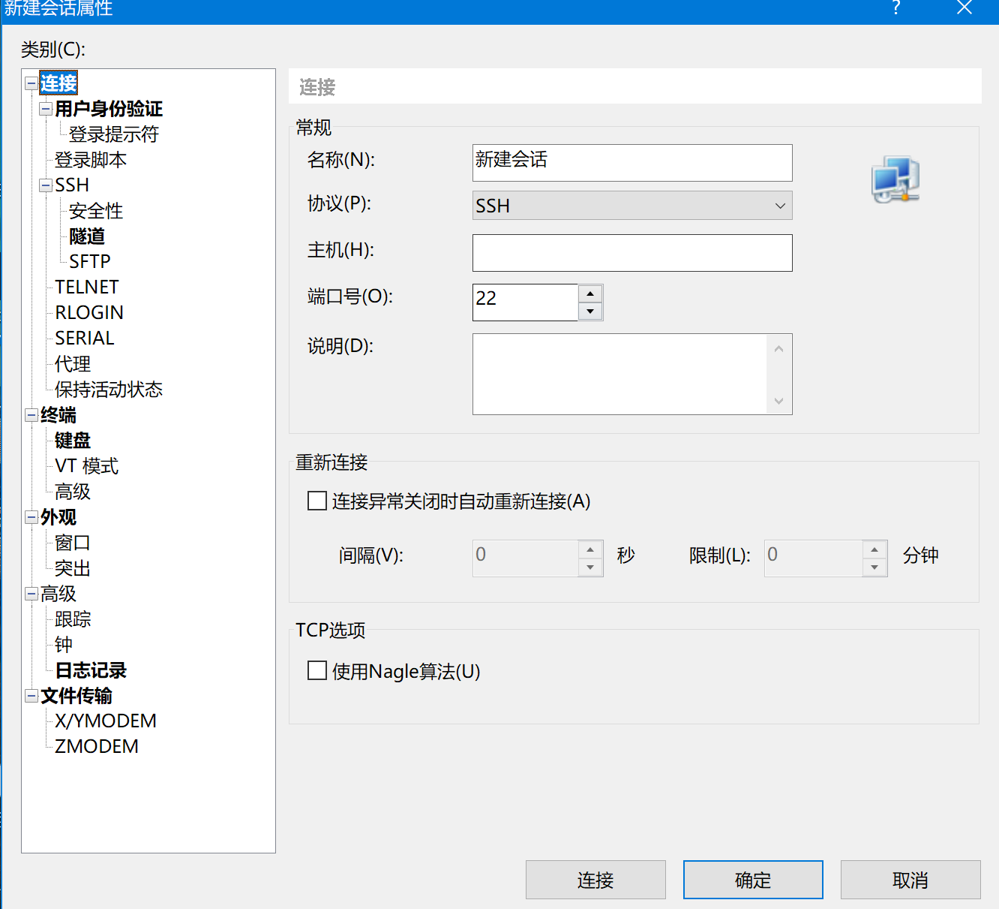

**点击连接**

**这里输入用户名为root（记住用户名）**

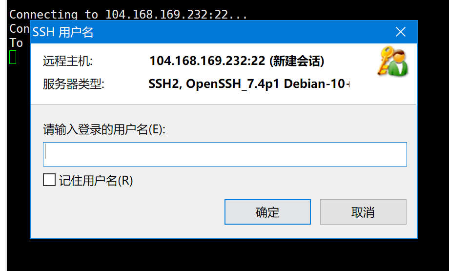

**输入密码（密码在manage选项也可以查到，勾选记住密码就不用每次连接都输）**

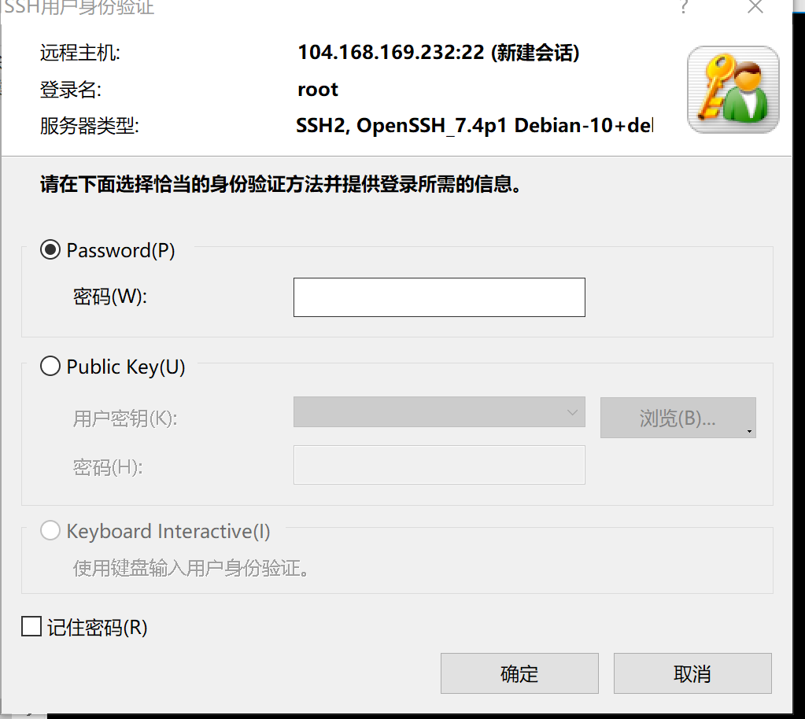

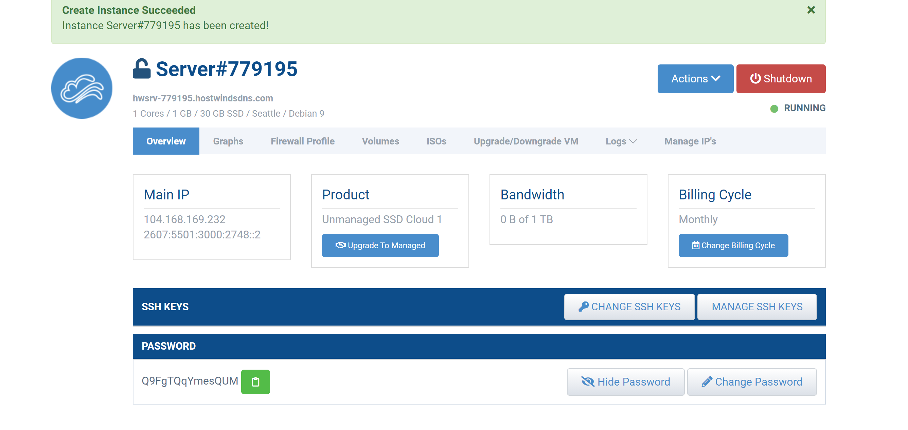

**连接成功**！(如果一直连接不成功可能是ISP block的原因，多换几次IP就可以)

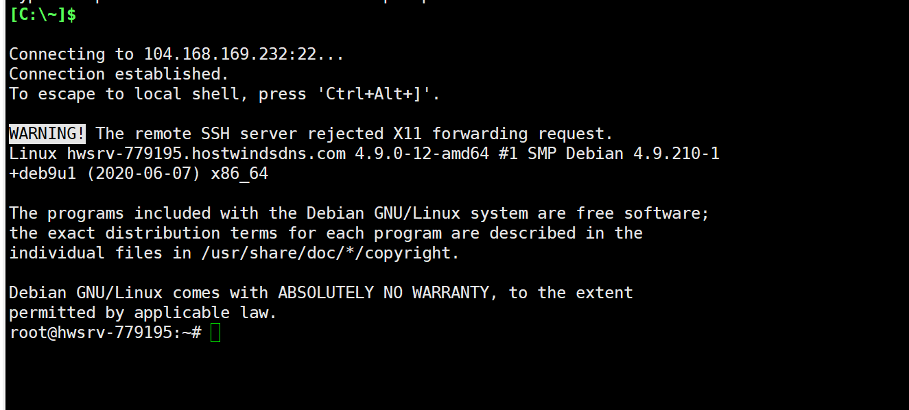

## 第三步：搭建V2Ray

这里是一键脚本搭建V2Ray

```
bash <(curl -s -L https://git.io/v2ray.sh)
//输入此命令即可
```

**按照提示选择即可**

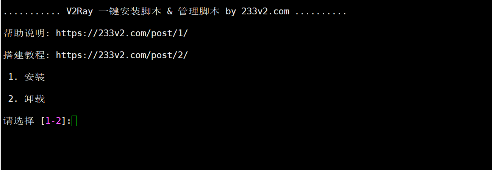

**默认传输协议即可**

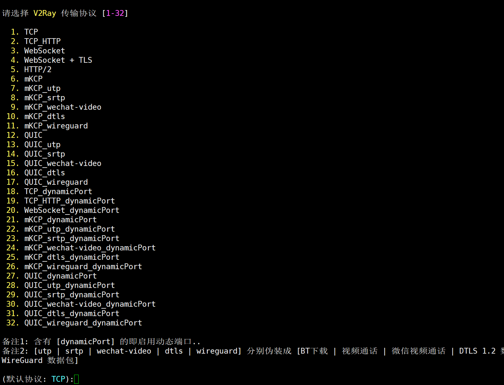

**默认端口即可**


**SS暂不配置**


**出现此界面表示V2Ray配置成功**

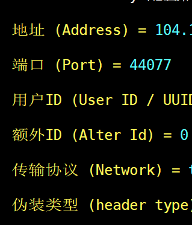

**V2Ray优化（可选）**

```
v2ray bbr
//键入命令，安装bbr加速
```

## 第四步：配置v2ray客户端

 <a href="https://github.com/v2ray/v2ray-core/releases" target="blank">下载链接</a>

`v2ray-windows-64.zip`进行解压，然后将下载的`V2RayN.exe`复制到解压后的目录

**添加一个新的服务器(VMess)**


**添加一个新的服务器(VMess)**

**填入各种信息（就是之前V2Ray结束的信息）**

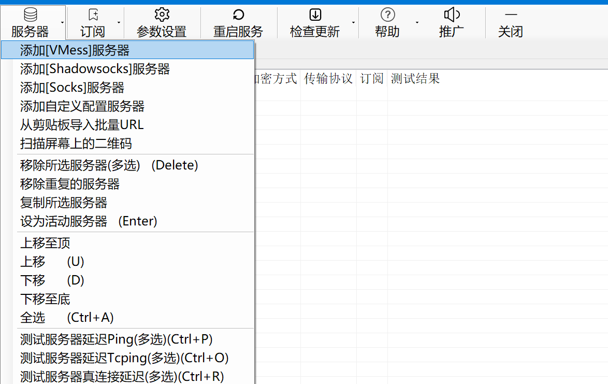

**启动PAC**

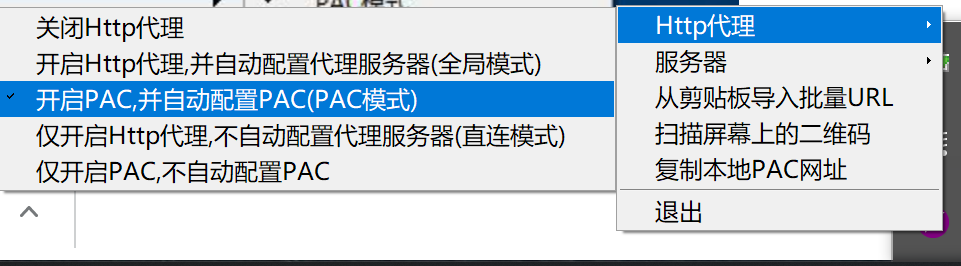

## 结束！

## 效果

