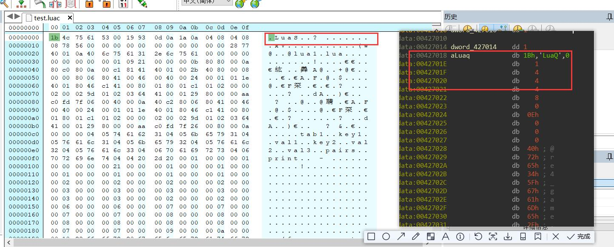

# 简单lua语言逆向
>**Lua 是一种轻量小巧的脚本语言, 其设计目的是为了嵌入应用程序中，从而为应用程序提供灵活的扩展和定制功能。(例如软件要加载用户自定义脚本, 就可以用lua语言)**

Pandownload的用户自定义脚本规则就是用的lua脚本

**以2018网鼎杯Reverse-game为例**

-----------------------

## 1. 静态分析

### 1.1 初步尝试


因为IDA没有lua的签名所以lua动态库的函数都识别不出来


通过搜索字符串可以发现该程序的lua版本应该是lua5.1
通过尝试官方lib文件以及自己编译的lib制作成的sig文件,发现ida都识别不出来, 遂放弃

正常的C语言调用lua脚本的方式都是C程序加载外部的lua文件, 而这个程序的没有调用外部lua文件,
但是lua的编译器也没有将lua文件编译成exe的功能
猜测这个程序可能是一个单独的lua脚本文件然后通过srlua.exe打包成了exe文件

那么只要找到内嵌在程序内的lua字节码就OK了

### 1.2 提取lua字节码


这里显然是加载lua文件:
```C++
luaL_loadfile(L, "test.lua") || lua_pcall(L, 0,0,0)
```
查看v32的字节: 左边是我用luac53编译的lua字节码, 可以看到左右两边很相似

所以v32指向的字节就是lua文件的字节码

将v32指向的字节码全部提取出来

------------------

## 2. 反编译lua字节码

用unluac这个工具, 这个一直在更新比较新
```C++
java -jar unluac.jar myfile.lua > myfile_ decompiled.lua
```


-----------------------

## 3. 分析lua脚本文件

主要逻辑:


**总体是个棋盘游戏, secret是个字节数组,每赢一次就将secret的每一个成员xor随机数**
**赢10000000次则secret就成了flag, 并输出**

---------------------

## 4. 逆向并写脚本

整体逻辑很简单, 那么只需要按这个逻辑, 每次按times置随机数种子再xor随机数, 循环10000000次就行了
lua的随机数算法可能和c,python的不一样(我猜的, 没验证), 所以要用lua语言写脚本

解密lua脚本:
```lua
require("bit")

secret = {
	171,
	201,
	244,
	200,
	118,
	100,
	138,
	190,
	170,
	159,
	94,
	91,
	42,
	184,
	8,
	98,
	198,
	134,
	110,
	165,
	108,
	219,
	117,
	179,
	180,
	179,
	221,
	144,
	167,
	155
}

times = 0
total = 10000000

print("begin\n")

while times < total do
	--randomize()

	times = times + 1
	math.randomseed(times)
	for i = 1,#secret do
		secret[i] = bit.bxor(secret[i], math.random(255))
	end

end

for i, v in ipairs(secret) do
	flag = flag .. string.char(v)
end
print(flag)
```