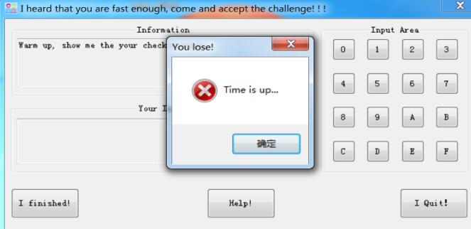
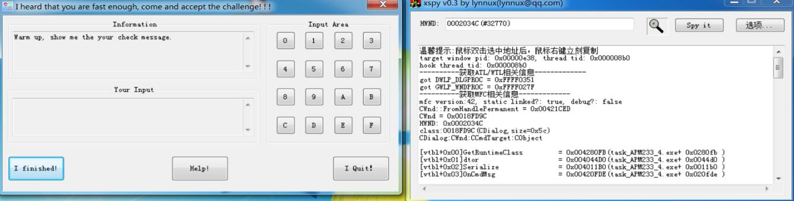
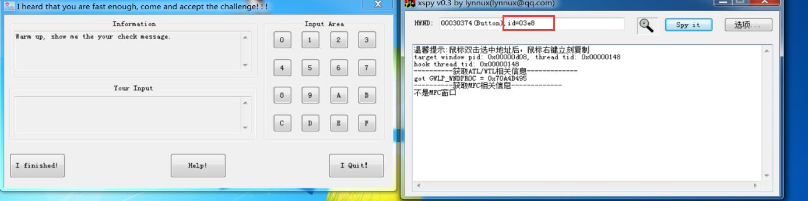
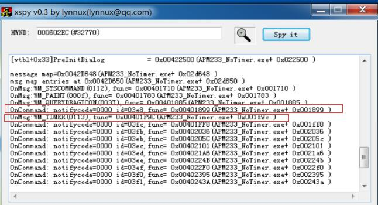
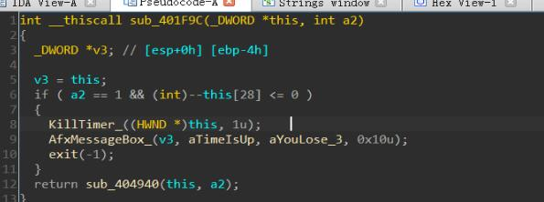

# MFC逆向
> 以APM233这道题为例

## 1. MFC简介
MFC是微软提供的一个C++封装类库(类比于QT), 这个C++库封装了大部分的win sdk中的API, 使得开发win32窗体程序变得容易

而MFC有**六大核心机制**, 这些在当时都是很先进且方便的, 我们只需要了解MFC的**消息映射机制:**

```C++
//自定义消息的步骤：
//1. 头文件中
#define WM_USER_MSG   (WM_USER + 1) 
afx_msg LRESULT OnUserMsg(WPARAM wParam, LPARAM lParam);
//2. cpp文件中
BEGIN_MESSAGE_MAP(CtestDialogDlg, CDialogEx)
    ON_MESSAGE(WM_USER_MSG, &CtestDialogDlg::OnUserMsg) //自定义消息
END_MESSAGE_MAP()
afx_msg LRESULT CtestDialogDlg::OnUserMsg(WPARAM wParam, LPARAM lParam)
{
    ....
    return 0;
}
```

而对于这种机制, 我们可以使用工具**定位到MFC的消息响应事件**

## 2. 逆向APM233程序

### 2.1 定位消息响应函数

首先查看程序主界面:

且一段时间后会弹出Messagebox然后退出, 所以肯定有个**定时事件**:


用**xspy**来hook MFC获取MESSAGE_MAP来查看函数地址:



spy主窗口时通过btn的id来**获取函数响应地址以及WM_TIMER**:


### 2.2 patch WM_TIMER消息事件防止程序定时退出


没学过面向对象的话可能看不懂, 这是因为IDA把汇编翻译成伪C代码而不是C++代码, **没法体现出类**, 所以自己转化一下:
this就是当前类的指针, 比如当前类是这样的:
```C++
class MainCDialog : public ...
{
    //👇隐含的虚表, 有虚函数的类都有一个虚表
    //void* vtable //offset  + 0x4

    一些成员方法或变量... // + ...

    int timerCount // + (0x28*4)
}
```
每隔固定的时间(比如1秒)就会执行sub_401F9C:
即会进行--this[28]的操作, 然后判断this[28]是否<=0, 如果真则退出
翻译成C++即:
```C++
this->timerCount--;
if (this->timerCount <= 0)
{
    KillTimer(this, 1);
    AfxMessageBox("Time is up", "You Lose!", MB_OK);
    exit(-1);
}
```
那么可以把减一操作patch掉(sub ecx, 1), 或者直接把jg改成jmp, 方法很多,怎么都行

### 2.3 逆向主逻辑

I finished函数中都是MFC的一些类, 所以IDA反编译效果极差, 只能用**动态调试**猜出来, 并且有大量的**try_catch语句**(会使得IDA反编译错误, 需要找出处理异常操作的函数), 以及**反调试**操作, **所以不好写md, 就不写了**