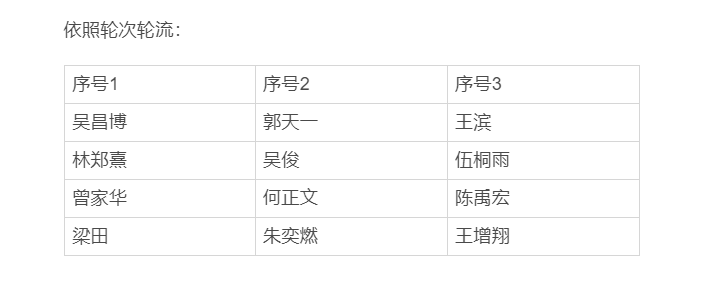

F4sthand - 王滨
T1m3e - 王增翔
Ttt0 - 郭天一
Helix - 吴俊
ZER0-Nu1L - 吴昌博
黑鹰 - 林郑熹
Juice - 何正文
zesiar0 - 曾家华
Ridddler - 申林熇
EL - 伍桐雨
Exlau - 陈禹宏
Li0nT1 - 梁田
doris - 朱奕燃

会议时间：2020年5月1日21:00:00

会议分享人：Helix（吴俊）、黑鹰（林郑熹）、zesiar0（曾家华）

内容预告：

- zesiar0 - PHP反序列化漏洞 | PHP反序列化漏洞.md
- 黑鹰 - Viking 微信公众号排版知识 | 排版要求.pptx
- Helix - CBC字节翻转攻击 | CBC.rar

附件：20200501.zip（初步材料，后续可能会更新）

---

会议时间：2020年5月4日21:00:00

会议分享人：郭天一（Ttt0）、ZER0-Nu1L（吴昌博）、T1m3e（王增翔）

内容预告：

- Ttt0 - IATHook (PE 相关知识，导入表 Hook) |  IATHook folder

- ZER0-Nu1L - NPUCTF_Crypto (DLP，高次剩余) | NPUCTF-Writeup folder

- T1m3e - z3库的使用 | z3库的使用.md

附件：2020-05-03.zip

---

会议时间：2020年5月10日21:00:00

会议分享人：Exlau（陈禹宏）、F4sthand（王滨）

内容预告：

- Exlau - php弱类型比较 | php弱类型比较 folder
- F4sthand - welpwn实战操作 | 2020.2.10-F4sthand-Welpwn folder

附件：2020-05-09.zip

---

会议时间：2020年5月17日21:00:00

会议分享人：Helix（吴俊）、EL（伍桐雨）、黑鹰（林郑熹）

内容预告：

- Helix - Padding Oracle Attack | Padding Oracle Attack folder
- EL - 壳及脱壳的一些入门办法 | 壳及脱壳的一些入门办法-EL.zip
- 黑鹰 - PE文件介绍 & WPS漏洞分析 |  黑鹰5.17分享 folder

附件：2020-05-17.zip

---

会议：2020年5月24日21:00:00

会议分享人：郭天一（Ttt0）、T1m3e（王增翔）

内容预告：

- Ttt0 - 用angr反ollvm混淆的控制流平坦化 | folder

- T1m3e - sharkyctf 两道题目讲解 | sharky_ctf floder

附件：2020-05-24.zip

> 吴昌博（ZER0-Nu1L）请假缺席，下期分享。

---

会议：2020年5月31日21:00:00

会议分享人：F4sthand（王滨）、ZER0-Nu1L（吴昌博）、Ridddler（申林熇）

内容预告：

- F4sthand - 战队新标准和规章的讲解 | Viking战队石墨文档
- ZER0-Nu1L - ECC 离散对数问题及 SageMath 教程 | ECC&Sage folder
- Ridddler - Python 图片转字符画 | md 文件

附件：2020-05-31.zip

---

会议时间：2020年6月7日21:00:00

会议分享人：Helix（吴俊）、zesiar0（曾家华）

内容预告：

- Helix - Rogue MySQL 漏洞分析 | Rogue MySQL folder
- zesiar0 - 文件包含漏洞 | 文件包含漏洞.md

附件：2020-06-07.zip

> 黑鹰（林郑熹）分享请假

---

会议时间：2020年6月14日21:00:00

会议分享人：郭天一（Ttt0）、ZER0-Nu1L（吴昌博）、黑鹰（林郑熹）

内容预告：

- Ttt0 - 受限的代码注入 |  codeInject folder
- ZER0-Nu1L - eNSP 模拟实验（后续攻击分析的基础） | eNSP_Experiment folder
- 黑鹰 - WinRAR 代码执行漏洞 (CVE-2018-20250) | 黑鹰6.14分享 folder

附件：2020-06-14.zip

> T1m3e（王增翔）请假。

---

会议时间：2020年6月21日21:00:00

会议分享人：F4sthand（王滨）、Juice（何正文）

内容预告：

- F4sthand - 内存条相关知识 | 内存条.pdf
- Juice - 彩虹表 | 彩虹表.md

附件：2020-06-21.zip

---

会议时间：2020年6月25日21:00:00

会议分享人：Exlau（陈禹宏）、Helix（吴俊）

内容预告：

- Exlau - Web 中的 URL编码 | URL编码 Folder
- Helix - RCTF2020 Web 两道题目讲解 | RCTF2020web Folder

附件：2020-06-25.zip

> EL（伍桐雨）分享请假
>
> 黑鹰（林郑熹）会议请假

---

会议时间：2020年6月28日21:00:00

会议分享人：ZER0-Nu1L（吴昌博）

内容预告：

- ZER0-Nu1L - Wireshark物理链路层攻击分析

---

会议时间：2020年7月2日21:00:00

会议分享人：F4sthand（王滨）、郭天一（Ttt0）、？？？

内容预告：

- F4sthand - MIPS 编程   | 7.2-Fasthand-re&mips folder
- Ttt0 - duilib 库 | duilib.md
- ？？？

附件：2020-07-02.zip

---

---

会议时间：2020年07月05日21:00:00

会议分享人：ZER0-Nu1L（吴昌博）、黑鹰（林郑熹）、Li0nT1（梁田）、zesiar0（曾家华）

内容预告：

- ZER0-Nu1L - 缓冲区溢出攻击分析 | 缓冲区溢出攻击分析 folder
- 黑鹰 - IOS 逆向 | 黑鹰7.2分享 folder
- Li0nT1 - Navicat for MySQL使用 | Navicat for MySQL使用.md
- zesiar0 - PHP反序列化尾部字符逃逸 | PHP反序列化尾部字符逃逸学习.md

附件：2020-07-05.zip

---

会议时间：2020年07月09日21:00:00

会议分享人：Helix（吴俊）、doris（朱奕燃）

内容预告：

- Helix - 拟态防御初探 | 拟态防御初探 folder
- doris - zip 普通加密和伪加密 | 朱奕燃-misc部分.md

附件：2020-07-09.zip

> 郭天一因为特殊原因，下次分享。

---

会议时间：2020年07月12日21:00:00

会议分享人：Ttt0（郭天一）、EL（伍桐雨）、F4sthand（王滨）

内容预告：

- Exlau - SEH-反调试 | SEH-反调试.md
- EL - 拼搏中 :sweat_smile:
- F4sthand - SQL注入 | SQL注入.md

附件：2020-07-12.zip

> 陈禹宏 请假

---

会议时间：2020年07月30日21:00:00

会议分享人：doris（朱奕燃）、Ttt0（郭天一）、zesiar0（曾家华）

内容预告：

- doris - SEH-反调试 | SEH-反调试.md
- Ttt0 - FSViewer注册机 | FSViewer注册机 folder
- zesiar0 - SSTI模板注入

附件：2020-07-30.zip

> 吴俊 请假

---

会议时间：2020年08月06日21:00:00

会议分享人：Exlau（陈禹宏）、F4sthand（王滨）、T1m3e（王增翔）、EL（伍桐雨）

内容预告：

- Exlau - 简易python爬取jpg | 简易python爬取jpg Folder
- F4sthand - 蛋白质设计 | 蛋白质设计 Folder
- T1m3e - 安卓逆向 | CFF1.apk
- EL - 恶意弹窗及winAPI | 恶意弹窗及winAPI folder

附件：2020-08-06.zip

---