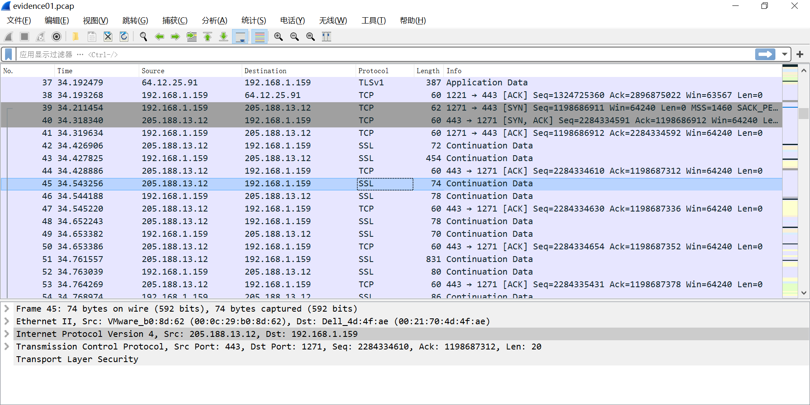
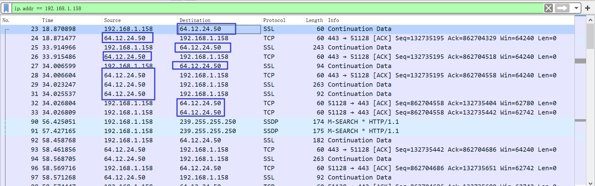
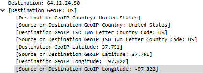
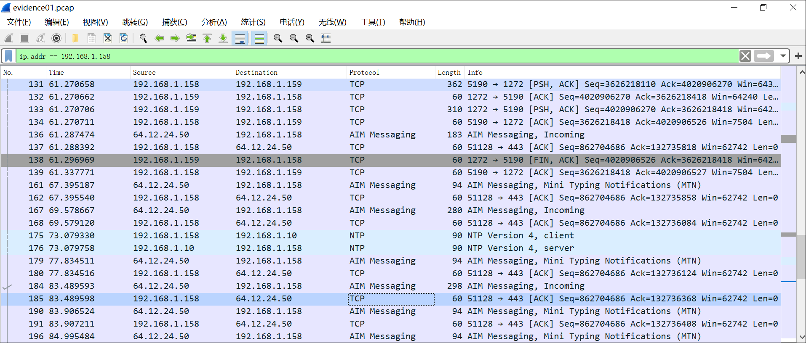
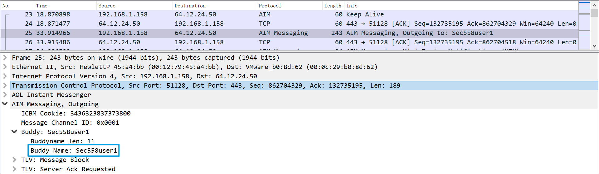
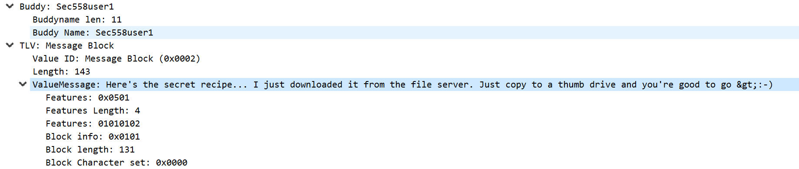
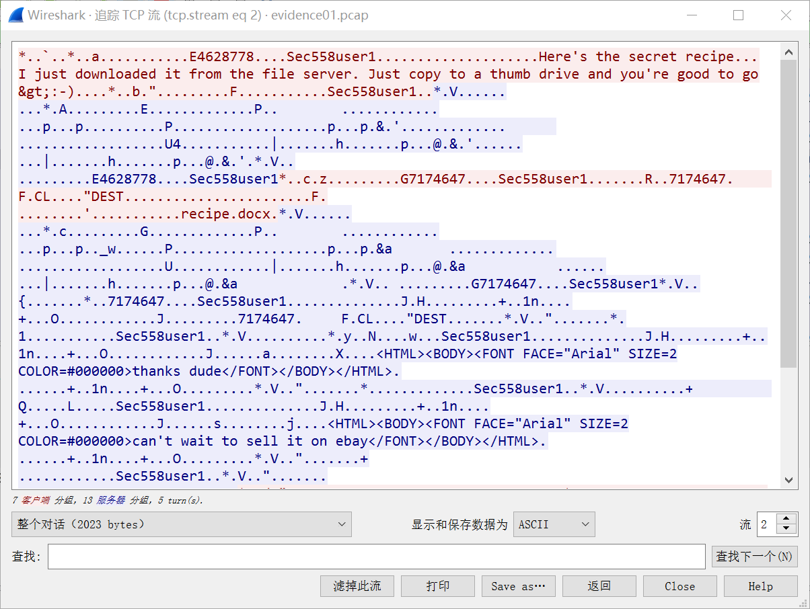
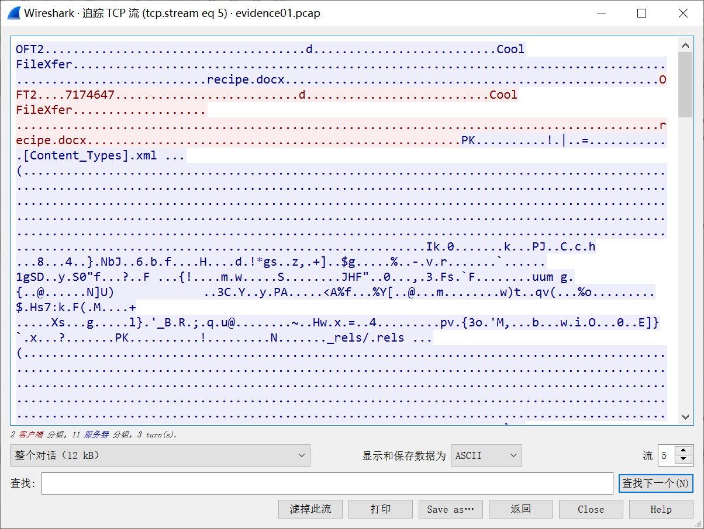
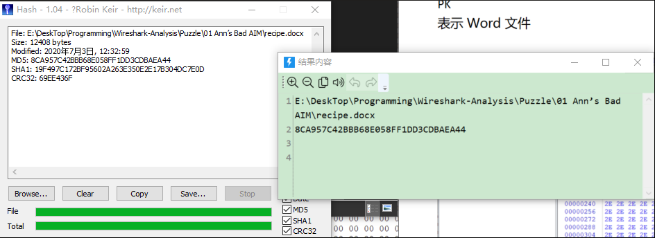

发现后续分析的各种攻击没什么意思:sweat_smile:，所以接下来直接开始网络流量分析与取证的实战环节。
开刀对象是 [http://forensicscontest.com](http://forensicscontest.com/2009/10/10/puzzle-2-ann-skips-bail) 的系列题目 :hammer_and_wrench:

# 题目描述

Anarchy-R-Us, Inc. suspects that one of their employees, Ann Dercover, is really a secret agent working for their competitor. Ann has access to the company’s prize asset, the secret recipe. Security staff are worried that Ann may try to leak the company’s secret recipe.

Security staff have been monitoring Ann’s activity for some time, but haven’t found anything suspicious– until now. Today an unexpected laptop briefly appeared on the company wireless network. Staff hypothesize it may have been someone in the parking lot, because no strangers were seen in the building. Ann’s computer, (**192.168.1.158**) sent IMs over the wireless network to this computer. The rogue laptop disappeared shortly thereafter.

“We have a [packet capture](http://forensicscontest.com/contest01/evidence01.pcap) of the activity,” said security staff, “but we can’t figure out what’s going on. Can you help?”

You are the forensic investigator. Your mission is to figure out who Ann was IM-ing, what she sent, and recover evidence including:

1. What is the name of Ann’s IM buddy?
1. What was the first comment in the captured IM conversation?
1. What is the name of the file Ann transferred?
1. What is the magic number of the file you want to extract (first four bytes)?
1. What was the MD5sum of the file?

6. What is the secret recipe?

Here is your [evidence file](http://forensicscontest.com/contest01/evidence01.pcap):

http://forensicscontest.com/contest01/evidence01.pcap
MD5 (evidence.pcap) = d187d77e18c84f6d72f5845edca833f5

# 题目分析

根据题目，简单说就是，嫌疑人 Ann（192.168.1.158）被网络监控到通过无线网络将即时消息发送到一台陌生电脑，我们需要通过数据包的分析，以知晓通信双方的信息和传输的信息。
题目 1、2 对通信进行分析即可。
题目 3、4、5、6 其实重要我们获取到文件，就一锅端了。

# 解题过程

## 通信加密？



乍一眼看过去，很不妙地看到了SSL（Secure Sockets Layer） 安全套接字协议，这很大程度上意味着通信进行了加密。
一般，只有 Wireshark 导入私钥才能解析其中的消息。

## 继续探索

应用层数据可能进行了加密，但不妨碍我们对传输层/网络层的报文字段进行分析。
我们知道 Ann 的 IP 是 192.168.1.158，所以先用显示过滤器：ip.addr == 192.168.1.158：
发现他正在和一个 well-kown IP 进行通信：


可以看出，这是来自美国的一个 IP。作为一个 well-kown IP，它很有可能是服务器。


我们进一步查询 IP：


果不其然，它是来自 AOL 美国在线公司的服务器。
可以查到 AOL 是一个提供电子邮件、新闻组、教育和娱乐服务，并支持对因特网访问的公司。所以 Ann 是通过这个和和外界通信的。
查一下 AOL 通信：AOL即时通讯（AOL Instant Messenger）简称AIM
AOL 作为通信的一种服务，应该有它自己的通信协议（比如 QQ 的通信协议是 OICQ），端口是 443。（留意这个端口！）

## 突破：Wireshark 的解析规则

虽然，看到 SSL 或者 SSLv3之后SSL重命名为的TLS，我们会以为的确是加密了。
但实际上，Wireshark 解析协议是根据端口的。
这里通信的端口是 443，所以自然而然会被解析成 SSL：


但是现实情况下往往存在端口映射等其他情况，以及特定协议带来的干扰导致 Wireshark 解析错误。（这里可能没有解释太清楚）所以，看到 SSL 或者 TLS 除了可能是通信加密，也有可能是解析错误！！！
这也是本题的解密关键。


## 解码

我们已知，Ann 通信对方是 AOL 的服务器，所以他们很可能是利用 AOL 和 AIM 的协议进行通信的；知道协议之后，就可以尝试 Decode As… 功能。
[Wireshark 的官方文档](https://www.wireshark.org/docs/wsug_html_chunked/ChCustProtocolDissectionSection.html)是这样介绍的：

The “Decode As” functionality lets you temporarily divert specific protocol dissections. This might be useful for example, if you do some uncommon experiments on your network.
点击数据包右键- Decode As …：


这是它原来的解析方式：


当前的 (none) 代表不进行解析
这几个项都可以进行更改（下拉菜单）-把能够解析的都列出来了，我们尝试将它当做 AIM 协议解析：


解析成功！激动的心！！


## 解读信息

难点解决了，接下来都是小问题了（坐好了，要加速了:car: ）：
### Question 1



### Question 2


ValueMessage: Here's the secret recipe... I just downloaded it from the file server. Just copy to a thumb drive and you're good to go &gt;:-) 
### Question3：

**TCP** **追踪流：**
tcp.stream eq 2 && ip.addr == 192.168.1.158


看到提到 recipe.docx
再追踪下一个 TCP 流：
tcp.stream eq 5 && ip.addr == 192.168.1.158


这个流就有点意思了（它没有经过服务器）
选择为单向对话。原始数据，保存为 recipe.bin，后面还原文件用。

### Question 4

问 Magic Number
Magic number，即幻数，它可以用来标记文件或者协议的格式，很多文件都有幻数标志来表明该文件的格式。
[常见文件头 | 幻数](https://asecuritysite.com/forensics/magic)

| DOCX  (Office 2010) | .docx | 50 4B 03  04 [PK] |

1. 把文件头去掉，保存文件为 recipe.docx


成功！
### Question 5：

计算 MD5


### Question 6：
```
Recipe for Disaster:
1 serving
Ingredients:
4 cups sugar
2 cups water
In a medium saucepan, bring the water to a boil. Add sugar. Stir gently over low heat until sugar is fully dissolved. Remove the saucepan from heat. Allow to cool completely. Pour into gas tank. Repeat as necessary. 
```

Case closed. :sun_with_face:

> 原始链接：https://zer0-nu1l.github.io/2020/07/13/%E3%80%90Wireshark%20%E7%B3%BB%E5%88%97%E3%80%91Puzzle-1/